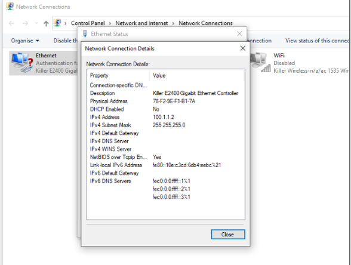
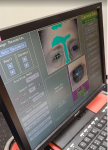

## Data Collection Visual checkerboard fMRI protocol

#### Overall experimental setting

The experimental setup includes:

- **Syncbox**: A NordicLabs Syncbox receives TTL (transistor-transistor logic) triggers from the scanner. This box can forward the triggers converted into other formats and/or manipulate them (e.g., filter, generate, etc.).
- **Eye tracker (ET)**: We use the EyeLink 1000 Plus (SR Research Ltd., Ottawa, Canada). Our particular variant “Long Range” is composed of three main elements: 
  <ul>
      <li>inside the scanner's bore, we place an arm that holds an infrared lens and camera sensor on one side and an infrared lamp that illuminates the right eye of the subject through</li>
      <li>a special mirror to reflect the infrared spectrum;</li>
      <li>a PC tower that receives the camera recordings, post-processes the images, and calculates the final parameters of interest (position of the eye, pupil size, etc.).</li>
       The ET is also connected to the experimental laptop.
    </ul>
 

- **Experimental laptop**: It is the laptop where the Psychopy software is installed and with it the task programs are executed. This laptop also stores the data recorded by the ET at the end of the experiment.

**ONE DAY BEFORE SCAN DATE**

- Verify that all Psychopy experiments run correctly.
- Verify that all the tools necessary for the data collection run correctly → check that the eyelink machine is correctly working.

???+ quote "Configuration"
     If you connect the eye tracker to the experimental laptop for the first time, you need to configure it.
	- Go to the experimental laptop.
	- Double click on the ethernet connection inside the control panel.
    
	  
	  
	- Change the IP address → double click on the internet protocol version and change IP address with IP 100.1.1.2 and sub with 255.255.255.0.

- Print the informed consent form.
- Print the MRI safety screener (EN|FR).
- Print a receipt form for each participant that will get scanned.

#### Session preparation
The following section describes how to prepare the session on the day of the scan BEFORE the participant arrives. Try to arrive at the Control Room at least 30 min ahead of the session start time.

##### Setup Preparation Inside the Scanner room
- Memorize where the other tools for the recordings are to put those back in place at the end (coil, emergency button, ears cover).

###### Setting up the projector
- Before entering the scanner room, go to the room where the projector is installed.
- Switch the projector ON by hitting the power button located on its right side.
- Verify the aim of the projector's beam by looking through the tube into the Scanning Room.
- Verify the projection corresponds to the Psychopy laptop screen.
- Before exiting the projector room, grab the plexiglass panel where the ET arm will be placed inside the scanner.
- Take the panel to the Control Room.
- Go to the scanner room and take the half-circle one-direction screen from the table behind the scanner and put it on the back of the scanner.

###### Setting up the eye-tracker
- Check out Eye Tracker set-up guidelin (ET_setup_3T_EyeLink_1000Plus).
- After accurately preparing the ET arm following the ET_setup_3T_EyeLink_1000Plus, bring the plexiglass panel inside the scanning room and place it at the end of the scanner's bore. A sign indicates the top side that MUST face up. The plastic feet must face down to avoid the panel from sliding. To ensure the repeatable positioning of the ET, place the end of the plexiglass such that its edge aligns with the edge of the illuminated MRI rails.
- Exit the Scanning Room and fetch the ET arm.
- Enter the Scanning Room and place the ET arm on top of the plexiglass panel with the two posterior feet of the ET arm aligned within the two corner markers made of scotch tape.
!!! danger "Hold the ET arm FIRMLY because the magnetic field imposes some resistance"

- Unroll and connect the cables (two plugs for the black, one plug for the orange).

- Take the half-circle one-direction screen from the table behind the scanner and put it on the back of the scanner behind the ET system (don't push the plexiglass yet).

###### Setting up the coils
- If any head coil from the last exam is still plugged, remove it:
  <ul>
    <li>If it is the 64-channel coil, you can just temporarily move it into the scanner's bore.</li>
    <li>Otherwise, store it on the shelf where the other coils are and bring the 64-channel one in the proximity of the bed (e.g., inside the scanner's bore). Make sure to remove other coil's fitting elements.</li>
  </ul>
- Remove the spine coil by lifting the corresponding latch, then sliding it toward the head of the bed, lift it from the bed and place it on the floor ensuring it is not obstructing any passage or unstable.
- Place the two back padding elements filling the spine coil socket.
- Place the 64-channel head-and-neck coil into its socket at the head end of the bed.
- Attach the dedicated infrared mirror to the coil (see ET_setup_3T_EyeLink_1000Plus):
  <ul>
    <li>Exit the Scanning Room.</li>
    <li>Fit in a pair of new latex gloves.</li>
    <li>Extract the dedicated infrared mirror from the ET box CAREFULLY.</li>
    <li>Remove the mirror protection EXTRA-CAREFULLY.</li>
    <li>Take the mirror, enter the Scanning Room and lock the mirror onto the frame of the head-coil.</li>
  </ul>

###### Final setting inside the scanning room
- Cover the MRI bed with a clean sheet.
- Prepare padding: under-knee padding, neck-and-head padding, under-elbows padding, head-sides padding, top-head wedge padding.
  <ul>
    <li>Wrap a sanitary cover around each padding.</li>
    <li>Place a double neck-and-head padding inside the coil, to ensure the eyes are close to the coil's windows.</li>
  </ul>
- Prepare a blanket to cover the participant.
- Prepare a new pair of earplugs.
- Completely disable the light inside of the scanner and the ventilation of the scanning room to facilitate the best performance of the ET.

##### Setup Preparation Inside the Control Room

###### Setting up experiment instruments
- Arrive to the Control Room at least 30 min ahead the session start time.
- Place the experimental laptop on the designed desk and connect all the as showed in the following picture (in this case Jack audio is not necessary). Specifically, connect the experimental laptop to:
  <ul>
    <li>Plug the power adaptor to the laptop, and the adaptor to the power outlet on the wall.</li>
    <li>The screen switch box with the corresponding HDMI cable (This should project your screen on the screen of CHUV's tower).</li>
    <li>The RJ-45/Ethernet cable from the ET computer into the RJ-45 socket of the experimental laptop.</li>
    <li>Connect the SyncBox to the laptop with the USB cable. It is normally plugged into CHUV's stimuli workstation, it must be re-plugged in there after the session.</li>
  </ul>

  
  
- Switch the laptop on and open the psychopy code.
- Click the switch button to share your PC.
- Switch the SyncBox on using the button on the right side.
- Change the SyncBox correctly to send the triggers (Corresponding to push the key-button “S” from keyboard). Take the SyncBox and go on “Simulation” mode.
- Then, change the parameters in the main menu modifying the pulse length at 100ms and the TR time at 650ms. 
- Push the enter button  and the syncbox will be now waiting for the scanner's trigger signal to forward it.
{ width=40% }
{ width=40% }

- Open the door of the cable wardrobe between the recording room and the scanner room, and connect the sync box in the following way:

{ width=40% }
{ width=40% }

- Switch on the ET’s PC using the power-om button at the front
- Select "Eyelink" when given the option of which operating system to launch.
  <li>Verify the IP address assigned to the Ethernet interface of the experimental laptop is correct:
    <ul>
      <li>Check the output of the following command and verify that IP/mask is 100.1.1.2/24, and the protocol is IP version 4.</li>
      <li>Check whether the link is properly established.</li>
    </ul>
  </li>

#### When the Participant Arrives

# Participant Preparation

## Participant Reception

- Meet the participant at an easily locatable place (e.g., the reception desk of the Radiology Unit) and show them the way into the control room. Allow sufficient time before the experiment for the preparation.
- Show the participant the scanning room and explain to them how the device is controlled from outside.
- Ask the participant to fill out the consent form and MRI safety screener, and verbally confirm responses and discuss further doubts, paying attention to frequently forgotten devices and implants, like orthodontia.
- Remind the participant to use the bathroom at this moment if they need.
- Describe to the participant how the session will develop and explain clearly the task. Let them interrupt you to ask for clarifications and answer all the questions that may arise.

???+ quote "Script for the session"
      “We are going to acquire two types of images. The first type is anatomical imaging that we use to study the morphology of the brain. The second type is a functional MRI, which we use to understand how the brain activates as a response to stimuli we will present to you. During the whole duration of the exam, please do not create closed loops by crossing your legs or holding your hands together. It is possible that your peripheral nerves get stimulated at some points, so you will feel twitching of muscles, for instance, of your pectorals. Do not panic, it is okay, but if it feels too uncomfortable, please squeeze the alarm button.During the functional MRI you will see a point at the center of the screen that will change the colors. For the entire period of the experiment you should takes the eye open on this fixation point at the center of a gray environment. The experiment has a duration of 30 minutes more and less. Before to start with scanning we will need to calibrate the eyetracker, therefore we will ask you to fix different points on the screen.

      Is everything clear to you? Do you have any questions?”

- Offer the participant a box to deposit everything they have in their pockets and all jewelry/hair accessories, and indicate that before continuing, we need to make sure we do not introduce any dangerous objects into the magnet room. Therefore, it is important to inform the participant to remove every metallic accessory.
- Ask to remove shoes at the entrance of the scanning room.

## Participant Preparation in the Scanning Room

- Instruct the participant to lay on the MRI bed and adjust the participant inside. With the paddings, their head position MUST be adjusted and elevated so that the nose and the forehead of the participant are both close to the upper coil. This procedure ensures the ET has the clearest possible view of the eye.
- Give them the ear-plugs to protect their hearing during acquisition, allow time for them to place them.
- Give the participant the emergency button. Make the participant try it, so they can see it works. To switch off the alarm, there’s a button on the scanner (circular, both on the left and on the right of the hole).
- Once the previous part is ensured, the participant is ready. If the participant is cold, put a blanket on top of him.
- Connect the coil's cable to the corresponding socket on the table.
- Gently move the participant with the manual regulation. Stop when the head is under the head-localizer. Ask the participant to close the eyes, localize the head with the infrareds.
- Switch off the infrareds, now the participant can open the eyes. You can move the participant (always gently as before) inside the scanner, until the mm counter marks “Isometric”.
- If everything is okay, you can move forward and record.

## Final Preparations

- Inform the participant that you are leaving the room and will shortly come back for a final preparation.
- Proceed with the ET positioning (see ET_setup_3T_EyeLink_1000Plus) and calibration.

???+ quote "ET Calibration"
    - Open psychopy in the experimental laptop.If you connect the eye tracker to the experimental laptop for the first time, you need to configure it.
	- Double click on the psychopy file of the rs protocol to open it.
	- Run the experiment on psychopy clicking the “run experiment” button. IMPORTANT: make sure that once the experiment start after the calibration, the data are being stored to the xx.EDF file. There should be a message about that displayed at the ET’s PC screen.
	- Once the stimulation begins, you follow the messages on the screen to run the calibration (make sure the 5 points calibration has been selected).
	- ET PC – apply threshold (left upper corner, as on the left figure), make sure that the pupil was found, and you see the blue cross on the eye. In case of troubles – check if there is enough light inside the scanner and not too much, check the position of the participant inside the coil. Once the calibration starts accept calibration points when green (Accept fixation).
	  
    
	  
	  

	- If the calibration was successful, you will see the sentence ‘calibration successful’ at the bottom in green. Check the stability of the accepted points and overall score o the calibration.
	- Follow up with the validation. What you should see in an ideal situation is: the reference dot on the center of the screen and another dot, which correspond to the pupil calibration, that it is more and less stable moving a little around the reference dot. If the calibration dot is unstable and is moving around far from the reference dot the experimenter should go back clicking the restart button, adjust the contrast and redo the calibration. Once the calibration dot is quite stable proceed with the validation clicking the accept fixation. 

- Inform the participant that you are leaving the room and will now close the door to start. Let them also know that you are going to communicate with them very shortly to check that communications through the speaker are functioning.
- Exit the Scanning Room.
- Close the Scanning Room door.

## Running the Scanning Session

!!!danger "You MUST know the security procedures in case of problem and keep yourself updated with changes" 

### Before Initiating the Session: Run the Experiment

- At the end of the ET calibration we are ready to run the experiment.
- Wait for the sentence “In this task you will see a color dot. Please keep your eyes on the fixation point. The program is ready for the scanner trigger. Press s to proceed manually.”
- Then click “start session” on the sync box clicking the round button. 

{ width=40% }
{ width=40% }

- The stimulation will start with the scanning. At the end of the experiment click “t” on the experimental laptop and click the round button on the SyncBox to stop the running session.

### During the Session

- Check in with the participant.
- Check in that everything is correctly working (e.g., The pupil is correctly detected).
- Watch for motion and arousal state using the ET's camera. If you detect motion or the participant falls asleep at inadequate points, use the speaker to inform them.

### Acquire a Localizer

- Indicate the participant that the scanning will soon start.
- Wait for the participant confirmation and set the speaker off afterward.
- Launch the AAhead_scout_64ch-head-coil protocol by pressing Continue.
- Once the localizer is concluded, click on the image stack icon with left click and drag the image with a 1 onto the image viewer. That will open the interpolated localizer on the viewer.
- If the quality looks good, check the box stating Localizer looked ok. If not, re-acquire the localizer.

### Acquire a High-Resolution Anatomical Image

- Run the wip19_mprage_1iso_cs4p2 protocol by pressing Continue.
???+ quote "Anatomical image Acquisition" 
    - While you are still running the MPRAGE sequence open the parameters of the sequence and ensure that:
    -	under Sequence ⤷ Part1, the shot per slice is 419. This is crucial so that so that the acquisition time is more and less 1 minute.
    -	under Routine, TR and TE should be set at the minimum value. the shot per slice is 419. This is crucial so that so that the acquisition time is more and less 1 minute.
    -	under Contrast ⤷ common, TR and TE should be set at the minimum value. The fat-water should be set as standard and the flip angle should be set to 5 degree.
    -	under Contrast ⤷ filter, click on the three dots and tick the “unfiltered images”.
    -	under System ⤷ coils, select the coils HC3, HC5, HC4, HC6, HC7.
    -	under System ⤷ miscellaneous, Put the coil selection as manual.
    -	under Physio, make sure that RECONSTRUCTION is off. 
    - Finally, click copy and go button
### Acquire Functional Image

- Inform the participant that we will start with the fMRI block, therefore the participant will start hearing sounds.
- Run the BEAT_LIBREoff_BOLD_audio_bis protocol by pressing Continue.

## Session Completed

- The exam is over, inform the participant that the session has concluded.
- At the end of the stimulation click “t” on the experimental laptop and click the round button on the SyncBox to stop the running session.
- You can proceed with the tear-down protocol.

## Session Tear-Down

### Showing the Participant Out

- Enter the scanner room, and announce yourself to the participant saying that you will get out the participant in a few seconds.
- Extract the participant by pressing the extraction button and then gently rolling the central knob. Alternatively, you can just press the Home button.
  <li>Remove the upper side of the head coil:
    <ul>
      <li>Unplug the head coil from the bed connector.</li>
      <li>Lift the lever that releases the upper part of the coil and put it aside (e.g., inside the bore or on a chair next to the scanner).</li>
    </ul>
  </li>
- Assist the participant to the headphones.
- Help the participant sit down.
- Help the participant step down and accompany them out to the control room.
- Help the participant recover their personal belongings and change clothes if necessary.
- Give the participant the corresponding compensation for the participation and transportation.
- Ask the participant to sign the receipt of the amount of the financial compensation.

### Cleaning up the Scanning Room

- Enter the scanner room, and announce yourself to the participant saying that you will get out the participant in a few seconds.
- Remove used blankets and bed-sheets ONE-BY-ONE: extend them to let any forgotten items fall on the floor before you fold it; and dispose of them in the adequate bin (soiled linen bag if they are fabric and trash if they are disposable).
- Dispose of all single-use sanitary protections (padding covers, earplugs, etc.).
- Put the pillows back in their designated storage places.
- Remove the head coil and put it in the scanner's bore.
- Remove the back padding elements and put them back in their designated storage.
- Reinstall the spine coil.
- Wipe the bed and the head coil (bottom and upper parts).
- Lock the head coil back with its bottom part without plugging the connectors.
- Put the head coil away with the other head-coils on the shelf next to the scanner.
- Return the bed to its Home position by pressing the button (more info).
- Exit and close the external door.

!!!danger "Everything that is removed for the experiment needs to be put back in place at the end of the experiment, i.e., position of the bed, coil, emergency button, ears cover."

### Cleaning up the Control Room

- Switch off the laptop and ET PC Tower. Plug back the SyncBox and the VGA projector where they were. Make sure you leave it connected exactly as you found it.
- Switch off the projector.