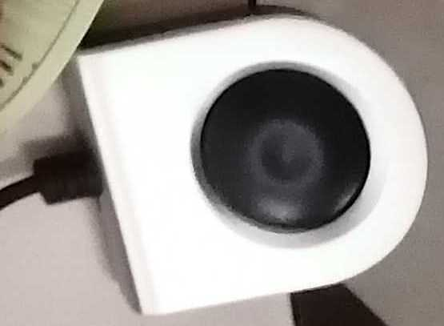

???+ quote "Note for writers"
    - Precisely point out what is connected to what by which kind of cables.
    - Need double check with JB
  

# Overall experimental setting
The experimental setting is to obtain anatomical MRI scan with synchronized eye tracking recording (the right eye gaze trajectories and eye movement events including blinking, saccades and fixation).

Here is the illustration of the overall experiment:

{: style="width: 100%;display: block; margin: 0 auto;"}

The graph above can be divided into the following components:
- Syncbox: A NordicLabs Syncbox sends TTL (transistor-transistor logic) triggers to the scanner and forward the signal converted to the keyboard signal "s" to the PsychoPy laptop. 

<!-- 

  
  
<strong>Trigger to PsychoPy PC</strong>

  
  
<strong>Trigger to Scanner</strong>

 -->
{: style="width: 80%;display: block; margin: 0 auto;"}

<strong>Trigger to PsychoPy PC</strong>

{: style="width: 80%;display: block; margin: 0 auto;"}

<strong>Trigger to Scanner</strong>

                                              
- Scanner: 3T clinical scanner (MAGNETOM PrismaFit, Siemens Healthineers) with a 64-channel head-neck coil with an attached mirror.
- Eye tracker: We use the EyeLink 1000 Plus (SR Research Ltd.) for eye tracking.
  (i) The eye tracker consists of an infrared lens and camera sensor on one side, along with an infrared lamp to illuminate the subject's right eye. It is positioned inside the scanner bore.
  (ii) An infrared mirror is mounted on the head coil.
- The Eye Tracker PC is bi-directionally connected to both the eye tracker and the PsychoPy laptop. It receives eye tracking data from the tracker, processes the eye movement trajectories and images, calculates pupil sizes by segmenting the pupil area, and classifies eye movement events based on predefined thresholds. The ET PC also receives trigger and task event messages from the PsychoPy laptop, logs data, and sends both the eye tracking data and logs back to the PsychoPy laptop.
- Stimuli laptop (PsychoPy Laptop): The PsychoPy laptop runs the PsychoPy software, which is used to execute the task programs. These programs coordinate various hardware components, including the ET PC, eye tracker, the screen, and syncbox. In our DEBI experiment, the 'MR-Eye' protocol displays a central dot that changes color at a frequency of 10Hz. In the 'MREye-Track' protocol, a gray dot sequentially appears at the top, bottom, left, and right sides of the screen. The laptop also stores the data and logs generated by the Eye Tracker PC after the experiment.

# Session Preparation
## Configure the IP address
If you are connecting your PC to the eye tracker (ET) for the first time, you need to reconfigure the IP address.
On windows:
- Go to `Control Panel` -> `Network and Internet` -> `Network Connections`
- Double-click on the `Ethernet` connection.
- Select `Internet Protocol Version 4 (TCP/IPv4)` and click `Properties`.
- Update the IP address to `100.1.1.2` and the subnet mask `255.255.255.0`.<mark> (Photos from Helene's sop)</mark>
 
{: style="width: 80%;display: block; margin: 0 auto;"}
{: style="width: 80%;display: block; margin: 0 auto;"}

## Prepare ET set up outside the scanner room
### Setting up the projector
Turn on the Sony projector located in the back room of the scanner room.
{: style="width: 80%;display: block; margin: 0 auto;"}

Ensure the projector beam is directed into the scanner room.
### Set up the Psychopy laptop on the table
- Insert the hdmi into the Psychopy laptop to monitor the visual stimuli on the screen. The hdmi should be from the 3-cable bundle (which connects PC, projector and the Psychopy laptop).
{: style="width: 80%;display: block; margin: 0 auto;"}

- If the monitor does not automatically switch the screen source, use the button below to manually change it. 
{: style="width: 80%;display: block; margin: 0 auto;"}

- Ensure that the PC beneath the monitor remains turned on.
{: style="width: 80%;display: block; margin: 0 auto;"}

- Connect the USB cable from the Syncbox to the PsychoPy laptop.
{: style="width: 80%;display: block; margin: 0 auto;"}
{: style="width: 80%;display: block; margin: 0 auto;"}

- Plug the Ethernet from the ET computer to the psychopy laptop.
{: style="width: 80%;display: block; margin: 0 auto;"}
!!! danger "Make sure the IP address is reset if the laptop is connected to the ET PC for the first time!" 
### Set up the syncbox
- Ensure the SyncBox cable (RJ45) already plugged onto the interface to the scanner room.
{: style="width: 80%;display: block; margin: 0 auto;"}
- Plug the other end of the cable into the SyncBox.
{: style="width: 80%;display: block; margin: 0 auto;"}
- Turn on the syncbox
- Go to the `Simulation`, and we can see the `Start Sesson` on the page.
{: style="width: 80%;display: block; margin: 0 auto;"}
{: style="width: 80%;display: block; margin: 0 auto;"}
- Configure the TR time to 2500 ms according to our sequence. The TR determines the interval between two triggers.
{: style="width: 80%;display: block; margin: 0 auto;"}
## Set up the ET workstation
- Make sure the ET PC is charged
{: style="width: 80%;display: block; margin: 0 auto;"}
- Before turning on the ET computer, ensure it is connected to the PsychoPy laptop (this should have been done in the previous step).
- Turn on the ET PC.
- Initialize the ET software from the ET work station here by typing "elcl.exe" in the terminal
{: style="width: 80%;display: block; margin: 0 auto;"}
### Prepare the ET
- All the lenses, mirrors, and other equipment are in the box in JB's office.
{: style="width: 80%;display: block; margin: 0 auto;"}
- Install the <mark>50mm</mark> lens onto the eye tracker (the compatible lens has a silver screw on it) <mark>(photos from Oscar's SOP)</mark>
  
{: style="width: 80%;display: block; margin: 0 auto;"}
{: style="width: 80%;display: block; margin: 0 auto;"}
<mark>what value is the default position of the screw for convenient focus ?</mark>
!!! tip "The default position of the screw for convenient focus is typically set to `1`. However, the exact value can vary depending on the specific participant and setup for each time. It's recommended to start with the screw at value `1` and adjust from there for optimal focus during setup. If you're following a specific SOP, it might provide additional details for your equipment."
{: style="width: 80%;display: block; margin: 0 auto;"}

### Place the infrared-mirror onto the head coil
- Detach the standard mirror's frame from the head coil, if it is placed there. 
- Take the infrared mirror out of the «fMRI usage» box. It should be always protected by a mask unless in use.
!!! warning "This infrared mirror is the most delicate part, because the morror cannot be replaced nor cleaned. This mirror is EXTREMELY EXPENSIVE."
{: style="width: 80%;display: block; margin: 0 auto;"}

- Get two gloves (e.g., from the box hanging at the entrance of the scanner room)
- Put the gloves on, and **DON'T TOUCH ANYTHING**. You must have the standard mirror dismounted and ahead of this step. 
- **WITH THE GLOVES** proceed to extract the infra-red mirror from its box, being extremely careful. **YOU CAN ONLY TOUCH THE MIRROR WITH GLOVES**, because it cannot be cleaned up. Watch out for FINGERPRINTS and once taken out of the protection mask, IMMEDIATELY AND CAREFULLY ATTACH IT to the head coil.
<mark>[A photo of the head coil with the mirror correctly installed is missing]</mark>
## Preparation in the scanner room
### Connect three external cables to ET and scanner

{: style="width: 80%;display: block; margin: 0 auto;"}
- Two plugs for the black and one plug for the orange to ET 
{: style="width: 80%;display: block; margin: 0 auto;"}
- Connect the external cable from the syncbox to the scanner.
<mark>No photo here due to magnetic field</mark>

### Place the eye tracker and screen

- Place the glass plate (stored in JB's office) on the scanner
- Position the ET on the glass plate according to the stickers on the plate.
- Place the half-circle one-direction screen, which is on the table behind the scanner, onto the glass plate. Position it between the projector and the eye tracker to reflect the projector's image.
{: style="width: 80%;display: block; margin: 0 auto;"}
### Place the participant
#### Place the subject on the bed
- Apply a blanket, ear plugs and sand bags to the participant.
- Adjust the head coil and the mirror. If necessary, apply some pads to adjust the participant's head position to ensure the forehead tightly positioned against the head coil.
- Ensure the participant does not cross their legs.
- Provide the participant with the emergency button and explain that they can press it in case of an emergency.
#### Adjust the scanner before send the subject inside
- Twist the knob to adjust the height of the bed and  wait for it to stop.
- Gently move the participant with the manual controls. Stop when the head is under the head-localizer. Instruct the participant to close his eyes.
- Turn on the red light to localize the head. Put one hand on the head coil, then turn the knob left or right to align the red light with the mark on the head coil. Once aligned, turn off the red light and instruct the participant to open their eyes.
- Turn off the ventilation and set the scanner light to the minimum level.
- SSend the participant into the scanner, then proceed to the console at the back of scanner.
#### Adjust the lens of eye tracker
- Point the lens of eye tracker towards the participant's right eye.
- <mark>[Add the default position of the lens for convenient adjustment]</mark>
- Rotate the lens until the pupil is in focus on the screen during camera mode. Adjust until the image is sharp, with both the pupil and eyelashes well defined.
{: style="width: 80%;display: block; margin: 0 auto;"}
{: style="width: 80%;display: block; margin: 0 auto;"}
<mark>ask for Mauro's consent</mark>
## ET Calibration
#### Inform the participant
Inform the participant that you are leaving the room and will shortly come back for a final preparation.
#### Open psychopy in the psychopy laptop. 
If you are connecting the eye tracker to the experimental laptop for the first time, you will need to configure it (see Section 0).
#### Run the experiment on psychopy
Click the `Run Experiment` button, or run the experiment from the terminal by typing:
`python experiment.py`
  
!!! important "Make sure that once the experiment start after the calibration, the data are being stored to the xx.EDF file. There should be a message about that displayed <mark>at the ET’s PC screen</mark>. <mark>(According to Helene's, but we did not notice there was such message popping out before)</mark>"

#### Run the calibration
Once the stimulation begins, follow the messages on the screen to run the calibration, make sure the following options are selected correctly

- Calibration Type: `5 points calibration`
- Sampling rate: `1k`
- Tracking mode: `Pupil-CR`
- Pupil Tracking: `Ellipse`
- Camera Position: `Right`"

#### Apply threshold to find the pupil
- On the ET PC, click `Apply Threshold` (top left corner, as shown in the figure below). Ensure that the pupil is detected and that you see the blue cross on the eye. If you encounter issues, check the lighting inside the scanner (ensure it's not too bright or too dim) and verify the participant's position inside the coil. Once the calibration starts, accept the calibration points when they turn green by clicking `Accept Fixation`.
- If the calibration was successful, you will see the sentence `calibration successful` at the bottom in green. Check the stability of the accepted points and overall score of the calibration. 
!!!tip "If the calibration points form a cross, it is the perfect calibration."
{: style="width: 80%;display: block; margin: 0 auto;"}
 
#### Follow up with the validation. 
!!! tip "What you should see in an ideal situation is: the reference dot on the center of the screen and another dot that corresponds to the pupil calibration. The calibration dot is more or less stable moving a little around the reference dot."
!!! warning "If the calibration dot is unstable and is moving around far from the reference dot, the experimenter should go back clicking the restart button, adjust the contrast and redo the calibration. Once the calibration dot is quite stable, proceed with the validation clicking the accept fixation."

{: style="width: 80%;display: block; margin: 0 auto;"}
#### Go into the scanner room and inform the participant
  Inform the participant that you are leaving the room and will now close the door to start. Let them also know that you are going to communicate with them very shortly to check that communications through the speaker are functioning.
#### Exit the Scanning Room.
#### Close the Scanning Room door.
## Running the scanning session
### Run the Experiment
- At the end of the ET calibration we are ready to run the experiment.
- Wait for the sentence “In this task you will see a color dot. Please keep your eyes on the fixation point. The program is ready for the scanner trigger. Press s to proceed manually.”
  
!!! important "Due to the upgrade of the scanner, it cannot immediately start the acquisition after receives the trigger signal from the syncbox. Thus, we need to extract the temporal information of the scanner and ET respectively. In order to make such post-processing easier, we need to first start the acquisition, and then the eye tracker. Thus, the first trigger recorded in the pmu in the raw data will be exactly the same trigger that starts the eye tracker."

!!! danger "The order: start of scanner -> press the button of syncbox is important and cannot be exchanged."

- Now two people need to get ready beside the syncbox and the scanner.
- One person first start the scanner acquisition.
- Then, another person press  `start session` on the sync box clicking the round button. 
- The stimulation will start with the ET recording. 

### Acquire a high-resolution anatomical image

wip

### Acquire T1w-LIBRE image and T1w-VIBE image
### Acquire T2w-LIBRE image and T2w-TSE image
### Session Completed
- At the end of the stimulation, click “t” on the experimental laptop and click the round button on the SyncBox to stop the running session.
- The exam is over, inform the participant that the session has concluded.
- You can proceed with the tear-down protocol.
## Session Tear-Down
### Showing the Participant Out
- Enter the scanner room, and announce yourself to the participant saying that you will get out the participant in a few seconds.
- Extract the participant by pressing the extraction button and then gently rolling the central knob. Alternatively, you can just press the Home button.  
- Remove the upper side of the head coil:
  - Unplug the head coil from the bed connector.
  - Lift the lever that releases the upper part of the coil and put it aside (e.g., inside the bore or on a chair next to the scanner).
- Assist the participant to remove the headphones.
- Help the participant sit down.
- Help the participant step down and accompany them out to the control room.
- Help the participant recover their personal belongings and change clothes if necessary.
- Give the participant the corresponding compensation for the participation and transportation.
- Ask the participant to sign the receipt of the amount of the financial compensation.
### ET setting
- Place the half-circle screen back to the table behind the scanner.
- Unplug the two cables (signal and power) connected to the ET arm.
- Roll the two ET cables and put them in the cupboard inside the Scanning room.
- Remove the mirror frame from its rails mounted on the head coil and lay it on the bed.
- Put the gloves on and cover the infrared mirror with a mask for storage.
### Clearing up the Scanner
- Unplug the cable on the scanner from syncbox and roll it back to the shelf.
- Remove used blankets and bed-sheets ONE-BY-ONE: extend them to let any forgotten items fall on the floor before you fold it; and dispose of them in the adequate bin (soiled linen bag if they are fabric and trash if they are disposable).
- Dispose of all single-use sanitary protections (padding covers, earplugs, etc.).
- Put the pillows back in their designated storage places.
- Remove the head coil and put it in the scanner's bore.
- Remove the back padding elements and put them back in their designated storage.
- Reinstall the spine coil.
- Wipe the bed and the head coil (bottom and upper parts).
- Lock the head coil back with its bottom part without plugging the connectors.
- Put the head coil away with the other head-coils on the shelf next to the scanner.
- Return the bed to its Home position by pressing the button (more info).
- Take the ET arm, the infrared mirror and the plexiglass panel outside to the control room and store them in the ET/fMRI box.
- Exit and close the external door.
!!! warning "Everything that is removed for the experiment needs to be put back in place at the end of the experiment, i.e., position of the bed, coil, emergency button, ears cover."
### Collect ET data 
- Copy data from the subfolder of PsychoPy program into the hard drive.
!!! tip "The subfolder should include the files for one session with the formats like 
`000001_fixed_dot-16_grid_T1w_2024-10-14_17h24.37.511.EDF`
`000001_fixed_dot-16_grid_T1w_2024-10-14_17h24.37.511.csv`
`000001_fixed_dot-16_grid_T1w_2024-10-14_17h24.37.511.log`
where '**.EDF' files are eye tracking records, `.csv` and `.log` files logs the task messages and the corresponding timestamps."

### Collect MRI raw data
**Export Twix raw data**
- Twix: Username: medadmin, Password: adm$pwd$4$med$.
- Press `Ctrl+Esc` to open the IDE terminal.
- In the IDE terminal: ideacmdtool -> type `4` -> type `6` //
- Type `Twix` and the Twix data browser opens.
- Select the data you want to copy, right click on the mouse -> Copy Total RAID file -> select destination (your hard drive).
-  The only useful thing is the physio [select the flag on External Signal] <mark>need more explanation </mark>
  
**Export the DICOM data (directly reconstructed images from the scanner)**
- Login as SuperUser by pressing `Tab` + `Delete` + `(Bottone a DX - 9)` to enter the advance mode.
- Export DICOM: select the patient, go to export // File System // Browse -> select `HD`.
- Select the “Enhanced” option (1 DICOM  / volume) instead of Interoperability (1 DICOM / slice).
!!! warning "The default option is `Interoperability`! So we have to change it manually!"
 
### Cleaning up the Control Room
- Plug back the SyncBox and the VGA projector where they were. Make sure you leave it connected exactly as you found it.
- Cover the eye tracker lens with the lid.
- Unscrew the 50mm lens from the eye tracker and place it back to the bag with the tag `50mm Lens for MRI use` on it. 
- Make sure the infrared mirror covered with a mask and everything stored safely in the ET/MRI box.
- Store the ET/MRI box back to the office.
- Switch off ET PC. 
- Switch off the projector.

