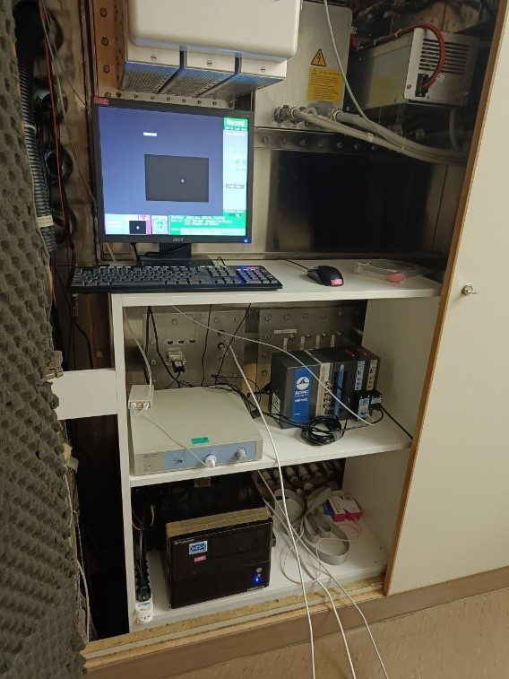
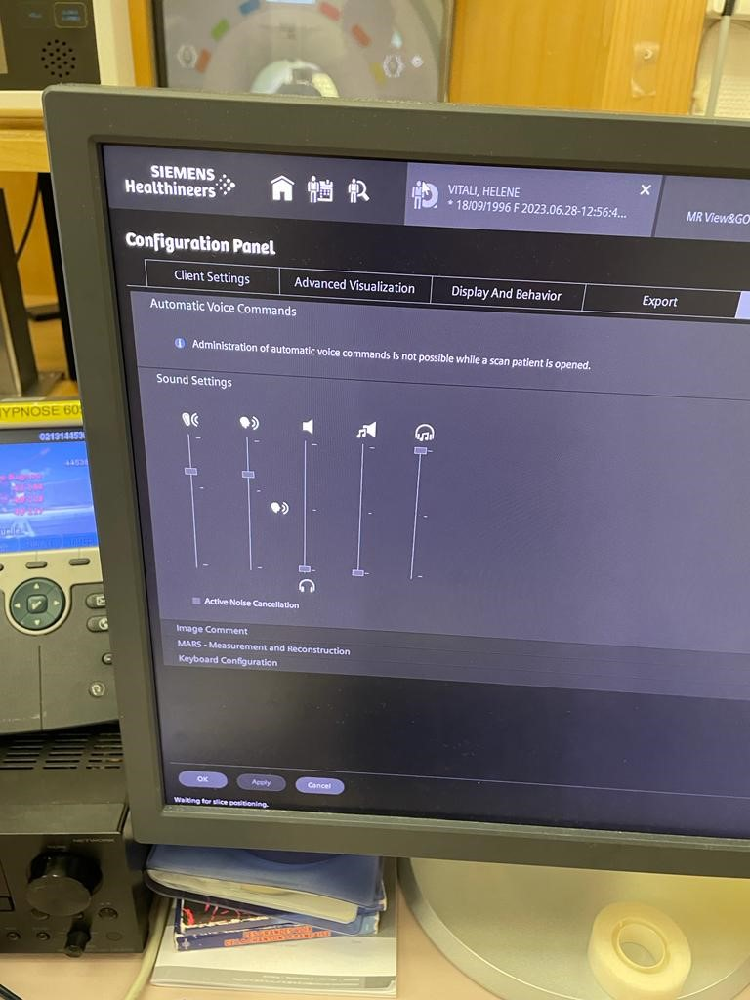
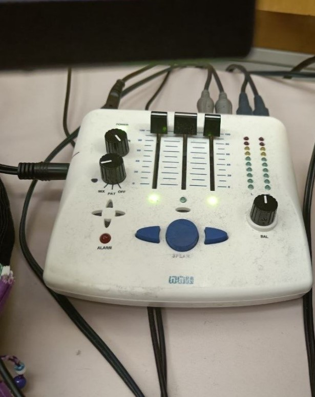

# **Data Collection for Audio fMRI protocol**

## **Overall experimental setting** 

The experimental setup includes:

- [X] **Syncbox:** A NordicLabs Syncbox receives TT (transistor-transistor logic) triggers from the scanner. This box can forward the triggers converted into other formats and/or manipulate them (e.g., filter, generate, etc.).
- [X] **Experimental laptop:** It is the laptop where the Psychopy software is installed and with it the task programs are executed. This laptop also stores the data recorded by the ET at the end of the experiment.

#### **ONE DAY BEFORE SCAN DATE**

- Verify that the Psychopy experiment runs correctly.
- Verify that all the tools necessary for the data collection run correctly.
- Print the informed consent form.
- Print the MRI safety screener (EN|FR).
- Print a receipt form for each participant that will get scanned.

## **Session preparation**
The following section describes how to prepare the session on the day of the scan BEFORE the participant arrives. 
!!! caution "Try to arrive at the Control Room at least 30 min ahead of the session start time."

### **Setup Preparation Inside the Scanner room**
- Memorize where the other tools for the recordings are to put those back in place at the end (coil, emergency button, headphones).

#### **Setting up the projector**
- Before entering the scanner room, go to the room where the projector is installed.
- Switch the projector ON by hitting the power button located on its right side.
- Verify the aim of the projector's beam by looking through the tube into the Scanning Room.
- Verify the projection corresponds to the Psychopy laptop screen.
- Go to the scanner room and take the half-circle one-direction screen from the table behind the scanner and put it on the back of the scanner.    

#### **Setting up cables and headphones**
- Open the door of the cable section between the control room and the scanner room.
- Connect the scanner machine to the sharing system.
- Prepare the headphones to connect to the scanner machine. The type of headphone was choose based on the comfortability for the participant. Here are the two possible models:
{ width=80% }

#### **Setting up the coils**
- If any head coil from the last exam is still plugged, remove it:
  <ul>
    <li>If it is the 64-channel coil, you can just temporarily move it into the scanner's bore.</li>
    <li>Otherwise, store it on the shelf where the other coils are and bring the 64-channel one in the proximity of the bed (e.g., inside the scanner's bore). Make sure to remove other coil's fitting elements.</li>
  </ul>
- Remove the spine coil by lifting the corresponding latch, then sliding it toward the head of the bed, lift it from the bed and place it on the floor ensuring it is not obstructing any passage or unstable.
- Place the two back padding elements filling the spine coil socket.
- Place the 64-channel head-and-neck coil into its socket at the head end of the bed.

#### **Final setting inside the scanning room**
- Cover the MRI bed with a clean sheet.
- Prepare padding: under-knee padding, neck-and-head padding, under-elbows padding, head-sides padding, top-head wedge padding.
  <ul>
    <li>Wrap a sanitary cover around each padding.</li>
    <li>Place a double neck-and-head padding inside the coil, to ensure the eyes are close to the coil's windows.</li>
  </ul>
- Prepare a blanket to cover the participant.

### **Setup Preparation Inside the Control Room**

#### **Setting up experiment instruments**
- Place the experimental laptop on the designed desk and connect all the as showed in the following picture (in this case eyelink ethernet is not necessary). Specifically, connect the experimental laptop to:
  <ul>
    <li>Plug the power adaptor to the laptop, and the adaptor to the power outlet on the wall.</li>
    <li>the screen switch box with the corresponding HDMI cable (This should project your screen on the screen of CHUV's tower).</li>
    <li>the audio switch box with the corresponding jack cable (This should share your audio on the audio of CHUV's tower).</li>
    <li>Connect the SyncBox to the laptop with the USB cable. It is normally plugged into CHUV's stimuli workstation, it must be re-plugged in there after the session.</li>
  </ul>
	

- Switch the laptop on and open the psychopy code.
- Click the switch button to share your PC.
- Switch the SyncBox on using the button on the right side named *power*.
- Change the SyncBox correctly to send the triggers (Corresponding to push the key-button *“S”* from keyboard). Take the SyncBox and go on *“Simulation”* mode.
- Then, change the parameters in the main menu modifying the pulse length at 100ms and the TR time at 650ms. 
- Push the enter button  and the syncbox will be now waiting for the scanner's trigger signal to forward it.  
{ width=63% }

- Open the door of the cable wardrobe between the recording room and the scanner room, and connect the sync box in the following way:  
{ width=40% }
{ width=40% }

## **Setup Preparation at the technician position**
- Change the parameters for the audio system in the *“Scan Application”* section as reported in the following figure at the pc and at the box.  
{ width=40% }
{ width=42.38% }
!!! Danger "Ensure that the volume is sufficiently high so that the participant can clearly hear the sounds."

- Switch audio to the scanner room clicking *“input”* button:
{ width=60% }

## **Participant Preparation**

### **Participant Reception**
- Meet the participant at an easily locatable place (e.g., the reception desk of the Radiology Unit) and show them the way into the control room. Allow sufficient time before the experiment for the preparation.
- Show the participant the scanning room and explain to them how the device is controlled from outside.
- Ask to the participant to fill out the consent form and MRI safety screener, and verbally confirm responses and discuss further doubts, paying attention to frequently forgotten devices and implants, like orthodontia.
- Remind the participant to use the bathroom at this moment if they need.
- Describe the participant how the session will develop and explain clearly the task. Let them interrupt you to ask for clarifications and answer all the questions that may arise.
???+ quote "Script for the session"
      “We are going to acquire two types of images. The first type is anatomical imaging that we use to study the morphology of the brain. The second type is a functional MRI, which we use to understand how the brain activates as a response to stimuli we will present to you. During the whole duration of the exam, please do not create closed loops by crossing your legs or holding your hands together. It is possible that your peripheral nerves get stimulated at some points, so you will feel twitching of muscles, for instance, of your pectorals. Do not panic, it is okay, but if it feels too uncomfortable, please squeeze the alarm button.For the anatomical MRI we just ask you to relax and try to stay as still and comfortable as possible. Like a photographic camera, the largest problem making analyses difficult is motion. As opposed to a photo camera, the imaging of the brain happens very slow so there is a lot of opportunity for involuntary movements (e.g., when you blink or you take a deeper breath) or semi-voluntary (e.g., you need to swallow).
	  During the functional MRI you will hear different sounds in the headphones. The audio stimulation consists of short sounds of objects of everyday life (es for example, the sound of vacuum cleaner, the crying of a child, a guitar song, a bell rings, etc.) or animal noises. The experimental protocol consists of 15s audio stimulation using the above tracks followed by 25s of pauses in which we provided a pink noise. For the entire period of the experiment you should takes the eye open on a fixation point (a red cross) at the center of a gray environment. The experiment has a duration of 40 minutes more and less.
	  
	  *Is everything clear to you? Do you have any questions?”

 
- Offer the participant a box to deposit everything they have in their pockets and all jewelry/hair accessories, and indicate the before to continue, we need to make sure we do not introduce any dangerous object in the magnet room. Therefore, it is important to inform the participant to remove every metallic accessory. 
- Ask to remove shoes at the entrance of the scanning room.

### **Participant preparation in the scanning room**
- Instruct the participant to lay on the MRI bed and adjust the participant inside.
- Put the headphones on the ears.
- Give to the participant the emergency button. Make the participant try it, so they can see it works. To switch off the alarm, there’s a button on the scanner (circular, both on the left and on the right of the hole) 
- Once the previous part is insured, the participant is ready. If the participant is cold, put a blanket on top of him. 
- Connect the coil's cable to the corresponding socket on the table.
- Gently move the participant with the manual regulation. Stop when the head is under the head-localizer. Ask the participant to close the eyes, localize the head with the infrareds.
- Switch off the infrareds, now the participant can open the eyes. You can move the participant (always gently as before) inside the scanner, until the mm counter marks “Isometric”.
- If everything is ok, you can move forward and record.

### **Participant preparation in the scanning room**
- Inform the participant that you are leaving the room and will now close the door to start. Let them also know that you are going to communicate with them very shortly to check that communications through the speaker are functioning.
- Exit the Scanning Room.
- Close the Scanning Room door.

## **Running the Scanning Session**

!!!caution "You MUST know the security procedures in case of problem and keep yourself updated with changes." 

### **Before Initiating the Session: Run the Experiment**

- Double click on the psychopy file of the audio protocol to open it.
- Run the experiment on psychopy clicking the “run experiment” button selected in the red square.   
{width=80%}
- Wait for the sentence *“In this task you will hear different sounds in the headphones. Please keep your eyes on the fixation point. The program is ready for the scanner trigger. Press s to proceed manually.”*
- Then click *“start session”* on the sync box clicking the round button. 
{width=40% }
{width=40% }
- The stimulation will start with the scanning. At the end of the experiment click *“t”* on the experimental laptop and click the round button on the SyncBox to stop the running session.

### **During the Session**
- Check in with the participant.
- Check in that everything is correctly working (sounds are played and heart from the participant, volume is loud enough, triggers correctly works, etc.)

#### **Acquire a Localizer**
- Indicate the participant that the scanning will soon start.
- Wait for the participant confirmation and set the speaker off afterward.
- Launch the AAhead_scout_64ch-head-coil protocol by pressing Continue.
- Once the localizer is concluded, click on the image stack icon with left click and drag the image with a 1 onto the image viewer. That will open the interpolated localizer on the viewer. 
- If the quality looks good, check the box stating Localizer looked ok. If not, re-acquire the localizer.   
{ width=80% }

#### **Acquire a High-Resolution Anatomical Image**

- Run the wip19_mprage_1iso_cs4p2 protocol by pressing Continue.
???+ quote "Anatomical image Acquisition" 
    - While you are still running the MPRAGE sequence open the parameters of the sequence (showed in the figure) and ensure that:  
	{ width=80% }	
    - [X]	under ***Sequence*** in the subsection ***Part1***, the *shot per slice* should be set at 419. This is crucial so that so that the acquisition time is more and less 1 minute.
    - [X]	under ***Routine***, *TR* and *TE* should be set at the minimum value. 
    - [X]	under ***Contrast*** in the subsection ***common***, the *fat-water* should be set as standard and the *flip angle* should be set at 5 degree.
    - [X]	under ***Contrast*** in the subsection ***filter***, click on the three dots and tick the *“unfiltered images”*.
    - [X]	under ***System*** in the subsection ***coils***, select Body the coils HC3, HC5, HC4, HC6, HC7 for BOLD_HC.
    - [X]	under ***System*** in the subsection ***miscellaneous***, put the coil selection as manual.
    - [X]	under ***Physio***, make sure that RECONSTRUCTION is off. 
    - Finally, click copy and go button

#### **Acquire Functional Image**

- Inform the participant that we will start with the fMRI block, therefore the participant will start hearing sounds.
- Run the BEAT_LIBREoff_BOLD_audio_bis protocol by pressing *Continue.

## **Session Completed**
- The exam is over, inform the participant that the session has concluded.
- At the end of the stimulation click “t” on the experimental laptop and click the round button on the SyncBox to stop the running session.
- You can proceed with the tear-down protocol.

## **Session tear-down**

### **Showing the Participant Out**
- Enter the scanner room, and announce yourself to the participant saying that you will get out the participant in few seconds.
- Extract the participant by pressing the extraction button and then gently rolling the central knob. Alternatively, you can just press the Home button.
  <li>Remove the upper side of the head coil:
    <ul>
      <li>Unplug the head coil from the bed connector.</li>
      <li>Lift the lever that releases the upper part of the coil and put it aside (e.g., inside the bore or on a chair next to the scanner).</li>
    </ul>
  </li>
- Assist the participant to the headphones.
- Help the participant sit down.
- Help the participant step down and accompany them out to the control room.
- Help the participant recover their personal belongings and change clothes if necessary.
- Give the participant the corresponding compensation for the participation and transportation.
- Ask the participant to sign the receipt of the amount of the financial compensation.

### **Cleaning up the Scanning Room**
- Remove used blankets and bed-sheets ONE-BY-ONE: extend them to let any forgotten items fall on the floor before you fold it; and dispose of them in the adequate bin (soiled linen bag if they are fabric and trash if they are disposable).
- Dispose of all single-use sanitary protections (padding covers, headphones, etc.).
- Put the pillows back in their designated storage places.
- Remove the head coil and put it in the scanner's bore.
- Remove the back padding elements and put them back in their designated storage.
- Reinstall the spine coil.
- Wipe the bed and the head coil (bottom and upper parts).
- Lock the head coil back with its bottom part without plugging the connectors.
- Put the head coil away with the other head-coils on the shelf next to the scanner.
- Return the bed to its Home position by pressing the  button (more info).
- Exit and close the external door.

!!!danger "Everything that is removed for the experiment needs to be put back in place at the end of the experiment, i.e., position of the bed, coil, emergency button, ears cover."

### **Cleaning up the Control Room**
- Switch off laptop. Plug back the SyncBox and the VGA projector where they were. Make sure you leave it connected exactly as you found it.
- Switch off the projector.

!!!tip "Congratulations you are concluded your data collection and you can go at home and relax yourself!"