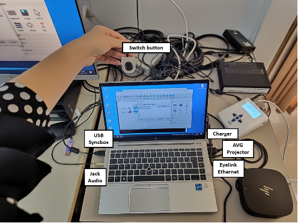
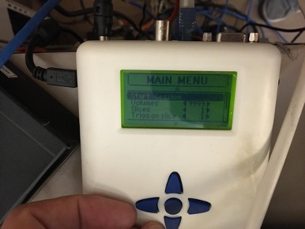

## Data Collection Visual checkerboard fMRI protocol

#### Overall experimental setting

The experimental setup includes:
- Syncbox: A NordicLabs Syncbox receives TTL (transistor-transistor logic) triggers from the scanner. This box can forward the triggers converted into other formats and/or manipulate them (e.g., filter, generate, etc.).
- Eye tracker (ET): We use the EyeLink 1000 Plus (SR Research Ltd., Ottawa, Canada). Our particular variant “Long Range” is composed of three main elements: (i) inside the scanner's bore, we place an arm that holds an infrared lens and camera sensor on one side and an infrared lamp that illuminates the right eye of the subject through (ii) a special mirror to reflect the infrared spectrum; and (iii) a PC tower that receives the camera recordings, post-processes the images, and calculates the final parameters of interest (position of the eye, pupil size, etc.). The ET is also connected to the experimental laptop.
- Experimental laptop: It is the laptop where the Psychopy software is installed and with it the task programs are executed. This laptop also stores the data recorded by the ET at the end of the experiment.

#### Three - One day before the session
- To verify that all Psychopy experiments run correctly.
- To verify that all the tools necessary for the data collection run correctly → check that the eyelink machine is correctly working.

???+ quote "Configuration"
     If you connect the eye tracker to the experimental laptop for the first time, you need to configure it.
	- Go to the experimental laptop.
	- Double click on the ethernet connection inside the control panel.
	  
	  
	- Change the IP address → double click on the internet protocol version and change IP address with IP 100.1.1.2 and sub with 255.255.255.0.

- Print the informed consent form.
- Print the MRI safety screener (EN|FR).
- Print a receipt form for each participant that will get scanned.

#### Session preparation
The following section describes how to prepare the session on the day of the scan BEFORE the participant arrives. Try to arrive at the Control Room at least 30 min ahead of the session start time.

##### Setup Preparation Inside the Scanner room
- Memorize where the other tools for the recordings are to put those back in place at the end (coil, emergency button, ears cover).

###### Setting up the projector
- Before entering the scanner room, go to the room where the projector is installed.
- Switch the projector ON by hitting the power button located on its right side.
- Verify the aim of the projector's beam by looking through the tube into the Scanning Room.
- Verify the projection corresponds to the Psychopy laptop screen.
- Before exiting the projector room, grab the plexiglass panel where the ET arm will be placed inside the scanner.
- Take the panel to the Control Room.
- Go to the scanner room and take the half-circle one-direction screen from the table behind the scanner and put it on the back of the scanner.

###### Setting up the eye-tracker
- Check out Eye Tracker set-up guidelines (ET_setup_3T_EyeLink_1000Plus).
- After accurately preparing the ET arm following the ET_setup_3T_EyeLink_1000Plus, bring the plexiglass panel inside the scanning room and place it at the end of the scanner's bore. A sign indicates the top side that MUST face up. The plastic feet must face down to avoid the panel from sliding. To ensure the repeatable positioning of the ET, place the end of the plexiglass such that its edge aligns with the edge of the illuminated MRI rails.
- Exit the Scanning Room and fetch the ET arm.
- Enter the Scanning Room and place the ET arm on top of the plexiglass panel with the two posterior feet of the ET arm aligned within the two corner markers made of scotch tape.
!!! danger "Hold the ET arm FIRMLY because the magnetic field imposes some resistance"

- Unroll and connect the cables (two plugs for the black, one plug for the orange).

- Take the half-circle one-direction screen from the table behind the scanner and put it on the back of the scanner behind the ET system (don't push the plexiglass yet).

###### Setting up the coils
- If any head coil from the last exam is still plugged, remove it:
  - If it is the 64-channel coil, you can just temporarily move it into the scanner's bore.
  - Otherwise, store it on the shelf where the other coils are and bring the 64-channel one in the proximity of the bed (e.g., inside the scanner's bore). Make sure to remove other coil's fitting elements.
- Remove the spine coil by lifting the corresponding latch, then sliding it toward the head of the bed, lift it from the bed and place it on the floor ensuring it is not obstructing any passage or unstable.
- Place the two back padding elements filling the spine coil socket.
- Place the 64-channel head-and-neck coil into its socket at the head end of the bed.
- Attach the dedicated infrared mirror to the coil (see ET_setup_3T_EyeLink_1000Plus):
  - Exit the Scanning Room.
  - Fit in a pair of new latex gloves.
  - Extract the dedicated infrared mirror from the ET box CAREFULLY.
  - Remove the mirror protection EXTRA-CAREFULLY.
  - Take the mirror, enter the Scanning Room and lock the mirror onto the frame of the head-coil.

###### Final setting inside the scanning room
- Cover the MRI bed with a clean sheet.
- Prepare padding: under-knee padding, neck-and-head padding, under-elbows padding, head-sides padding, top-head wedge padding.
- Wrap a sanitary cover around each ear cover.
- Wrap a sanitary cover around the emergency button.

##### Setup Preparation Inside the Control Room

###### Setting up experiment instruments
- Arrive to the Control Room at least 30 min ahead the session start time.
- Place the experimental laptop on the designed desk and connect all the as showed in the following picture (without eyelink ethernet). Specifically, connect the experimental laptop to:
  - Plug the power adaptor to the laptop, and the adaptor to the power outlet on the wall.
  - the screen switch box with the corresponding HDMI cable ( This should project your screen on the screen of CHUV's tower).
  - the RJ-45/Ethernet cable from the ET computer into the RJ-45 socket of the experimental laptop.
  - Connect the SyncBox to the laptop with the USB cable. It is normally plugged into CHUV's stimuli workstation, it must be re-plugged in there after the session.
  
  
- Switch the laptop on and open the psychopy code.
- Click the switch button to share your PC.
- Switch the SyncBox on using the button on the right side.
- Change the SyncBox correctly to send the triggers (Corresponding to push the key-button “S” from keyboard). Take the SyncBox and go on “Simulation” mode.
- Then, change the parameters in the main menu modifying the pulse length at 100ms and the TR time at 650ms. 
- Push the enter button  and the syncbox will be now waiting for the scanner's trigger signal to forward it.

- Open the door of the cable wardrobe between the recording room and the scanner room, and connect the sync box in the following way:

- Switch on the ET’s PC using the power-om button at the front
- Select "Eyelink" when given the option of which operating system to launch.
- Verify the IP address assigned to the Ethernet interface of the experimental laptop is correct:
  - Check the output of the following command and verify that IP/mask is 100.1.1.2/24, and the protocol is IP version 4.
  - Check whether the link is properly established. 
 
  
#### When the Participant Arrives
- Greet the participant and make them comfortable.
- Briefly explain the session's procedure and address any questions they may have.
- Describe the participant how the session will develop and explain clearly the task. Let them interrupt you to ask for clarifications and answer all the questions that may arise.
???+ quote "Script for the session"
      “We are going to acquire two types of images. The first type is anatomical imaging that we use to study the morphology of the brain. The second type is a functional MRI, which we use to understand how the brain activates as a response to stimuli we will present to you. During the whole duration of the exam, please do not create closed loops by crossing your legs or holding your hands together. It is possible that your peripheral nerves get stimulated at some points, so you will feel twitching of muscles, for instance, of your pectorals. Do not panic, it is okay, but if it feels too uncomfortable, please squeeze the alarm button.During the functional MRI you will see a point at the center of the screen that will change the colors. For the entire period of the experiment you should takes the eye open on this fixation point at the center of a gray environment. The experiment has a duration of 30 minutes more and less. Before to start with scanning we will need to calibrate the eyetracker, therefore we will ask you to fix different points on the screen.

      Is everything clear to you? Do you have any questions?”

 
- Have the participant fill out the MRI safety screener and sign the informed consent form.
- Conduct the pregnancy test for female participants, if applicable.
- Escort the participant to the scanner room.

##### Inside the Scanner Room
- Assist the participant in lying down on the MRI bed.
- Provide the participant with earplugs and place the padded ear covers on them.
- Position the head-and-neck coil over the participant's head.
- Place the emergency button in the participant's hand and explain its use.
- Adjust the padding to ensure the participant is comfortable and secure.

##### Final preparation
- Inform the participant that you are leaving the room and will shortly come back for a final preparation.
- Proceed with the ET positioning (see ET_setup_3T_EyeLink_1000Plus) and calibration.

???+ quote "ET Calibration"
    - Open psychopy in the experimental laptop.If you connect the eye tracker to the experimental laptop for the first time, you need to configure it.
	- Double click on the psychopy file of the rs protocol to open it.
	- Run the experiment on psychopy clicking the “run experiment” button. IMPORTANT: make sure that once the experiment start after the calibration, the data are being stored to the xx.EDF file. There should be a message about that displayed at the ET’s PC screen.
	- Once the stimulation begins, you follow the messages on the screen to run the calibration (make sure the 5 points calibration has been selected).
	- ET PC – apply threshold (left upper corner, as on the left figure), make sure that the pupil was found, and you see the blue cross on the eye. In case of troubles – check if there is enough light inside the scanner and not too much, check the position of the participant inside the coil. Once the calibration starts accept calibration points when green (Accept fixation).
	  
	  
	  
	- If the calibration was successful, you will see the sentence ‘calibration successful’ at the bottom in green. Check the stability of the accepted points and overall score o the calibration.
	- Follow up with the validation. What you should see in an ideal situation is: the reference dot on the center of the screen and another dot, which correspond to the pupil calibration, that it is more and less stable moving a little around the reference dot. If the calibration dot is unstable and is moving around far from the reference dot the experimenter should go back clicking the restart button, adjust the contrast and redo the calibration. Once the calibration dot is quite stable proceed with the validation clicking the accept fixation. 

- Inform the participant that you are leaving the room and will now close the door to start. Let them also know that you are going to communicate with them very shortly to check that communications through the speaker are functioning.
- Exit the Scanning Room.
- Close the Scanning Room door.

##### Running the Experiment
- Exit the scanner room and go to the control room.
- Start the ET system and ensure it is tracking the participant's eye movements correctly.
- Begin the Psychopy task program and monitor the participant's responses.
- Throughout the session, keep in communication with the participant to ensure they are comfortable.

#### Before initiating the session: Run the experiment

- Double click on the psychopy file of the audio protocol to open it.
- Run the experiment on psychopy clicking the “run experiment” button selected in the red square. 

- Wait for the sentence “In this task you will hear different sounds in the headphones. Please keep your eyes on the fixation point. The program is ready for the scanner trigger. Press s to proceed manually.”
- Then click “start session” on the sync box clicking the round button. 

- The stimulation will start with the scanning. At the end of the experiment click “t” on the experimental laptop and click the round button on the SyncBox to stop the running session.

##### Post-Session Procedures
- Once the session is complete, stop the task program and save all data.
- Assist the participant in getting up from the MRI bed.
- Escort the participant back to the waiting area and provide them with any necessary post-session instructions.
- Clean and sanitize all equipment and surfaces in the scanner room.
- Store the ET arm and other equipment in their designated places.