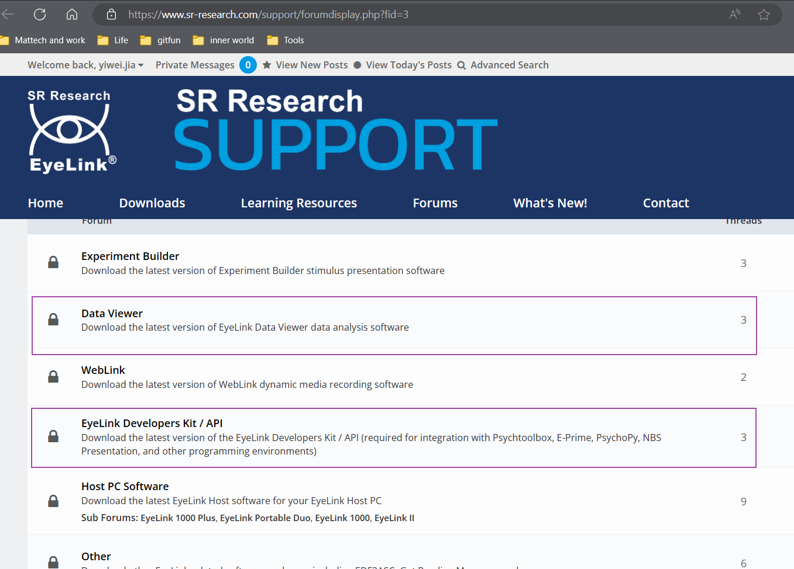
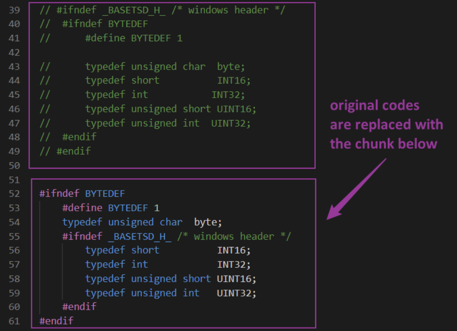

## 1 EyeLink Installation

  - The EyeLink MUST be installed before PyEDFRead and Pychopy.
  - Register a new account for downloading the EyeLink Developers Kits. [Link for installation](https://www.sr-research.com/support/forumdisplay.php?fid=3).
  - The activation of the new account might take up for 24 hours.
  - Install the EyeLink Developer Kit and EyeLink Data Viewer following the instructions.
  {: style="width: 80%;display: block; margin: 0 auto;"}

## 2 Additional Steps
### 2.1 For Windows Platform 
- Ensure you have installed the Microsoft C++ Build Tools.
  - You can download them from the [Visual Studio website](https://visualstudio.microsoft.com/zh-hans/visual-cpp-build-tools/).
  - Make sure to select the "Desktop development with C++" workload during the installation.
  - Properly set up the environment variable:
      - For example on Windows system
    ``` bash
    D:\Program Files (x86)\Microsoft Visual Studio\2022\BuildTools\VC\Tools\MSVC\14.40.33807\bin\Hostx64\x64
    D:\Program Files (x86)\Microsoft Visual Studio\2022\BuildTools\VC\Tools\MSVC\14.40.33807\include
    ```
- Modify the files in the directory of EyeLink for supporting Windows
  - Edit edftypes.h in the dir: C:\Program Files (x86)\SR Research\EyeLink\Includes\eyelink
  {: style="width: 80%;display: block; margin: 0 auto;"}


### 2.2 For Mac Platform

Install the EyeLink Developer Kit and EyeLink Data Viewer following the instructions on the website.

### 2.3 For Linux Platform
<!-- [Link to HCPH](https://www.axonlab.org/hcph-sops/data-collection/notes-software/)
- Ensure your Ubuntu system has all necessary dependencies:
    ```bash
    sudo apt install python3-dev \
                    libgtk-4-dev \
                    libgstreamer1.0-dev \
                    libgstreamer-plugins-base1.0-dev \
                    freeglut3-dev \
                    libwebkitgtk-6.0-dev \
                    libjpeg8-dev \
                    libpng-dev \
                    libtiff-dev \
                    libsdl1.2-dev \
                    libnotify-dev \
                    libsm-dev
    ```
- Create a Python virtual environment
- Load the new virtual environment -->
This part is derived from[ HCPH SOP](https://www.axonlab.org/hcph-sops/data-collection/setup/#installing-eyelink-eye-tracker-software). Since we did not work on eye tracking data with Linux system, we refer to the HCPH SOP for completeness.

- Enable Canonical's universe repository with the following command:
  ```bash
  sudo add-apt-repository universe
  sudo apt update
  ```
- Install and update the ca-certificates package:
  ```bash
  sudo apt update
  sudo apt install ca-certificates
  ```
- Add the SR Research Software Repository signing key:
  ```bash
  curl -sS https://apt.sr-research.com/SRResearch_key | gpg --dearmor | sudo tee /etc/apt/trusted.gpg.d/sr-research.gpg
  ```
- Add the SR Research Software Repository as an Aptitude source:
    ```bash
    sudo apt install eyelink-display-software
    ``` 
- Install the EyeLink Data Viewer:
  ```
  sudo apt install eyelink-dataviewer
  ```
## 3 Virtual Environment Preparation 
- Prepare conda virtual env, with python version above 3.7. Some unexpected issues will occur if the python version=3.6 or below.
    ```bash
    $ conda create -n edfenv python=3.8
    $ conda activate edfenv
    $ pip install cython
    $ pip install pandas
    $ pip install h5py
    ```

  
- Install pyedfread from the original repo:
  ```bash
  $ pip install git+https://github.com/s-ccs/pyedfread
  ```