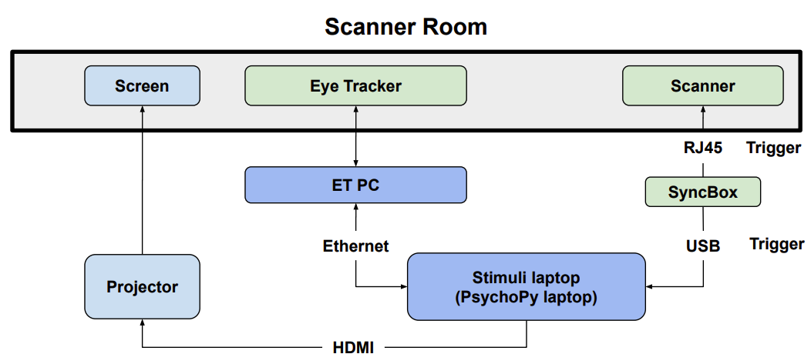

# Overall experimental setting

The experimental setting is to obtain anatomical MRI scan with synchronized eye tracking recording (the right eye gaze trajectories and eye movement events including blinking, saccades and fixation).

Here is the illustration of the overall experiment:

{: style="width: 100%;display: block; margin: 0 auto;"}

The graph above can be divided into the following components:

- SyncBox: A NordicLabs SyncBox sends TTL (transistor-transistor logic) triggers to the scanner and forward the signal converted to the keyboard signal "s" to the PsychoPy laptop.

- Scanner: 3T clinical scanner (MAGNETOM PrismaFit, Siemens Healthineers) with a 64-channel head-neck coil with an attached mirror.
- Eye tracker: We use the EyeLink 1000 Plus (SR Research Ltd.) for eye tracking.
  (i) The eye tracker consists of an infrared lens and camera sensor on one side, along with an infrared lamp to illuminate the subject's right eye. It is positioned inside the scanner bore.
  (ii) An infrared mirror is mounted on the head coil.
- The Eye Tracker PC is bi-directionally connected to both the eye tracker and the PsychoPy laptop. It receives eye tracking data from the tracker, processes the eye movement trajectories and images, calculates pupil sizes by segmenting the pupil area, and classifies eye movement events based on predefined thresholds. The ET PC also receives trigger and task event messages from the PsychoPy laptop, logs data, and sends both the eye tracking data and logs back to the PsychoPy laptop.
- Stimuli laptop (PsychoPy Laptop): The PsychoPy laptop runs the PsychoPy software, which is used to execute the task programs. These programs coordinate various hardware components, including the ET PC, eye tracker, the screen, and SyncBox. In our DEBI experiment, the 'MR-Eye' protocol displays a central dot that changes color at a frequency of 10Hz. In the 'MREye-Track' protocol, a gray dot sequentially appears at the top, bottom, left, and right sides of the screen. The laptop also stores the data and logs generated by the Eye Tracker PC after the experiment.