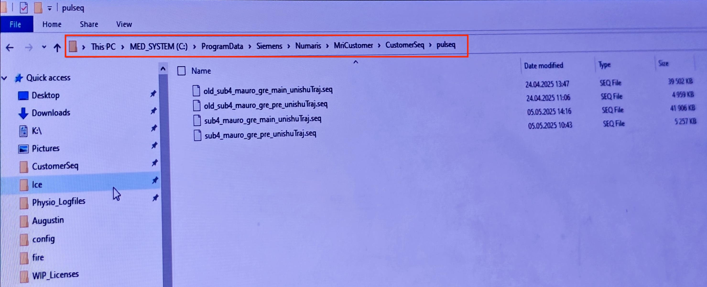
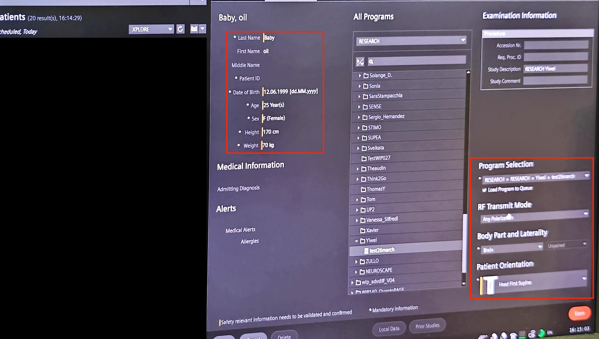
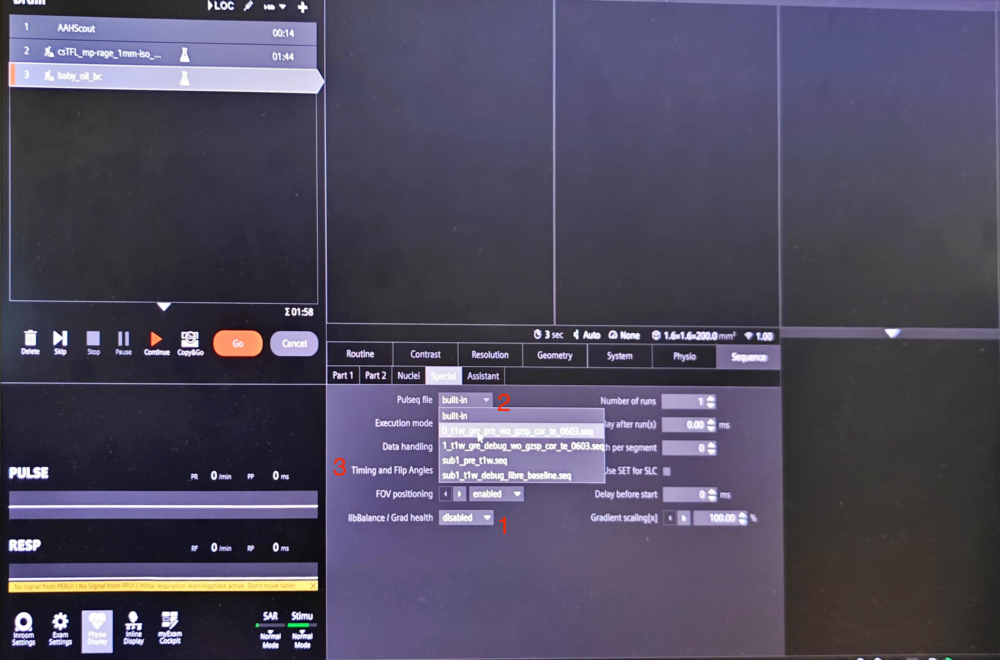
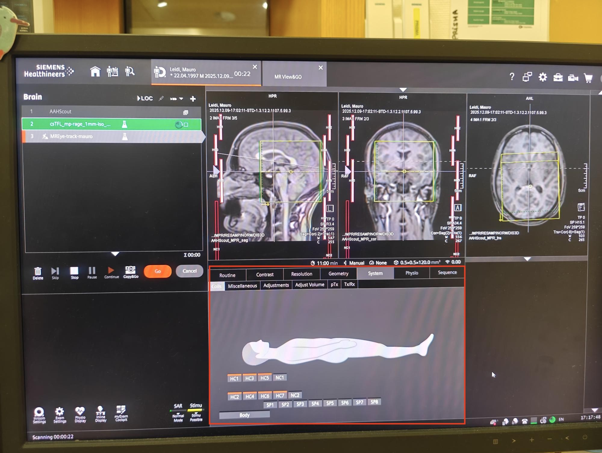
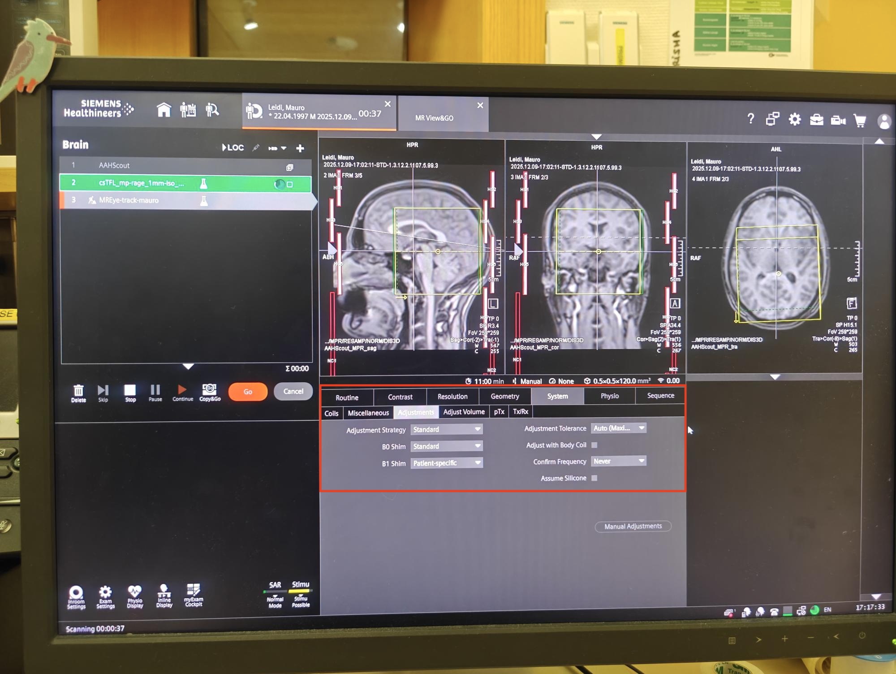
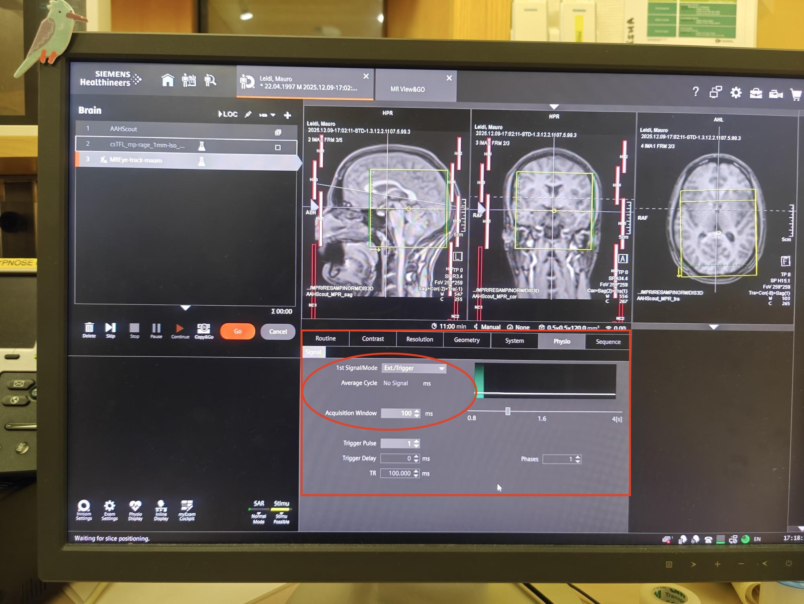
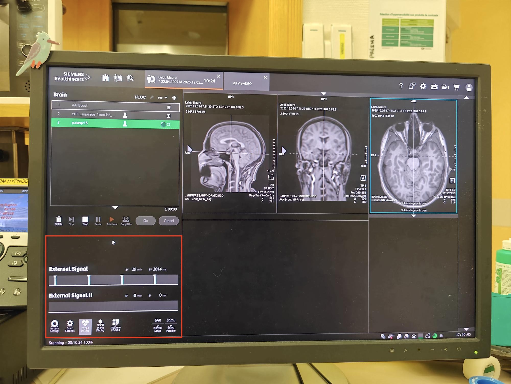
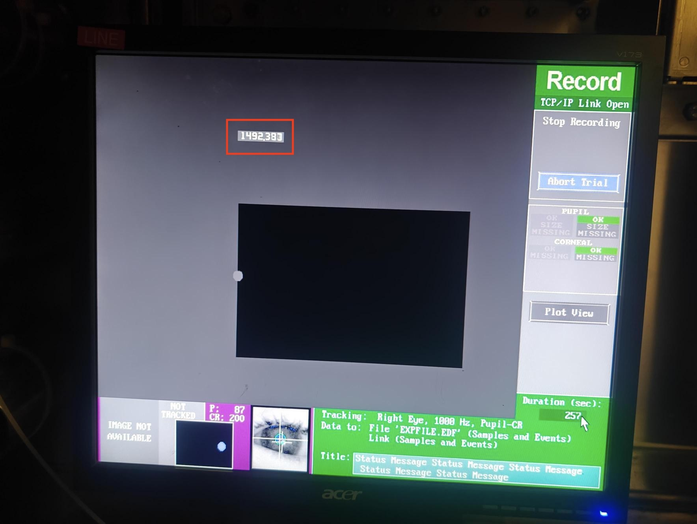
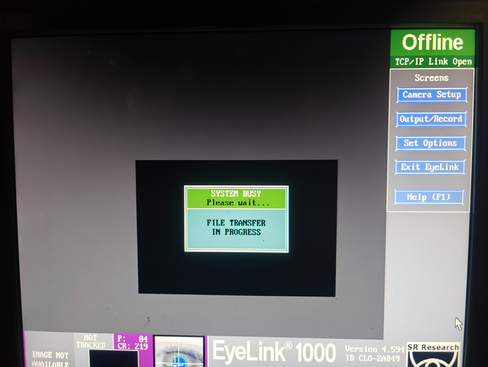

## Prepare the visual stimulation experiment

!!!info "Click [here](https://github.com/Evelyn92/MREye_psychopy/blob/main/ver25/fixation_dots_T1weighted_250127_last_run.py) to check out the psychopy code for the [2.0 MR-Eye study](https://data.snf.ch/grants/grant/220433), and [here](https://github.com/MattechLab/MR-EyeTrack/blob/dev/visual_stimuli/fixed_dot-16_grid_T1w.py) for the [MR-Eye Track study](https://hee-projets.heig-vd.ch/en/projects/183/MREye-Track)"

- At the end of the ET calibration we are ready to continue with the experiment.
- Wait for the sentence regarding the initial description of the task: “In this task you will see...”
- Now, get ready to prepare the scanning sequence (next step).

## Prepare the scanning sequence

### Copy the Pulseq (.seq) files

If you are using Pulseq to develop your own sequences, the first thing you'd need to do is to copy your .seq files into the corresponding Siemens folder for Pulseq, in C:\ProgramData\Siemens\Numaris\MriCustomer\CustomerSeq\pulseq, as shown in the picture below.

{: style="width: 80%;display: block; margin: 0 auto;"}

You can refer to [our Github repository](https://github.com/MattechLab/pulseq4mreye) to check more about code and documentation of the pulseq sequences we used for the protocol.

### Add a new patient

First, register a new patient, completing the **last name**, the **name**, the **patient ID** (you can press the Tab bar and the field will be automatically filled by the current timestamp), **date of birth**, age (automatic after entering the date of birth), **sex**, **height** and **weight**. On the right of the UI, open the Program Selection window to choose your protocol. If you don't have one yet, it is recommended to create one, so every time you scan a new subject, you don't have to drag and drop all the sequences, they will already be there! Select "**Any Polarization**" as RF Transmit Mode. Select "**Brain**" as Body Part and Laterality. Select "**Head First Supine**" as Patient Orientation. You're good to go!

{: style="width: 80%;display: block; margin: 0 auto;"}

The protocol includes several sequences. In DEBI protocol's case, a head-scout, a high-resolution anatomical image (MP-RAGE), and other sequences depending on the project: T1w-LIBRE for MR-Eye Track and T1w-LIBRE, T1w-VIBE, T2w-LIBRE, and T2w-TSE for 2.0 MR-Eye.

### Load the Pulseq (.seq) files

Once you have run the scout and the MP-RAGE, and you have positioned the FOV accordingly (check the video recording below), load the .seq file by going to Sequence > Special.

- [ ] Change "libBalance / Grad health" to "disabled"

!!! warning "Disable the "libBalance / Grad health" before loading the sequence. Otherwise, the UI might freeze..."

- [ ] Select your sequence from the Pulseq file list
- [ ] Change "Timing and Flip Angles" to "strict"
- [ ] Leave the rest of the parameters untouched
- [ ] Adjust the FOV and Shimming box (check the video recording below)

{: style="width: 80%;display: block; margin: 0 auto;"}

### Modify some system parameters

- Go to System > Coils and modify the following:

    - [ ] Select HC1 to HC7 (all of them, in the video recording it is only shown HC3 to HC7, when the video was recorded)
    
{: style="width: 80%;display: block; margin: 0 auto;"}

- Go to System > Miscellaneous and modify the following:

    - [ ] Coil selection: Manual
    - [ ] Coil combination: Sum of Squares

- Go to System > Adjustments to:

    - [ ] Adjustment strategy: Standard
    - [ ] B0 Shim: Standard
    - [ ] B1 Shim: Patient-specific
    - [ ] Adjustment Tolerance: Auto
    - [ ] Disable "Adjust with Body Coil" (this is only to acquire prescans)

{: style="width: 80%;display: block; margin: 0 auto;"}

### Send the trigger to both the scanner and the stimuli laptop

In IDEA UI, go to Physio, and select EXT Trigger.

{: style="width: 80%;display: block; margin: 0 auto;"}

Then, when the scan is launched through the Syncbox, you should see something like the following screenshot (make sure you have activated the Physio display with External Signal I):

{: style="width: 80%; display: block; margin: 0 auto;"}

If the trigger worked, you should see that both the visual stimulation and the scanning have started. Also, on the ET's PC, you should see a screen like this one, where the number in the red textbox indicates the samples being recorded:

{: style="width: 80%; display: block; margin: 0 auto;"}

### Video recording of the whole process

 <wistia-player media-id="6eod5wljf4"></wistia-player>

Your browser does not support the video? Click [here](https://github.com/MattechLab/sops/blob/dev/docs/assets/debi_protocol/selected/scan_eva.mp4) to download it.

### How to acquire prescans

You can refer to this link documentation of monalisa reconstruction where we explained with a video recording how to do acquire the prescans:
[Prescan Acquisition Guide](https://mattechlab.github.io/monalisa/2-6_prescan_acquisition.html). Remember to enable "Adjust with Body Coil" in System > Adjustments (only for prescans).

!!! warning "When copying parameters from one sequence to another (HC to BC), make sure that the correct coils are selected!! E.g. If you copied the parameters (Copy Parameters + Adjustment Volume) from HC to BC, the coils selected for the BC scan are the ones from the HC, so you would need to manually select Body in System > Coils"

## Session Completed

- At the end of the stimulation, click “t” on the experimental laptop and click the round button on the SyncBox to stop the running session.

!!! warning "By pressing 't', the EDF data is being transferred from the ET PC to the laptop. Don't disconnect the ethernet cable before doing this!!"

{: style="width: 80%;display: block; margin: 0 auto;"}

- The exam is over, inform the participant that the session has concluded.
- You can proceed with the tear-down protocol.
