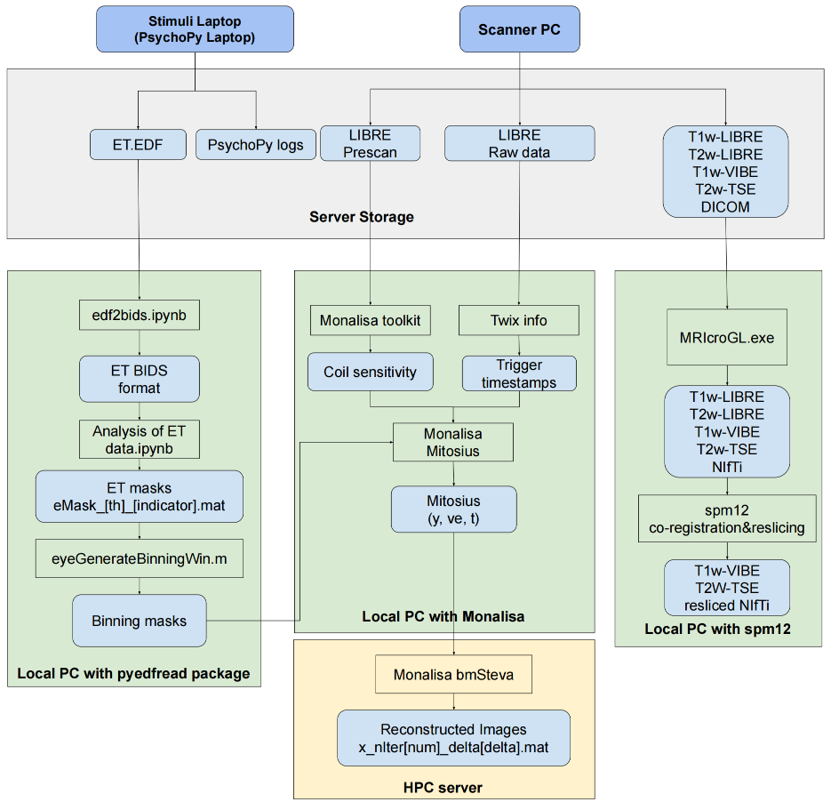

The data workflow can be divided into two parts: (figure is editing)
<!-- https://docs.google.com/drawings/d/1J4RUVk647YXuAsq7B-6wf6nKiEy5rKnjl5h4MKooOrw/edit -->
{: style="width: 100%;display: block; margin: 0 auto;"}

- MRI data. The raw MRI data should be first stored on the HES-SO server. 
    - We recommend to convert the raw MRI data to BIDS. Since from there, the BIDS compliant data can be quality controlled and pre-processed using the corresponding packages (e.g. MRIQC, fMRIPrep, dMRIPrep) to allow computation of analysis-grade derivatives (e.g. functional or structural connectivity). 
  
- Eye tracking data. The eye tracking data is automatically generated and store in the PsychoPy laptop. We should store the edf data in the folder of the MRI dataset.

- Twix physio data. If we need to extract the physio information from the raw data, we should also store the physio data in the subfolder `Twix` inside the dataset folder.
  
- Example folder structure should be followed as below:

```
MR-Eye/
    ├── code/
    │   ├── git_repo_specific_for_this_project/
    │   │   ├── README.md  # Add a detailed description of the repository here
    │   │   ├── [Your code files for this specific project go here]
    │   │   └── .gitignore  # Include entries to exclude commonly-used packages like Monalisa
    │
    ├── data/
    │   ├── update_protocol_description.md
    │   ├── subject_table.xlsx
    │   ├── final_fixed_protocol.md
    │   ├── pilot_/
    │   │   ├── year-month-date/
    │   │   │   ├── subject00x/
    │   │   │   │   └── [Relevant pilot subject data files]
    │   │   └── [Additional subjects as needed]
    │   ├── final_protocol/
    │   │   ├── subject001/
    │   │   │   ├── mri/
    │   │   │   │   ├── dicom/
    │   │   │   │   ├── raw_data/
    │   │   │   │   ├── ISMRMD/
    │   │   │   │   └── bids/  # (TBD: Decide on the structure)
    │   │   │   ├── physio/
    │   │   │   └── others/
    │   │   └── [Additional subjects as needed]
    │
    ├── output/
    │   └── [Generated output files go here]
    │
    ├── .gitignore  # Add patterns to exclude unnecessary files globally, like logs or temp files
    └── README.md  # Main project description with an overview, usage, and other details.

```