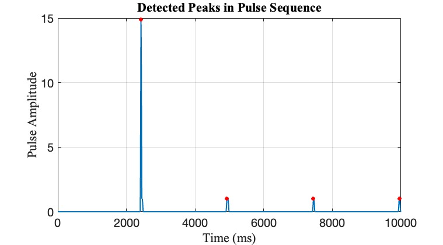

# Physiological Signal Extraction

To synchronize the scanner with the eye-tracking (ET) recordings, we use the SyncBox (NordicNeuroLab) to simultaneously send triggers to both the ET system and the MR scanner. The scanner records the timestamps in the physiological signal channel as part of the raw data, while the ET system begins recording upon receiving the first trigger.

To ensure proper synchronization, we first start the scanner acquisition, then activate the SyncBox, which converts the signal into a keyboard input (“s”) to initiate the ET system via the PsychoPy laptop.

We extract the physiological signal using modified [mapVBVD](https://github.com/jaimebarran/mapVBVD) and identify the timestamp of the first trigger with an exclusive script [physio signal extraction](https://github.com/jaimebarran/mapVBVD/blob/fix/free-running/twix_process_yj/S1_resolve_twix_ext.m), marking the exact moment when the ET system starts recording, as shown in the figure below. 

{: style="width: 50%;display: block; margin: 0 auto;"}

This method allows us to align the timestamps of the ET system and MR readouts, ensuring accurate synchronization in millisecond.

