# Data Collection flexyphy protocol

??? thanks "Thanks to Jaime Barranco, this protocol is highly inspired by DEBI's protocol"

## About this project

This page contains a complete description of the data collection process for the flexyphy project.
The acquisition of N=20 subjects were / will be collected in compliance with the ethical protocol VD 2023-02197 kick fMRI project (Ki-Ck fMRI – IRM fonctionnelle avec correction de mouvements).
The goal of this project is to acquire data to demonstrate the superiority of a redesigned 3D radial phyllotaxis spiral, that is suitable for collecting resting state data, requiring sequential binning of data. This project consequentally improves the 3D radial phyllotaxis spiral for non-sequential binning (uniform phyllotaxis). 

## Overall experimental setting

The goal of this setting is to compare several trajectories (3 trajectories: the standard phyllotaxis, uniform phillotaxis, and flexiphy) on two different acquisition sequences associated to two different visual tasks: a GRE sequence with central fixation task and a LIBRE sequence with a moving dot task.

The goal is to obtain anatomical T1w MRI scan with synchronized eye tracking recording (the right eye gaze trajectories and eye movement events including blinking, saccades and fixation).

Here is the illustration of the overall experiment:

{: style="width: 100%;display: block; margin: 0 auto;"}

The graph above can be divided into the following components:

- SyncBox: A NordicLabs SyncBox sends TTL (transistor-transistor logic) triggers to the scanner and forward the signal converted to the keyboard signal "s" to the PsychoPy laptop.

- Scanner: 3T clinical scanner (MAGNETOM PrismaFit, Siemens Healthineers) with a 64-channel head-neck coil with an attached infrared mirror.
- Eye tracker: We use the EyeLink 1000 Plus (SR Research Ltd.) for eye tracking.
  (i) The eye tracker consists of an infrared lens and camera sensor on one side, along with an infrared lamp to illuminate the subject's right eye. It is positioned inside the scanner bore.
  (ii) An infrared mirror is mounted on the head coil.
- The Eye Tracker PC is bi-directionally connected to both the eye tracker and the PsychoPy laptop. It receives eye tracking data from the tracker, processes the eye movement trajectories and images, calculates pupil sizes by segmenting the pupil area, and classifies eye movement events based on predefined thresholds. The ET PC also receives trigger and task event messages from the PsychoPy laptop, logs data, and sends both the eye tracking data and logs back to the PsychoPy laptop.
- Stimuli laptop (PsychoPy Laptop): The PsychoPy laptop runs the PsychoPy software, which is used to execute the task programs. These programs coordinate various hardware components, including the ET PC, eye tracker, the screen, and SyncBox. In our flexiphy experiment, two different protocols displays 1) a central fixation shape and 2) a moving dot (along 4 horizontal locations) to induce a smooth pursuit eye movement.

## Session Preparation

### Documentation

- [ ] Prepare the informed consent form ([FR](../../assets/files/informed_consent/flexyphy/adults-formulaire-d-information-et-consentement-kick-fmri.pdf))
- [ ] Prepare an MRI safety screener ([EN](../../assets/files/mri_safety/safety_form-en.pdf)|[FR](../../assets/files/mri_safety/safety_form-fr.pdf))
- [ ] Prepare a pen and a receipt form that the participant will sign to receive the compensation

### Configure the IP address

If you are connecting your PC to the eye tracker (ET) for the first time, you need to reconfigure the IP address.
On windows:

- Go to `Control Panel` -> `Network and Internet` -> `Network Connections`
- Double-click on the `Ethernet` connection.
- Select `Internet Protocol Version 4 (TCP/IPv4)` and click `Properties`.
- Update the IP address to `100.1.1.2` and the subnet mask `255.255.255.0`.

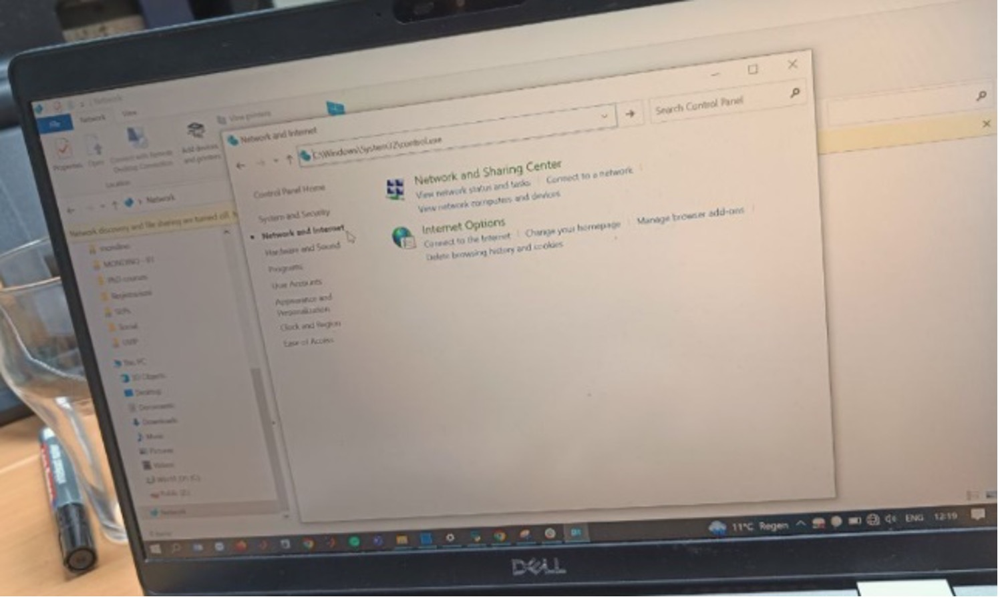{: style="width: 80%;display: block; margin: 0 auto;"}
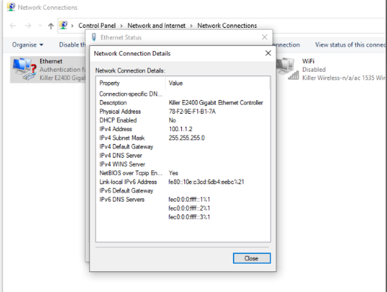{: style="width: 80%;display: block; margin: 0 auto;"}

### Prepare Equipment Outside the Scanner Room

#### Turn on the projector

!!! important "If someone is already scanning, ask first if you can switch the projector on already"

Turn on the Sony projector located in the back room of the scanner room.
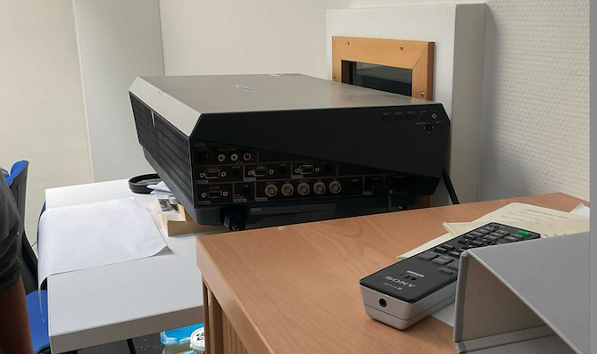{: style="width: 80%;display: block; margin: 0 auto;"}

Ensure the projector beam is directed into the scanner room.

#### Set up the Psychopy laptop on the table

- Take the psychopy PC from JB's office.
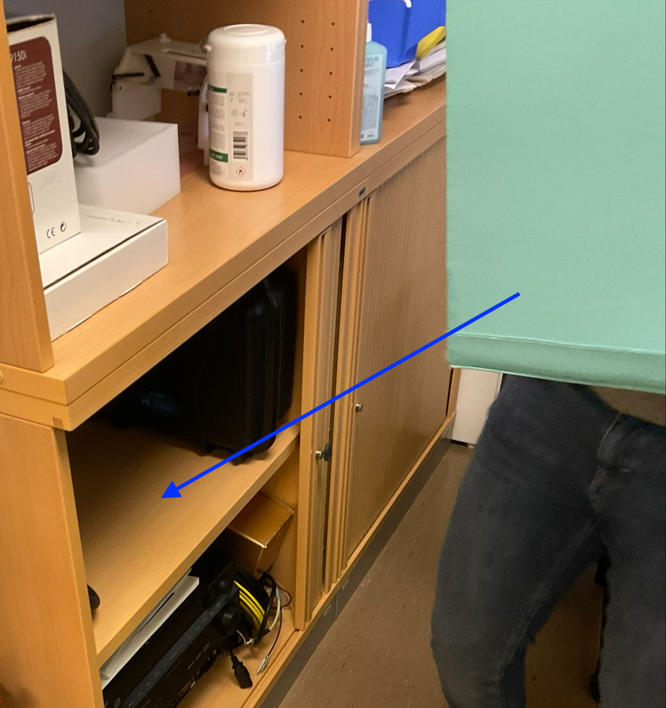{: style="width: 80%;display: block; margin: 0 auto;"}

- Insert the HDMI into the Psychopy laptop to monitor the visual stimuli on the fixed computer screen. The hdmi should be from the 3-cable bundle (which connects PC, projector and the Psychopy laptop).
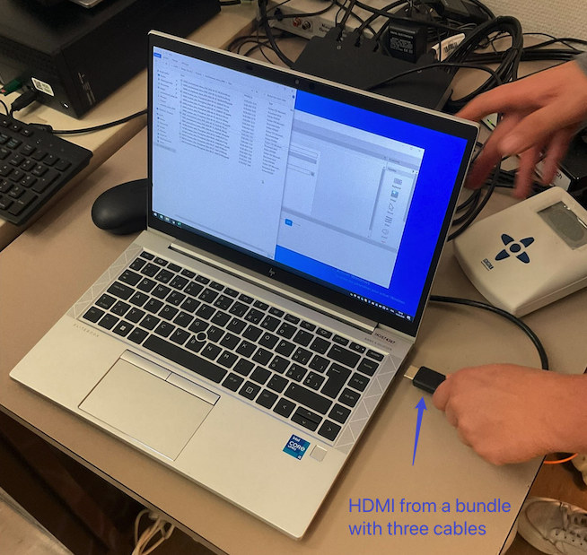{: style="width: 80%;display: block; margin: 0 auto;"}

- If the monitor does not automatically switch the screen source, use the button below to manually change it.
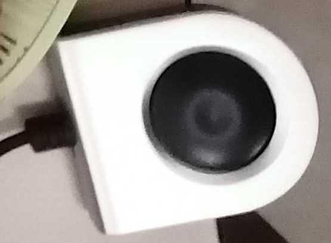{: style="width: 80%;display: block; margin: 0 auto;"}

- Change the resolution of the screen of the laptop to 800x600 to ensure the whole screen is projected to the participant inside the scanner.

- Ensure that the PC beneath the monitor remains turned on.
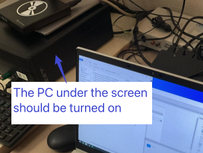{: style="width: 80%;display: block; margin: 0 auto;"}

- Connect the USB cable from the SyncBox to the PsychoPy laptop.
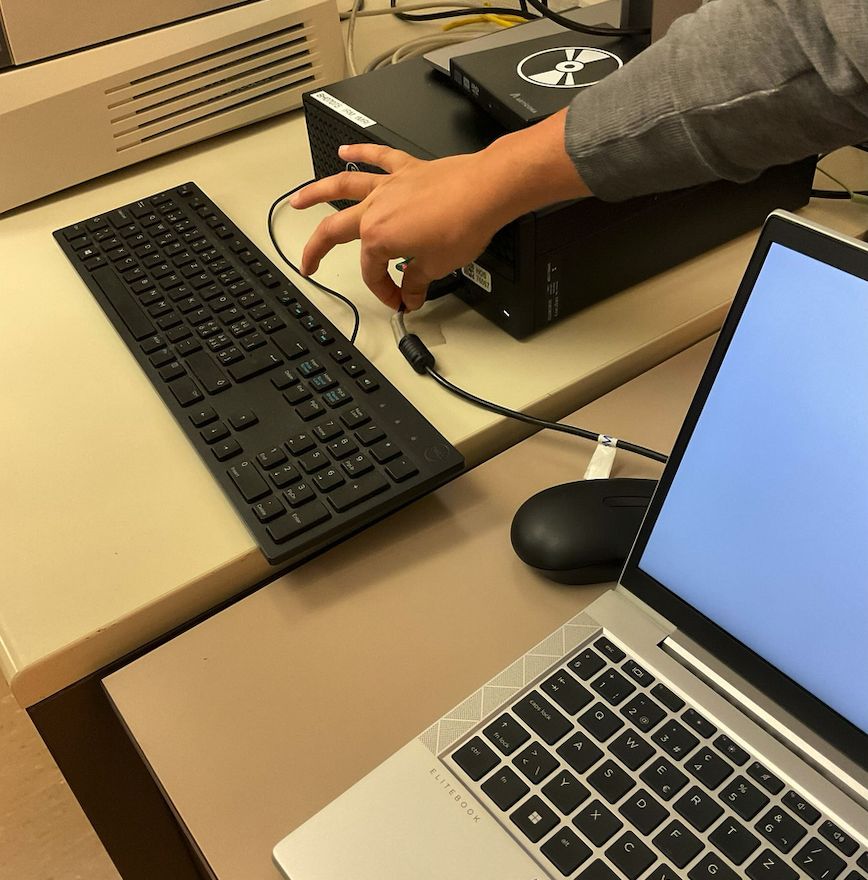{: style="width: 80%;display: block; margin: 0 auto;"}
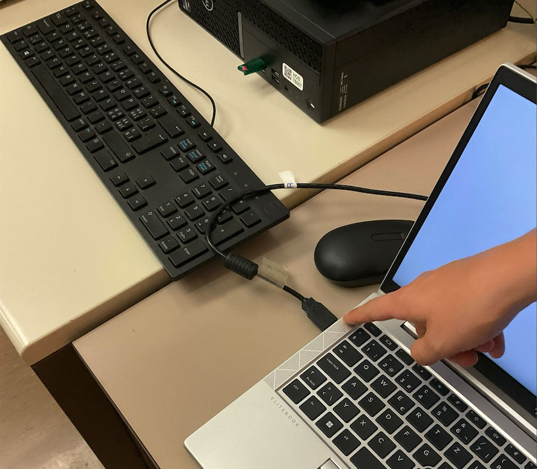{: style="width: 80%;display: block; margin: 0 auto;"}

- Plug the Ethernet from the ET computer to the psychopy laptop.
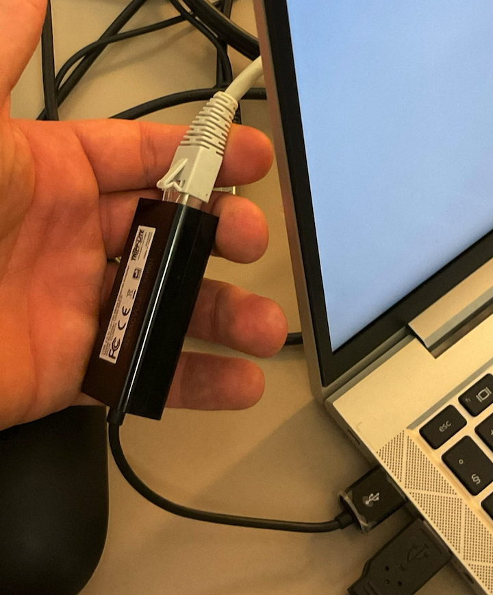{: style="width: 80%;display: block; margin: 0 auto;"}
!!! danger "Make sure the IP address is reset if the laptop is connected to the ET PC for the first time!"

#### Set up the SyncBox

- Ensure the SyncBox cable (RJ45) is already plugged onto the interface to the scanner room.
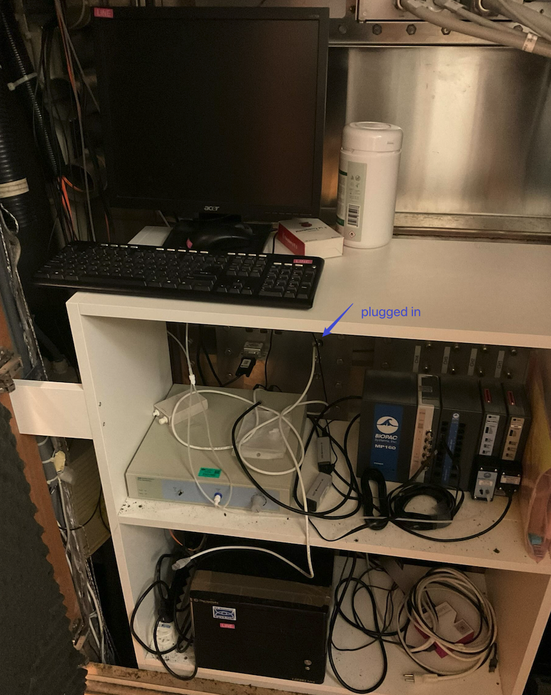{: style="width: 80%;display: block; margin: 0 auto;"}
- Plug the other end of the cable into the SyncBox.
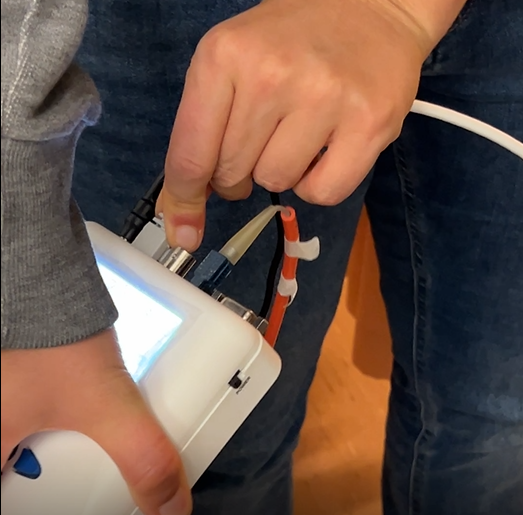{: style="width: 80%;display: block; margin: 0 auto;"}
- Turn on the SyncBox
- Check syncrohonization
    - [ ] Enter the <span class="syncbox">Synchronization</span> mode by selecting it and pushing the enter button :fontawesome-solid-circle:{ .bluecolor }.
    - [ ] Hit the down arrow button :fontawesome-solid-caret-down:{ .bluecolor } until you find <span class="syncbox">Send triggerpulse to PC</span>
    - [ ] Push the enter button :fontawesome-solid-circle:{ .bluecolor } every time you want to send an <span class="keypress">s</span> character.
    - [ ] Check that the *PsychoPy* laptop types those triggers (e.g., on an open editor receiving keypresses, or the shell prompt, or looking at your open log).

    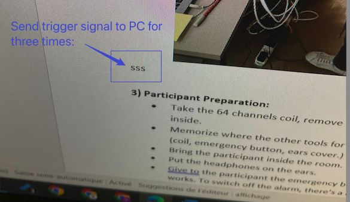{: style="width: 80%;display: block; margin: 0 auto;"}
    **Trigger to PsychoPy PC**
    {: style="text-align: center;"}

    - [ ] Check that the syncbox triggers are sent onto the scanner's PC (by pushing the enter button :fontawesome-solid-circle:{ .bluecolor }). If not, the trigger cable might not be correctly plugged inside the scanner room (black cable that connects the electronics panel to the scanner). The RJ45 cable and the trigger cable must be plugged (inside and outside the scanner) to the same exit number.

    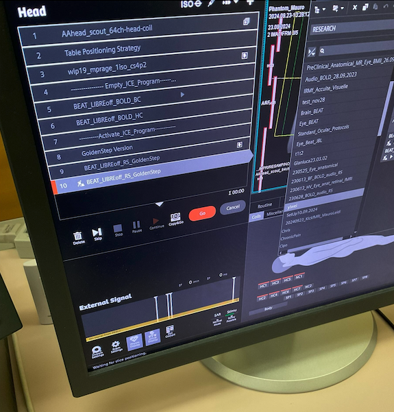{: style="width: 80%;display: block; margin: 0 auto;"}
    **Trigger to Scanner**
    {: style="text-align: center;"}

- Go to the `Simulation`, and we can see the `Start Session` on the page.
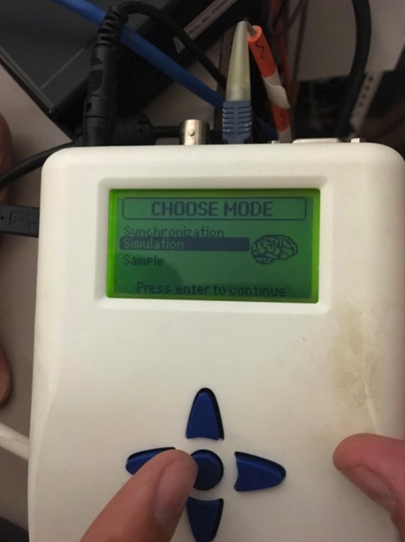{: style="width: 80%;display: block; margin: 0 auto;"}
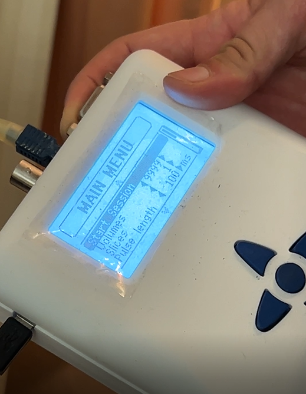{: style="width: 80%;display: block; margin: 0 auto;"}
- Configure the TR time to 2500 ms according to our sequence. The TR determines the interval between two triggers. In this experiment, we use only the first trigger to synchronize the raw data MRI acquisition and the visual stimulation.
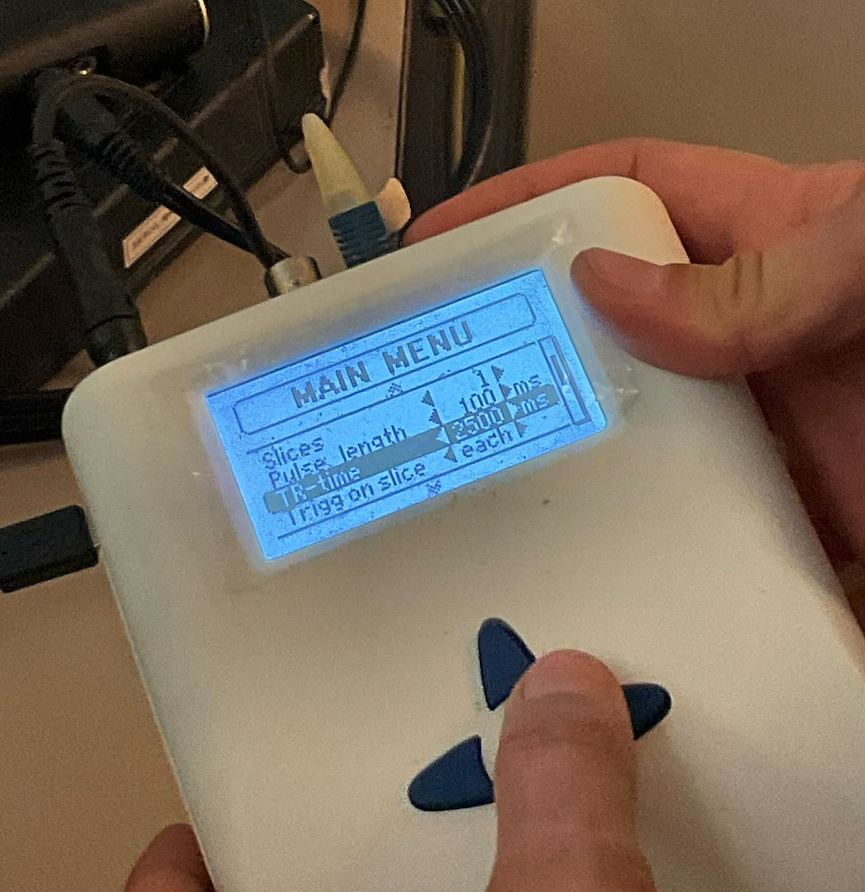{: style="width: 80%;display: block; margin: 0 auto;"}

#### Set up the ET system

- Make sure the ET PC is plugged in.
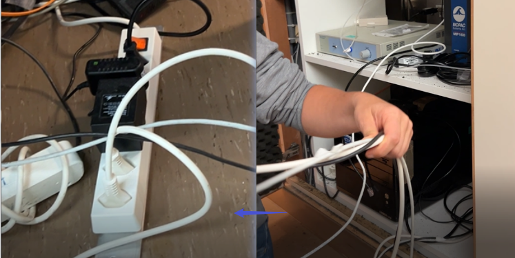{: style="width: 80%;display: block; margin: 0 auto;"}
- Before turning on the ET computer, ensure it is connected to the PsychoPy laptop (this should have been done in the previous step).
- Switch on the ET’s PC using the power-on button at the front
- Select "Eyelink" when given the option of which operating system to launch.
- If it doesn't work automatically, initialize the ET software from the ET work station here by typing "elcl.exe" in the terminal
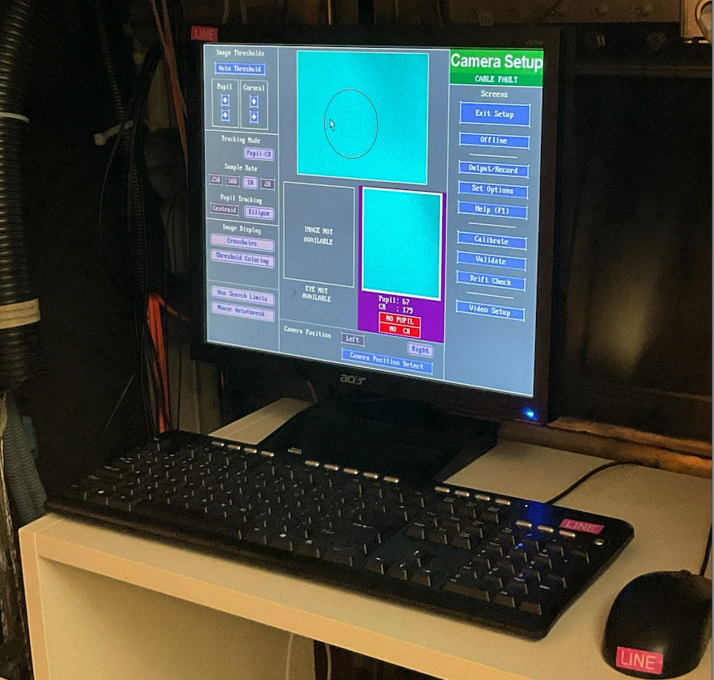{: style="width: 80%;display: block; margin: 0 auto;"}

!!! warning "The command elcl.exe will only work and start the software once the eye tracker device is connected to the ET PC. If you encounter any error messages, please ensure the eye tracker is connected to the PC inside the scanner room and try running the command again."

#### Prepare the Eye Tracker device

- All the lenses, mirrors, and other equipment are in the box in JB's office.
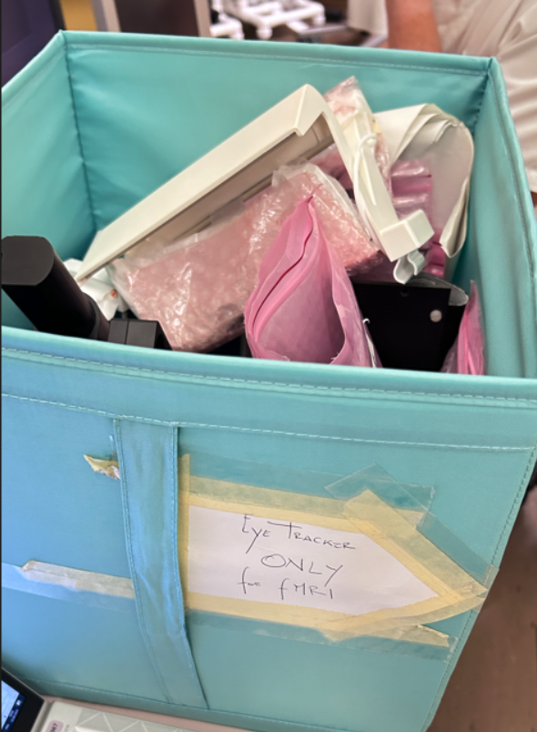{: style="width: 80%;display: block; margin: 0 auto;"}
- Install the <mark>50mm</mark> lens onto the eye tracker (the compatible lens has copper screws on it)
  
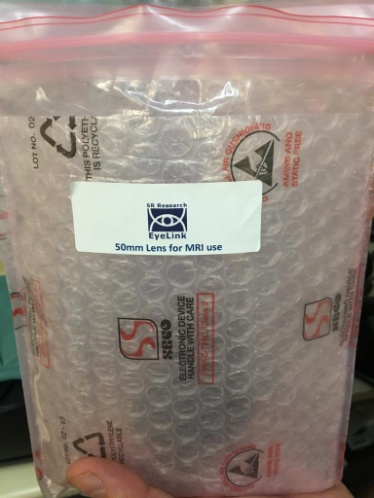{: style="width: 80%;display: block; margin: 0 auto;"}
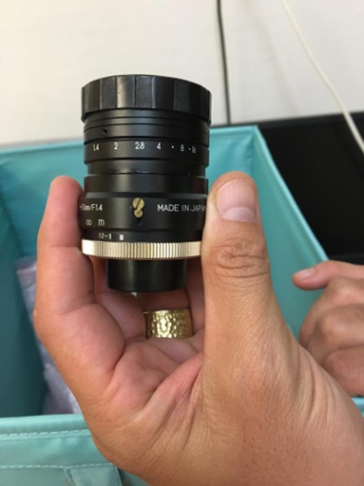{: style="width: 80%;display: block; margin: 0 auto;"}

!!! tip "The default position of the screw for convenient focus is typically set to around `1`. 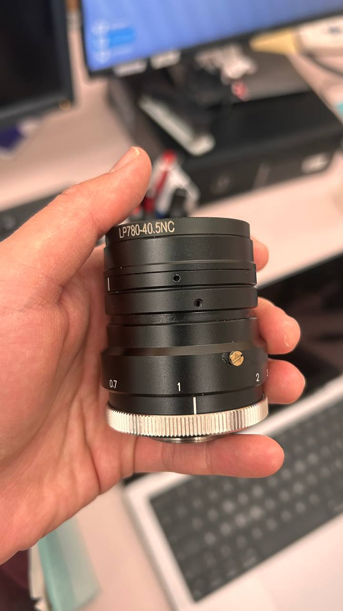However, the exact value can vary depending on the specific participant and setup for each time. It's recommended to start with the screw at value `1` and adjust from there for optimal focus during setup. If you're following a specific SOP, it might provide additional details for your equipment."
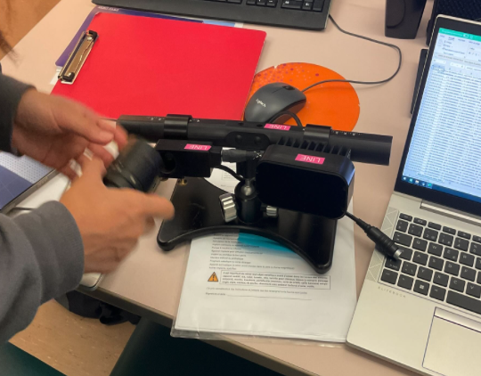{: style="width: 80%;display: block; margin: 0 auto;"}

#### Place the infrared-mirror onto the head coil

- Detach the standard mirror's frame from the head coil, if it is placed there.
- Take the infrared mirror out of the «fMRI usage» box. It should be always protected by a mask unless in use.
!!! warning "This infrared mirror is the most delicate part, because the mirror cannot be replaced nor cleaned. This mirror is EXTREMELY EXPENSIVE."
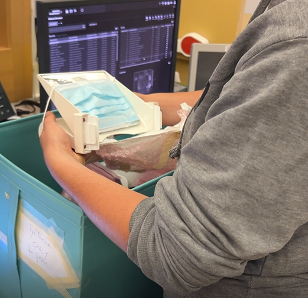{: style="width: 80%;display: block; margin: 0 auto;"}

- Get two gloves (e.g., from the box hanging at the entrance of the scanner room)
- Put the gloves on, and **DON'T TOUCH ANYTHING**. You must have the standard mirror dismounted and ahead of this step.
- **WITH THE GLOVES** proceed to extract the infra-red mirror from its box, being extremely careful. **YOU CAN ONLY TOUCH THE MIRROR WITH GLOVES**, because it cannot be cleaned up. Watch out for FINGERPRINTS and once taken out of the protection mask, IMMEDIATELY AND CAREFULLY ATTACH IT to the head coil.
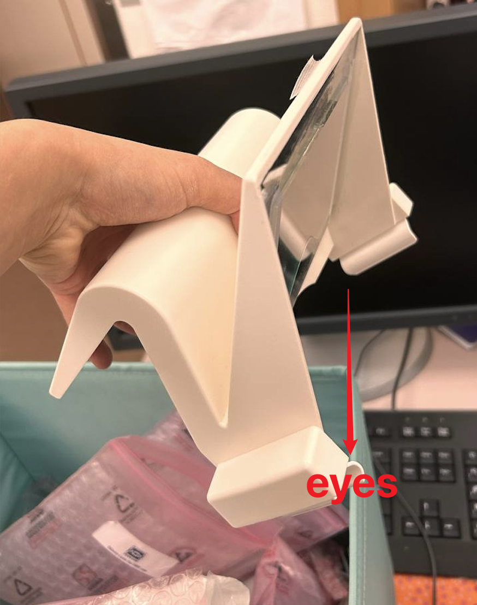{: style="width: 80%;display: block; margin: 0 auto;"}

### Preparation in the scanner room

#### Connect the external cables to ET and scanner

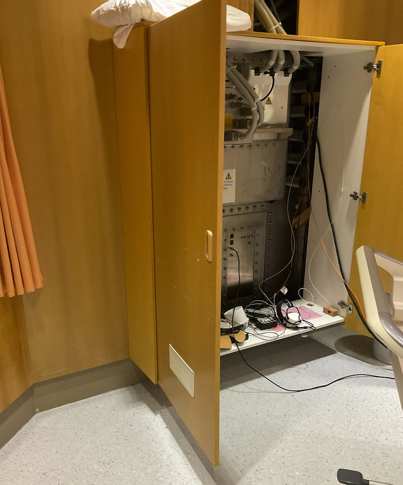{: style="width: 80%;display: block; margin: 0 auto;"}

- Unroll and connect the cables (two plugs for the black - power supply cable, one plug for the orange - optic fiber). Check that the trigger cable (black one) is correctly plug to the scanner.
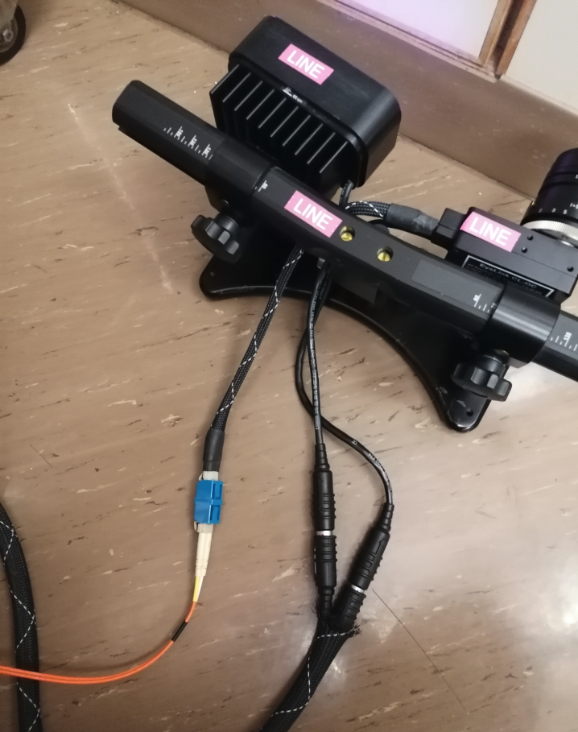{: style="width: 80%;display: block; margin: 0 auto;"}

!!! warning "No photo here due to magnetic field."

#### Place the eye tracker and screen

- Place the glass plate (stored in JB's office) in the scanner
- Position the ET on the glass plate according to the stickers on the plate.

!!! danger "Hold the ET arm FIRMLY, because the magnetic field imposes some resistance."

- Place the half-circle one-direction screen, which is on the table behind the scanner, onto the glass plate. Position it between the projector and the eye tracker to reflect the projector's image.
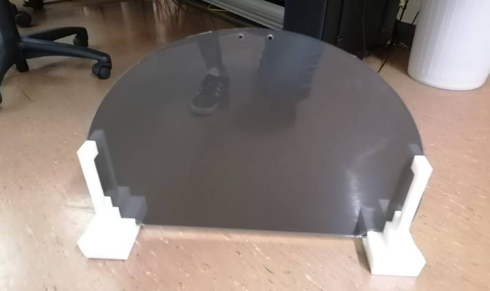{: style="width: 80%;display: block; margin: 0 auto;"}

- Check the output of the following command and verify that IP/mask is **100.1.1.2/24**, and the protocol is IP version 4.

    ``` shell
    ifconfig -a
    ```

- Check whether the link is properly established. The ET should respond to echos sent from a terminal with:

    ```shell
    ping 100.1.1.1
    ```

#### Place the participant

!!! danger "Go through the Information to the participant section."
- Sign the ICF and go through the experimental instructions one more time.
- Make sure any metallic object (necklace, earring, piercing, elements in the pockts, e.g coins, etc) is correctly removed before entering the scanner room. Sometimes, boots and bras have metallic parts too. 

##### Place the subject on the bed

- Provide the participant with a blanket, ear plugs and sand bags.
- Adjust the head coil and the mirror. If necessary, apply some pads to adjust the participant's head position to ensure the forehead tightly positioned against the head coil.
- Ensure the participant does not cross the legs or arms, to prevent artifacts due to close loops.
- Provide the participant with the emergency button and explain that it can be pressed it in case of an emergency.

##### Adjust the scanner before send the subject inside

- Twist the knob to adjust the height of the bed and  wait for it to stop.
- Gently move the participant with the manual controls. Stop when the head is under the head-localizer. Instruct the participant to close the eyes.
- Turn on the red light to localize the head. Put one hand on the head coil, then turn the knob left or right to align the red light with the mark on the head coil. Once aligned, turn off the red light and instruct the participant to open the eyes.
- Turn off the ventilation and set the scanner light to the minimum level.
- Send the participant into the scanner, then proceed to the console at the back of scanner.

##### Adjust the lens of eye tracker

- Point the lens of eye tracker towards the participant's right eye.
- The default position of the screw on the lens can be set to around 1 for convenient adjustment.
{: style="width: 80%;display: block; margin: 0 auto;"}
- Rotate the lens until the pupil is in focus on the screen during camera mode. Adjust until the image is sharp, with both the pupil and eyelashes well defined.
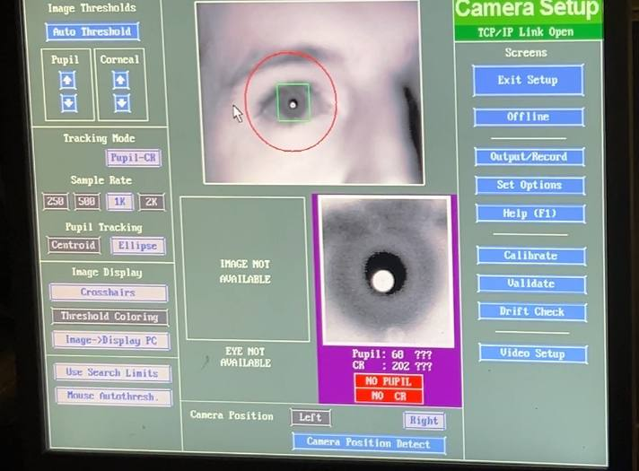{: style="width: 80%;display: block; margin: 0 auto;"}
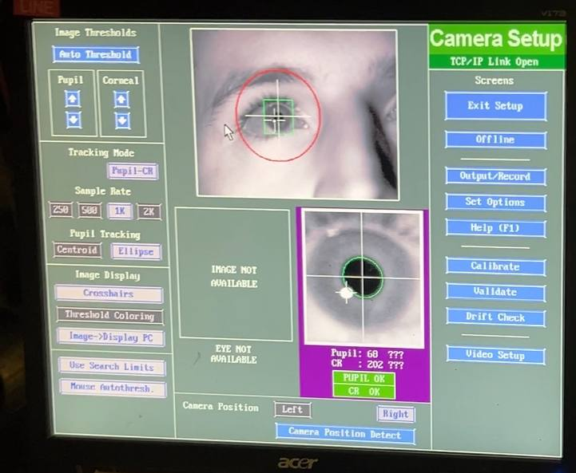{: style="width: 80%;display: block; margin: 0 auto;"}

### ET Calibration

#### Inform the participant

Inform the participant that you are leaving the room and will shortly come back for a final preparation.

#### Open psychopy in the psychopy laptop

If you are connecting the eye tracker to the experimental laptop for the first time, you will need to configure it (see Section 0).

#### Run the experiment on psychopy

Click the `Run Experiment` button, or run the experiment from the terminal by typing:
`python experiment.py`. All the experiments must have a calibration and validation phase before the experiment itself (they come with the software).

!!!info "Click [here](https://github.com/Evelyn92/MREye_psychopy/blob/main/ver25/fixation_dots_T1weighted_250127_last_run.py) to check out the psychopy code for the [2.0 MR-Eye study](https://data.snf.ch/grants/grant/220433), and [here](https://github.com/MattechLab/MR-EyeTrack/blob/dev/visual_stimuli/fixed_dot-16_grid_T1w.py) for the [MR-Eye Track study](https://hee-projets.heig-vd.ch/en/projects/183/MREye-Track)"

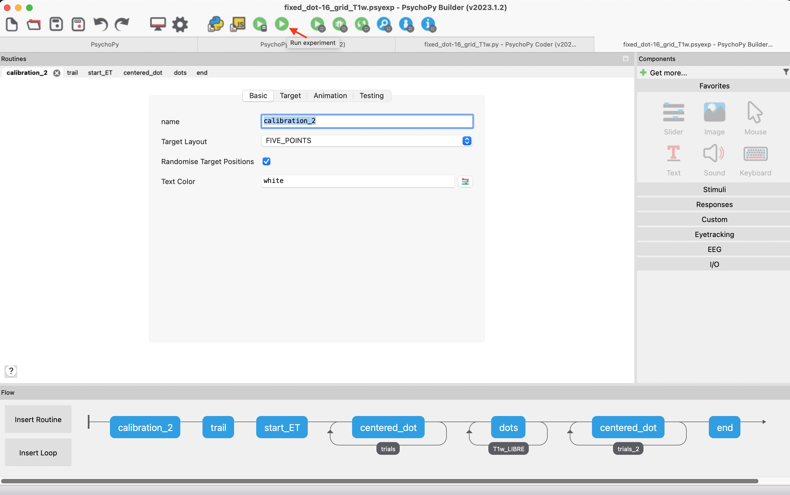
<!-- {: style="width: 80%;display: block; margin: 0 auto;"} -->
**Example psychopy project (MR-Eye Track)**
{: style="text-align: center;"}

!!! important "Make sure that once the experiment start after the calibration, the data are being stored to the xx.EDF file. There should be a message about that displayed <mark>at the ET’s PC screen</mark>. <mark>(According to Helene's SOP, but we did not notice there was such message popping out before)</mark>"

!!! important "For every new visual stimulation, even on the same subject, there must be new calibration and validation phases to ensure a proper generated EDF"

#### Run the calibration

Once the stimulation begins, follow the messages on the screen to run the calibration, make sure the following options are selected correctly

- Calibration Type: `5 points calibration`
- Sampling rate: `1k`
- Tracking mode: `Pupil-CR`
- Pupil Tracking: `Ellipse`
- Camera Position: `Right`

#### Apply threshold to find the pupil

- On the ET PC, click `Apply Threshold` (top left corner, as shown in the figure below). Ensure that the pupil is detected and that you see the blue cross on the eye. If you encounter issues, check the lighting inside the scanner (ensure it's not too bright or too dim) and verify the participant's position inside the coil. Once the calibration starts, accept the calibration points when they turn green by clicking `Accept Fixation` (the first click is always manual, the following ones are automatic or manual).
- If the calibration was successful, you will see the sentence `calibration successful` at the bottom in green. Check the stability of the accepted points and overall score of the calibration.
!!!tip "If the calibration points form a cross, it is a perfect calibration."
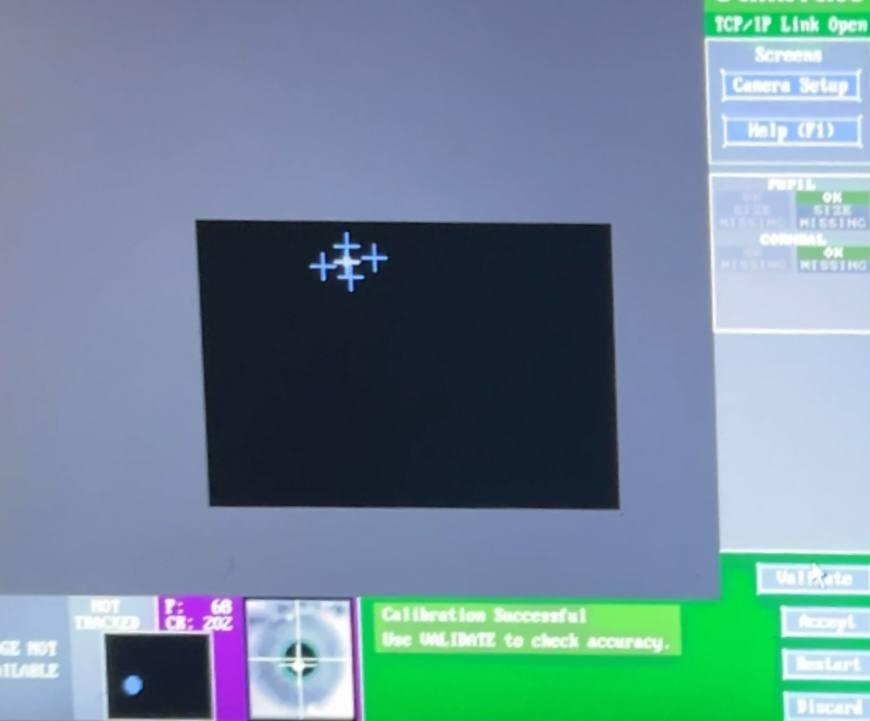{: style="width: 80%;display: block; margin: 0 auto;"}

#### Follow up with the validation

!!! tip "What you should see in an ideal situation is: the reference dot on the center of the screen and another dot that corresponds to the pupil calibration. The calibration dot is more or less stable moving a little around the reference dot."
!!! warning "If the calibration dot is unstable and is moving around far from the reference dot, the experimenter should go back clicking the restart button, adjust the contrast and redo the calibration. Once the calibration dot is quite stable, proceed with the validation clicking the accept fixation."

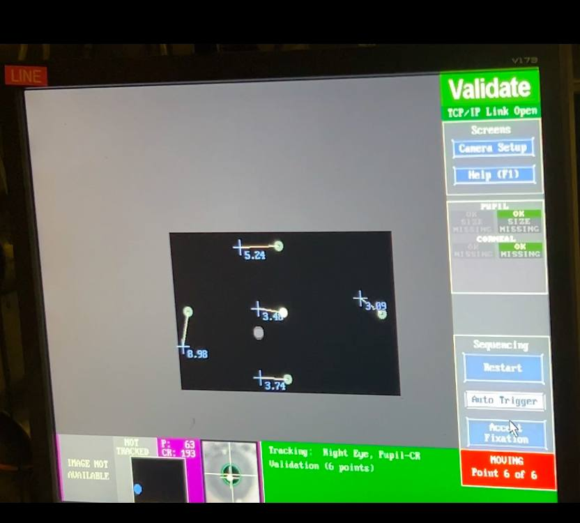{: style="width: 80%;display: block; margin: 0 auto;"}

#### Go into the scanner room and inform the participant

Inform the participant that you are leaving the room and will now close the door to start. Let them also know that you are going to communicate with them very shortly to check that communications through the speaker are functioning.

#### Exit the Scanning Room

#### Close the Scanning Room door

### Running the scanning session

#### Prepare the visual stimulation experiment

!!!info "Click [here](https://github.com/Evelyn92/MREye_psychopy/blob/main/ver25/fixation_dots_T1weighted_250127_last_run.py) to check out the psychopy code for the [2.0 MR-Eye study](https://data.snf.ch/grants/grant/220433), and [here](https://github.com/MattechLab/MR-EyeTrack/blob/dev/visual_stimuli/fixed_dot-16_grid_T1w.py) for the [MR-Eye Track study](https://hee-projets.heig-vd.ch/en/projects/183/MREye-Track)"

- At the end of the ET calibration we are ready to continue with the experiment.
- Wait for the sentence regarding the initial description of the task: “In this task you will see...”
- Now, get ready to prepare the scanning sequence (next step).

#### Prepare the scanning sequence

##### Copy the Pulseq (.seq) files

Since we are using Pulseq to develop our own sequences, the first thing you'd need to do is to copy the .seq files into the corresponding scanner folder for Pulseq, which is the standard C:\ProgramData\Siemens\Numaris\MriCustomer\CustomerSeq\pulseq on all the scanners, as shown in the picture below.

{: style="width: 80%;display: block; margin: 0 auto;"}

In the picture above, you can see that for each trajectory-sequence combination a different pulseq file was generated. Additionally, an extra prescan file was also generated that is used to acquire prescan data necessary to estimate the coil sensitivity maps. All the used `.seq` files were generated using the code released in the
[MattechLab/pulseq4mreye GitHub repository](https://github.com/MattechLab/pulseq4mreye).

##### Add a new patient

First, register a new patient, completing the **last name**, the **name**, the **patient ID** (you can press the Tab bar and the field will be automatically filled by the current timestamp), **date of birth**, age (automatic after entering the date of birth), **sex**, **height** and **weight**. On the right of the UI, open the Program Selection window to choose your protocol. If you don't have one yet, it is recommended to create one, so every time you scan a new subject, you don't have to drag and drop all the sequences, they will already be there! Select "**Any Polarization**" as RF Transmit Mode. Select "**Brain**" as Body Part and Laterality. Select "**Head First Supine**" as Patient Orientation. You're good to go!

{: style="width: 80%;display: block; margin: 0 auto;"}

The protocol includes several sequences. In DEBI protocol's case, a head-scout, a high-resolution anatomical image (MP-RAGE), and other sequences depending on the project: T1w-LIBRE for MR-Eye Track and T1w-LIBRE, T1w-VIBE, T2w-LIBRE, and T2w-TSE for 2.0 MR-Eye.

##### Load the Pulseq (.seq) files

To avoid biases induced by 1. the voulonteer mooving more since he spent more time in the sccanner 2. More accurate coil sensitivity due to the proximity of the prescan file to the mainscan file of a given trajectory w.r.t the others, the order of different trajectory was randomized.
Hence the protocol is functioning in the following order:
1. GRE prescan (repeated twice, once for the body coil once with the acquisition coils)
2. Randomly ordered (standard_phyllotaxis_gre, uniform_phyllotaxis_gre, flexiphy_phyllotaxis_gre)
3. LIBRE prescan (repeated twice, once for the body coil once with the acquisition coils)
4. Randomly ordered (standard_phyllotaxis_libre, uniform_phyllotaxis_libre, flexiphy_phyllotaxis_libre)

For each .seq file, once you have run the scout and the MP-RAGE, and you have positioned the FOV accordingly (The FOV and Shimming box were placed in a central box covering most of the brain, note that to avoid fold over artifacts we are in reality acquiring double the FOV of what is shown by the FOX box at the scanner console), load the .seq file by going to Sequence > Special.

- [ ] Change "libBalance / Grad health" to "disabled"

!!! warning "Disable the "libBalance / Grad health" before loading the sequence. Otherwise, the UI might freeze..."

- [ ] Select your sequence from the Pulseq file list
- [ ] Change "Timing and Flip Angles" to "strict"
- [ ] Leave the rest of the parameters untouched
- [ ] Adjust the FOV and Shimming box (check the video recording below)

{: style="width: 80%;display: block; margin: 0 auto;"}

##### Modify some system parameters

- Go to System > Coils and modify the following:

    - [ ] Select HC1 to HC7 (all of them)
    
{: style="width: 80%;display: block; margin: 0 auto;"}

- Go to System > Miscellaneous and modify the following:

    - [ ] Coil selection: Manual
    - [ ] Coil combination: Sum of Squares

- Go to System > Adjustments to:

    - [ ] Adjustment strategy: Standard
    - [ ] B0 Shim: Standard
    - [ ] B1 Shim: Patient-specific
    - [ ] Adjustment Tolerance: Auto
    - [ ] Disable "Adjust with Body Coil"

{: style="width: 80%;display: block; margin: 0 auto;"}

##### Send the trigger to both the scanner and the stimuli laptop

In IDEA UI, go to Physio, and select EXT Trigger.

{: style="width: 80%;display: block; margin: 0 auto;"}

Then, when the scan is launched through the Syncbox, you should see something like the following screenshot (make sure you have activated the Physio display with External Signal I):

{: style="width: 80%; display: block; margin: 0 auto;"}

##### Video recording of the whole process

<script src="https://fast.wistia.com/player.js" async></script><script src="https://fast.wistia.com/embed/6eod5wljf4.js" async type="module"></script><style>wistia-player[media-id='6eod5wljf4']:not(:defined) { background: center / contain no-repeat url('https://fast.wistia.com/embed/medias/6eod5wljf4/swatch'); display: block; filter: blur(5px); padding-top:56.25%; }</style> <wistia-player media-id="6eod5wljf4"></wistia-player>

Your browser does not support the video? Click [here](https://github.com/MattechLab/sops/blob/dev/docs/assets/debi_protocol/selected/scan_eva.mp4) to download it.

##### How to acquire prescans

You can refer to this link documentation of monalisa reconstruction where we explained with a video recording how to do acquire the prescans:
[Prescan Acquisition Guide](https://mattechlab.github.io/monalisa/2-6_prescan_acquisition.html). Remember to enable "Adjust with Body Coil" in System > Adjustments (only for prescans).

#### Session Completed

- At the end of the stimulation, click “t” on the experimental laptop and click the round button on the SyncBox to stop the running session.
- The exam is over, inform the participant that the session has concluded.
- You can proceed with the tear-down protocol.

### Session Tear-Down

#### Showing the Participant Out

- Enter the scanner room, and announce yourself to the participant saying that you will get out the participant in a few seconds.
- Extract the participant by pressing the extraction button and then gently rolling the central knob. Alternatively, you can just press the Home button.  
- Remove the upper side of the head coil:
  - Unplug the head coil from the bed connector.
  - Lift the lever that releases the upper part of the coil and put it aside (e.g., inside the bore or on a chair next to the scanner).
- Help the participant sit down.
- Help the participant step down and accompany them out to the control room.
- Help the participant recover their personal belongings and change clothes if necessary.
- Give the participant the corresponding compensation for the participation and transportation.
- Ask the participant to sign the receipt of the amount of the financial compensation.

#### ET setting

- Place the half-circle screen back to the table behind the scanner.
- Unplug the two cables (signal and power) connected to the ET arm.
- Roll the two ET cables and put them in the cupboard inside the Scanning room.
- Remove the mirror frame from its rails mounted on the head coil and lay it on the bed.
- Put the gloves on and cover the infrared mirror with a mask for storage.

#### Clearing up the Scanner

- Unplug the cable on the scanner from SyncBox and roll it back to the shelf.
- Remove used blankets and bed-sheets ONE-BY-ONE: extend them to let any forgotten items fall on the floor before you fold it; and dispose of them in the adequate bin (soiled linen bag if they are fabric and trash if they are disposable).
- Dispose of all single-use sanitary protections (padding covers, earplugs, etc.).
- Put the pillows back in their designated storage places.
- Remove the head coil and put it in the scanner's bore.
- Remove the back padding elements and put them back in their designated storage.
- Reinstall the spine coil.
- Wipe the bed and the head coil (bottom and upper parts).
- Lock the head coil back with its bottom part without plugging the connectors.
- Put the head coil away with the other head-coils on the shelf next to the scanner.
- Return the bed to its Home position by pressing the button (more info).
- Take the ET arm, the infrared mirror and the plexiglass panel outside to the control room and store them in the ET/fMRI box.
- Exit and close the external door.
!!! warning "Everything that is removed for the experiment needs to be put back in place at the end of the experiment, i.e., position of the bed, coil, emergency button, ears cover."

#### Collect ET data

- Copy data from the subfolder of PsychoPy program into the hard drive.
!!! tip "The subfolder should include the files for one session with the formats like
`000001_fixed_dot-16_grid_T1w_2024-10-14_17h24.37.511.EDF`
`000001_fixed_dot-16_grid_T1w_2024-10-14_17h24.37.511.csv`
`000001_fixed_dot-16_grid_T1w_2024-10-14_17h24.37.511.log`
where '**.EDF' files are eye tracking records, `.csv` and `.log` files logs the task messages and the corresponding timestamps."

#### Collect MRI raw data

#### Export Twix raw data

- Twix: Username: █████████, Password: ████████████.
- Press `Ctrl+Esc` to open the IDE terminal.
- In the IDE terminal: ideacmdtool -> type `4` -> type `6` //
- Type `Twix` and the Twix data browser opens.
- Select the data you want to copy, right click on the mouse -> Copy Total RAID file -> select destination (your hard drive).
- The only useful thing is the physio [select the flag on External Signal] <mark>need more explanation </mark>
  
#### Export the DICOM data (directly reconstructed images from the scanner)

- Login as SuperUser by pressing `Tab` + `Delete` + `(Bottone a DX - 9)` to enter the advance mode.
- Export DICOM: select the patient, go to export // File System // Browse -> select `HD`.
- Select the “Enhanced” option (1 DICOM  / volume) instead of Interoperability (1 DICOM / slice).
!!! warning "The default option is `Interoperability`! So we have to change it manually!"

#### Cleaning up the Control Room

- Plug back the SyncBox and the VGA projector where they were. Make sure you leave it connected exactly as you found it.
- Cover the eye tracker lens with the lid.
- Unscrew the 50mm lens from the eye tracker and place it back to the bag with the tag `50mm Lens for MRI use` on it.
- Make sure the infrared mirror covered with a mask and everything stored safely in the ET/MRI box.
- Store the ET/MRI box back to the office.
- Switch off ET PC.
- Switch off the projector.
