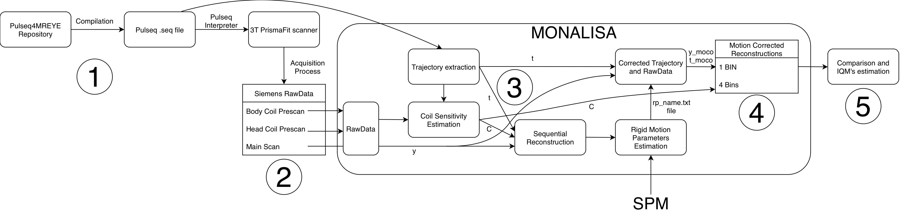
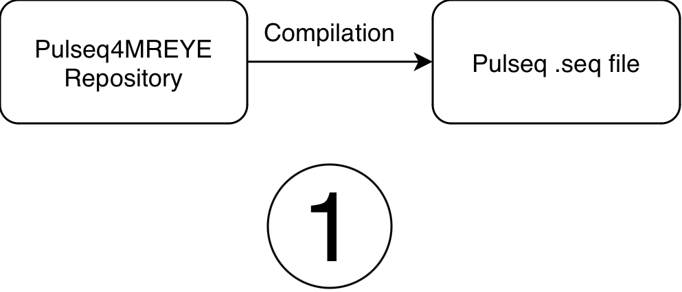
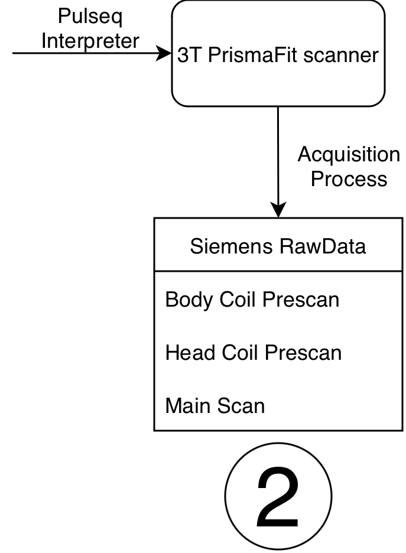
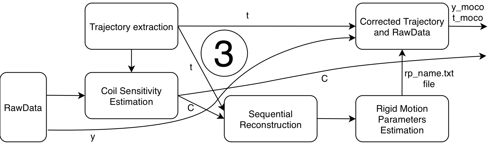

## Data Generation and Processing Workflow

This SOP describes the data-generation and reconstruction workflow used for the Flexyphy study. The workflow starts with Pulseq sequence generation and Siemens TWIX raw data acquisition, then reconstructs non-motion-corrected and motion-corrected images with Monalisa on the HPC, and finally some plotting and statistical analysis.

{: style="width: 80%;display: block; margin: 0 auto;"}

The complete workflow contains five stages:

1. Generate Pulseq `.seq` files.
2. Acquire MRI raw data on the scanner.
3. Estimate rigid motion from temporally resolved reconstructions.
4. Reconstruct final non-motion-corrected and motion-corrected images.
5. Compare trajectory designs and perform group-level hypothesis testing.

In the release repository, the reconstruction code used for the current analysis is stored at:

```text
code/HPC
```

The practical HPC execution steps are described in the [folder structure and HPC computing SOP](1_folder-structuring-and-HPC-computing-flexyphy.md).

---

## 1. Pulseq `.seq` File Generation



The first step is to generate the Pulseq `.seq` files required by the scanner. The sequence-generation code is maintained in the Pulseq4MREYE repository:

[https://github.com/MattechLab/pulseq4mreye](https://github.com/MattechLab/pulseq4mreye/tree/main)

The repository contains implementations for:

- standard 3D radial GRE;
- LIBRE 3D GRE;
- three trajectory designs used in the study: original phyllotaxis, uniform phyllotaxis, and Flexyphy.

The sequence scripts allow customization of the main acquisition parameters, including FoV, number of readout points, trajectory design, number of shots, number of segments, bandwidth, gradient spoiling, RF spoiling, and other sequence-specific settings.

For each sequence type and trajectory, compile:

- one main acquisition `.seq` file;
- one prescan `.seq` file used for coil sensitivity estimation.

For the experiments described here, the main acquisition contains 82,960 radial lines and the prescan contains 7,922 radial lines. Keep the compiled `.seq` file together with the corresponding TWIX `.dat` file in the raw-data folder described in the HPC SOP.

---

## 2. Data Acquisition



The scanner must have the Pulseq interpreter installed. For this study, the acquisition was run with Pulseq interpreter v1.5.1. The interpreter reads the compiled `.seq` file and executes the corresponding MRI sequence on the Siemens scanner.

For each subject, sequence type, and trajectory, acquire:

- one main scan TWIX `.dat` file;
- the `.seq` file used for that main scan;
- two prescan TWIX `.dat` files, one body-coil prescan and one head-coil prescan;
- the prescan `.seq` file used for coil sensitivity estimation.

The reconstruction scripts assume that the prescan files contain `BC` and `HC` in their filenames so the body-coil and head-coil files can be identified automatically.

A detailed description of the acquisition protocol and data-collection procedure is provided in the [Flexyphy data collection protocol](../data-collection/data-collection_flexyphy_protocol.md).

---

## 3. Rigid Motion Estimation and Correction



Rigid motion estimation is performed from temporally resolved images reconstructed from the raw k-space data.

The pipeline first reconstructs a time series of low-resolution temporal images. In the current HPC scripts, this is performed by `step3_recon_sequential.m` using a compressed-sensing reconstruction with temporal regularization between adjacent frames. The nominal motion-estimation reconstruction used by the subsequent scripts is:

```text
x_cs_tres3p5s_Nu120x120x120_delta5.mat
```

This filename corresponds to a temporal resolution of 3.5 s, reconstruction matrix size of 120 x 120 x 120, and regularization parameter `delta = 5`.

Motion parameters are then estimated by `step4_estimate_motion.m`. Each temporal frame is registered to the first frame using SPM realignment. The output is an SPM-style text file containing one rigid-body parameter vector per temporal frame:

```text
[Tx Ty Tz Rx Ry Rz]
```

Translations are in millimeters and rotations are in radians.

For final motion correction, `step5_recon_mathilda_moco.m` interpolates the frame-wise motion parameters to the acquisition time of each k-space readout line. The correction is applied directly in k-space by:

- correcting translations with phase shifts applied to the raw measurements using the Fourier shift theorem;
- correcting rotations by applying the inverse rotation to the k-space trajectory.

This produces motion-corrected raw data and motion-corrected trajectories, denoted conceptually as `(y_moco, t_moco)`. Any reconstruction using these corrected inputs is referred to as a motion-corrected reconstruction.

An illustration and reference implementation of this type of correction is available in:

[https://github.com/MauroLeidi/rigid_motion_correction_monalisa_spm](https://github.com/MauroLeidi/rigid_motion_correction_monalisa_spm)

---

## 4. Final Image Reconstruction

Final reconstructions are performed with the Monalisa framework. The HPC scripts generate both non-motion-corrected and motion-corrected outputs.

Before reconstruction, coil sensitivity maps are estimated from the prescan data using `step1_coil_sens.m`. The maps are saved once per subject and sequence type, then reused for all trajectory reconstructions of that sequence.

### 4.1 Non-Motion-Corrected Reconstruction

`step2_recon_mathilda.m` reconstructs the original raw data and trajectory without applying motion correction. For each subject, sequence type, and trajectory, it saves:

- `normalization.mat`: ROI-based raw-data normalization factor;
- `x0_1bin.mat`: all-lines reconstruction using the full k-space dataset;
- `x0_4bins.mat`: four temporally sequential reconstructions, each using one quarter of the k-space lines.

The 1-bin and 4-bin reconstructions use a 240 x 240 x 240 reconstruction grid. Coil sensitivity maps are resized from the low-resolution prescan estimate before reconstruction.

### 4.2 Motion-Corrected Reconstruction

`step5_recon_mathilda_moco.m` performs the same 1-bin and 4-bin reconstructions after applying the interpolated rigid-body correction in k-space. For each scan, it saves:

- `normalization_moco.mat`: ROI-based normalization factor after motion correction;
- `x0_1bin_moco.mat`: motion-corrected all-lines reconstruction;
- `x0_4bins_moco.mat`: motion-corrected four-bin reconstruction.

These files are saved in the same scan-level derivatives folder as the corresponding non-motion-corrected reconstructions, which makes direct comparison possible.

---

## 5. Trajectory Comparison and Hypothesis Testing

As described in the [Flexyphy data collection protocol](../data-collection/data-collection_flexyphy_protocol.md), the study contains a static fixation task and a dynamic eye-motion task.

The static fixation task provides an all-lines image that is expected to be close to a fully sampled reference. This reference is used to evaluate how much each four-bin reconstruction deviates from the corresponding all-lines image.

The dynamic eye-motion task is used to evaluate reconstruction behavior under a more realistic radial imaging condition with motion.

Group-level metrics are computed by `step6_group_metrics.m`. The script compares the 4-bin images against the corresponding 1-bin reference for both non-motion-corrected and motion-corrected reconstructions. The output table is saved as:

```text
derivatives/group_analysis/recon_metrics/metrics_all_long.csv
```

The current metrics are:

- relative L2 distance between each bin image and the all-lines reference;
- SSIM averaged across slices.

## Statistical testing

The statistical analysis used for the current study is implemented in:

```text
plotting/plots_metrics_and_stats.ipynb
```

The notebook reads the group-level metrics table generated by `step6_group_metrics.m`:

```text
<study_root>/derivatives/group_analysis/recon_metrics/metrics_all_long.csv
```

Only motion-corrected reconstructions are included in the statistical tests:

```python
T = T[T["recon_type"] == "moco"].copy()
```

For each sequence type (`gre`, `libre`), the metrics are averaged at the subject and trajectory level:

```python
G = (
    Tseq.groupby(["subject", "trajectory"], as_index=False)[["ssim", "l2_rel"]]
    .mean()
)
```

This produces one value per subject, trajectory, sequence, and metric. The averaging is across the four temporal bins produced by the reconstruction. The two tested metrics are:

- `ssim`: higher values indicate greater similarity between the four-bin reconstruction and the corresponding all-lines reference;
- `l2_rel`: lower values indicate smaller relative L2 error between the four-bin reconstruction and the corresponding all-lines reference.

The notebook then pivots the table so that each subject has paired measurements for the three trajectory designs:

```text
flexiphy, original, uniform
```

For each sequence and metric, all pairwise trajectory comparisons are tested with paired t-tests using `scipy.stats.ttest_rel`:

- Flexyphy vs original phyllotaxis;
- Flexyphy vs uniform phyllotaxis;
- original phyllotaxis vs uniform phyllotaxis.

The tests are paired because each subject contributes measurements for all trajectory designs. Missing values are removed pairwise before each test.

Multiple-comparison correction is performed with Bonferroni correction using `statsmodels.stats.multitest.multipletests`. The final notebook cell corrects across the full family of 12 tests:

```text
2 sequences x 2 metrics x 3 trajectory comparisons = 12 tests
```

The corrected results from the notebook are:

| Sequence | Metric | Comparison | t | p | Bonferroni-corrected p | Significant |
| --- | --- | --- | ---: | ---: | ---: | --- |
| GRE | SSIM | Flexyphy vs original | 23.227 | 2.418e-09 | 2.902e-08 | Yes |
| GRE | SSIM | Flexyphy vs uniform | 32.025 | 1.387e-10 | 1.664e-09 | Yes |
| GRE | SSIM | Original vs uniform | 0.863 | 0.4104 | 1 | No |
| GRE | L2 | Flexyphy vs original | -17.644 | 2.734e-08 | 3.281e-07 | Yes |
| GRE | L2 | Flexyphy vs uniform | -25.247 | 1.154e-09 | 1.385e-08 | Yes |
| GRE | L2 | Original vs uniform | 1.511 | 0.1651 | 1 | No |
| LIBRE | SSIM | Flexyphy vs original | 46.987 | 4.486e-12 | 5.383e-11 | Yes |
| LIBRE | SSIM | Flexyphy vs uniform | 18.227 | 2.056e-08 | 2.467e-07 | Yes |
| LIBRE | SSIM | Original vs uniform | -1.528 | 0.1609 | 1 | No |
| LIBRE | L2 | Flexyphy vs original | -28.572 | 3.837e-10 | 4.604e-09 | Yes |
| LIBRE | L2 | Flexyphy vs uniform | -18.441 | 1.855e-08 | 2.227e-07 | Yes |
| LIBRE | L2 | Original vs uniform | 4.374 | 0.001786 | 0.02143 | Yes |

These tests show that the Flexyphy trajectory significantly improves both SSIM and relative L2 distance compared with the original and uniform trajectories for both GRE and LIBRE acquisitions after motion correction. The original and uniform trajectories are not significantly different for GRE. For LIBRE, original and uniform are not significantly different for SSIM, but they are significantly different for relative L2 distance after correction across all 12 comparisons.
