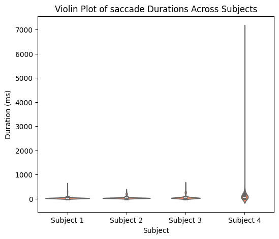

# Analysis of ET data within MR-Eye 2.0
Derived from:
https://www.axonlab.org/hcph-sops/data-management/eyetrack-qc/

Author: Yiwei Jia


This notebook focuses on the analysis of eye-tracking data within the MR-Eye 2.0 project, where visual stimuli are presented at the center of the screen. The analysis includes examining eye-tracking signals, identifying regions of interest (ROIs), and creating eye-tracking (ET) masks based on specific criteria—in this case, selecting areas corresponding to eye rotation displacements within 1/3 voxel size. Furthermore, we investigate eye movement characteristics extracted from the ET data and compare them across four subjects to assess and standardize the data quality.

For demonstration purposes, this notebook illustrates only the method for selecting the region but does not include functions for saving the masks to a local device. Readers are encouraged to implement their own save functions as needed.

```python
# Derived from:
# https://www.axonlab.org/hcph-sops/data-management/eyetrack-qc
# Load the autoreload extension
%load_ext autoreload
# Set autoreload to update the modules every time before executing a new line of code
%autoreload 2

%matplotlib inline
from pathlib import Path
import json
import ppjson
from importlib import reload  # For debugging purposes

import numpy as np
import pandas as pd

import eyetrackingrun as et

from IPython.display import HTML
from matplotlib import animation
from matplotlib.animation import FuncAnimation, PillowWriter
import matplotlib.image as mpimg
import matplotlib.pyplot as plt
import copy
from write_bids_yiwei import EyeTrackingRun, write_bids, write_bids_from_df
```

## Step 1: Inspecting Eye-Tracking Data

In this step, we’ll begin by parsing the metadata of our eye-tracking data. This will help us understand the structure of the data, including the recording parameters, subject details, and any relevant events or labels. Parsing the metadata provides insight into the conditions and settings during data collection, which is essential for accurate analysis.


```python
# Specify the subject and modality you want to inspect

subject_idx = 1
T_idx = 1

if T_idx == 1:
    mode = 'T1'
else:
    mode = 'T2'


BIDS_PATH = Path("./data/")  # file within a subdirectory
FILE_NAME = f"sub00{subject_idx}_T{T_idx}"    
    
# session = "001" #can be a string to be defined when required
tsv_name = f"{FILE_NAME}.tsv.gz"

recording_file = BIDS_PATH / tsv_name
print(f'recording_file: {recording_file}')

recording = pd.read_csv(
    recording_file,
#     sep=r"\s+",
    sep="\t",
    na_values="n/a",
)
```

    recording_file: data/sub001_T1.tsv.gz


This command shows the first few rows of our eye-tracking dataset, 
helping us understand the organization, key columns, and the format of the data. 
This step is useful to verify that the data loaded correctly and to identify any initial patterns or anomalies.


```python
print(f'The length of the recording: {len(recording)}')
```

    The length of the recording: 754932


## Step 2: Understanding Metadata

The metadata provides crucial information about the setup and parameters used during eye-tracking data collection. By examining the metadata, we can gain insights into the recording conditions, data quality, and calibration settings.


```python
metadata = json.loads((
    recording_file.parent
    / recording_file.name.replace(".tsv.gz", ".json")
).read_text())

metadata
```


    {'AverageCalibrationError': [0.5],
     'CalibrationCount': 1,
     'CalibrationLog': [[1047679,
       '>>>>>>> CALIBRATION (HV5,P-CR) FOR RIGHT: <<<<<<<<<'],
      [1047679, 'Calibration points:'],
      [1047680, '-10.3, -50.9         0,      0'],
      [1047680, '-8.9, -71.9         0,  -2457'],
      [1047680, '-9.3, -29.2         0,   2457'],
      [1047680, '-41.2, -50.5     -3474,      0'],
      [1047680, '24.2, -49.8      3474,      0'],
      [1047680, 'eye check box: (L,R,T,B)\n\t  -48    31   -76   -25'],
      [1047680, 'href cal range: (L,R,T,B)\n\t-5211  5211 -3686  3686'],
      [1047680,
       'Cal coeff:(X=a+bx+cy+dxx+eyy,Y=f+gx+goaly+ixx+jyy)\n   5.882e-05  107.02  1.2434 -0.18295 -0.27969 \n   4.4115e-05 -0.84952  115.02 -0.085003 -0.090966'],
      [1047680, 'Prenormalize: offx, offy = -10.326 -50.929'],
      [1047680, 'Gains: cx:102.441 lx:116.794 rx:88.586'],
      [1047680, 'Gains: cy:109.181 ty:118.022 by:110.039'],
      [1047680, 'Resolution (upd) at screen center: X=2.6, Y=2.4'],
      [1047680, 'Gain Change Proportion: X: 0.318 Y: 0.073'],
      [1047680, 'Gain Ratio (Gy/Gx) = 1.066'],
      [1047680, 'Cross-Gain Ratios: X=0.011, Y=0.008'],
      [1047680, 'PCR gain ratio(x,y) = 2.478, 2.261'],
      [1047680, 'CR gain match(x,y) = 1.020, 1.020'],
      [1047680, 'Slip rotation correction OFF'],
      [1047682, 'CALIBRATION HV5 R RIGHT   GOOD'],
      [1058027,
       'VALIDATION HV5 R RIGHT GOOD ERROR 0.50 avg. 0.79 max  OFFSET 0.43 deg. -11.0,-3.5 pix.']],
     'CalibrationResultOffset': [0.43, [-11.0, -3.5]],
     'CalibrationResultOffsetUnits': ['deg', 'pixels'],
     'CalibrationResultQuality': ['GOOD'],
     'CalibrationType': 'HV5',
     'Columns': ['eye1_x_coordinate',
      'eye1_y_coordinate',
      'eye1_pupil_size',
      'eye1_pupil_x_coordinate',
      'eye1_pupil_y_coordinate',
      'eye1_href_x_coordinate',
      'eye1_href_y_coordinate',
      'fast_raw_x_velocity',
      'screen_ppdeg_x_coordinate',
      'screen_ppdeg_y_coordinate',
      'timestamp',
      'eye1_fixation',
      'eye1_saccade',
      'eye1_blink'],
     'CornealReflectionThreshold': [179],
     'EyeTrackingMethod': 'P-CR',
     'LoggedMessages': [[1066471,
       'NO Reply is disabled for function eyelink_cal_result'],
      [1084633, 'RECCFG CR 1000 2 0 R'],
      [1084633, 'ELCLCFG TOWER'],
      [1084633, 'ELCL_PCR_PARAM 5 3.0']],
     'MaximalCalibrationError': [0.79],
     'PupilFitMethod': 'centroid',
     'PupilFitMethodNumberOfParameters': 3,
     'PupilThreshold': [68],
     'RecordedEye': 'right',
     'SamplingFrequency': 1000,
     'ScreenAOIDefinition': ['square', [0, 800, 0, 600]],
     'StartTime': None,
     'StopTime': None,
     'ValidationErrors': [['eye1', 0.45, [-12.1, 1.8]],
      ['eye1', 0.21, [-5.6, 0.7]],
      ['eye1', 0.41, [-11.1, 1.8]],
      ['eye1', 0.5, [-12.7, -4.4]],
      ['eye1', 0.79, [-10.8, -18.3]]],
     'ValidationPosition': [['eye1', [400, 300]],
      ['eye1', [400, 51]],
      ['eye1', [400, 549]],
      ['eye1', [48, 300]],
      ['eye1', [752, 300]]]}


For instance:
- **RecordedEye**: This specifies which eye was tracked. Here, the data corresponds to the right eye.
- **SamplingFrequency**: The sampling rate is 1000 Hz (1 kHz), meaning the data captures 1000 samples per second.
- **CalibrationDetails**: We can see the calibration method used (`HV5`), calibration quality (`GOOD`), and errors.

Understanding these parameters helps us ensure data reliability and assess the quality of eye-tracking measurements before analysis.


```python
# Prepare the time axis based on the sampling frequency

t_axis = (
    recording.timestamp.values - recording.timestamp[0]
) / metadata["SamplingFrequency"]
print(f"The end of the timestamp: {t_axis[-1]}")
```

    The end of the timestamp: 754.931


```python
# Change the naming to make it more readable
recording = recording.rename(
        columns={
            f"eye1_pupil_size": f"pupil_size",
            f"eye1_fixation": f"fixation",
            f"eye1_saccade": f"saccade",
            f"eye1_blink": f"blink",
            f"eye1_x_coordinate": f"x_coordinate", 
            f"eye1_y_coordinate": f"y_coordinate"         
        }
    )

metadata["Columns"] = recording.columns.tolist()
```


```python
metadata["Columns"]
```


    ['Unnamed: 0',
     'x_coordinate',
     'y_coordinate',
     'pupil_size',
     'eye1_pupil_x_coordinate',
     'eye1_pupil_y_coordinate',
     'eye1_href_x_coordinate',
     'eye1_href_y_coordinate',
     'fast_raw_x_velocity',
     'screen_ppdeg_x_coordinate',
     'screen_ppdeg_y_coordinate',
     'timestamp',
     'fixation',
     'saccade',
     'blink']


## Step 3: Inspecting Signals, Event Masks and Correlation
In this step we first visualize all the signals in the recordings to examine the overall shapes (trend, variability, or periodicity) and the scale of its values (range and units).

Besides, eye-tracking data includes event masks, which label segments of the data corresponding to specific events such as blinks, saccades, or fixations. These masks are typically binary arrays or categorical labels indicating the presence of a specific event at each timestamp.


```python
check_all = True
if check_all:
    fig,axes = plt.subplots(6, 1, figsize=(10, 36), sharex=False)

     # Plot x coordinate
    axes[0].plot(t_axis, recording["x_coordinate"].values, label='X Coordinate', color='blue')
    axes[0].set_title("X coordinate")
    axes[0].legend()
    axes[0].set_xlabel("time [s]")
    
    # Plot y coordinate
    axes[1].plot(t_axis, recording["y_coordinate"].values, label='Y Coordinate', color='green')
    axes[1].set_title("Y coordinate")
    axes[1].legend()
    axes[1].set_xlabel("time [s]")
    
    # Plot pupil x coordinate
    axes[2].plot(t_axis, recording["eye1_pupil_x_coordinate"].values, label='Pupil X Coordinate', color='blue')
    axes[2].set_title("Pupil X")
    axes[2].legend()
    axes[2].set_xlabel("time [s]")
    
    # Plot pupil y coordinate
    axes[3].plot(t_axis, recording["eye1_pupil_y_coordinate"].values, label='Pupil Y Coordinate', color='green')
    axes[3].set_title("Pupil Y")
    axes[3].legend()
    axes[3].set_xlabel("time [s]")
    
    # Plot href x coordinate
    axes[4].plot(t_axis, recording["eye1_href_x_coordinate"].values, label='Href X Coordinate', color='orange')
    axes[4].set_title("Href X")
    axes[4].legend()
    axes[4].set_xlabel("time [s]")
    
    # Plot screen ppdeg x coordinate
    axes[5].plot(t_axis, recording["screen_ppdeg_x_coordinate"].values, label='Screen PPdeg X Coordinate', color='red')
    axes[5].set_title("Screen X (ppdeg)")
    axes[5].legend()
    axes[5].set_xlabel("time [s]")
    
    plt.ylabel(" ");

    
```


    

    


Here we check the pupil area


```python
check_pupil = True
if check_pupil:
    fig = plt.figure(figsize=(16, 2))
    plt.plot(
        t_axis,
        recording["pupil_size"].values,
    )

    plt.xlabel("time [s]")
    plt.ylabel("pupil area [a.u.]");

    fig = plt.figure(figsize=(16, 2))
    plt.plot(
        t_axis,
        recording["pupil_size"].values,
    )
    plt.title("Zoom In - Pupil Area")
    plt.xlabel("time [s]")
    plt.ylabel("pupil area [a.u.]")
    # JB1 (100, 150)
    plt.xlim((100, 150))
```


    

    


    

    


Check the eye events:

 - Blink
    
- Saccade
    
- Fixation


We want to first check the masks of each event and want to inspect the correlation with the signals we checked above.


```python
# Check blinking
check_blink = True
if check_blink:
    fig = plt.figure(figsize=(16, 2))
    plt.plot(
        t_axis,
        recording["blink"].values,
    )
    plt.title("Blink Event")
    plt.xlabel("time [s]")
    plt.ylabel("eyes closed");

    fig = plt.figure(figsize=(16, 2))
    plt.plot(
        t_axis,
        recording["blink"].values * 10000,
    )
    plt.xlabel("time [s]")
    plt.ylabel("eyes closed")
    plt.title("Zoom in - Blink Event")
    plt.xlim((100, 150))
```


    

    


    

    


```python
plot_pupil_blink = True
if plot_pupil_blink:
    fig = plt.figure(figsize=(16, 2))

    plt.plot(
        t_axis,
        recording["pupil_size"].values,
    )

    plt.plot(
        t_axis,
        recording["blink"].values * 5000,
    )
    # screen_coor = recording["screen_ppdeg_x_coordinate"].values
    # plt.plot(
    #     t_axis,
    #     (screen_coor-np.min(screen_coor))/(np.max(screen_coor)-np.min(screen_coor)) * 7000
    # )

    plt.xlabel("time [s]")
    plt.ylabel("pupil area [a.u.]")
    plt.xlim((260, 290))
    plt.title('Pupil area vs. blinking')


```


    

    


Check saccading


```python
Check_saccading=True
if Check_saccading:
    fig = plt.figure(figsize=(16, 2))
    plt.plot(
        t_axis,
        recording["saccade"].values,
    )
    plt.title("Saccade Event")
    plt.xlabel("time [s]")
    plt.ylabel("eyes closed");

    fig = plt.figure(figsize=(16, 2))
    plt.plot(
        t_axis,
        recording["saccade"].values * 10000,
    )
    plt.xlabel("time [s]")
    plt.ylabel("eyes closed")
    plt.title("Zoom in - Saccade Event")
    plt.xlim((100, 150))
```


    

    


    

    


```python
plot_pupil_saccade = True

if plot_pupil_saccade:
    fig = plt.figure(figsize=(16, 2))

    plt.plot(
        t_axis,
        recording["x_coordinate"].values,
    )

    plt.plot(
        t_axis,
        recording["saccade"].values * 500,
    )

    plt.xlabel("time [s]")
    plt.ylabel("x coord [pixel]")
    plt.xlim((206, 210))
    plt.ylim((300, 600))
    plt.title('x coordinates vs. saccading')

```


    

    


Check fixation


```python
plot_fixation = True
xlim = (206, 210)
ylim = (200, 600)

if plot_fixation:
    # Fixation
    fig = plt.figure(figsize=(16, 2))
    plt.plot(
        t_axis,
        recording["x_coordinate"].values,
    )

    plt.plot(
        t_axis,
        recording["fixation"].values * 500,
    )
    plt.xlim(xlim)
    plt.ylim(ylim)
    plt.title('X coordinate of gazing with fixation')

    fig = plt.figure(figsize=(16, 2))
    plt.plot(
        t_axis,
        recording["y_coordinate"].values,
    )

    plt.plot(
        t_axis,
        recording["fixation"].values * 500,
    )
    plt.xlim(xlim)
    plt.ylim(ylim)
    plt.title('Y coordinate of gazing with fixation')
```


    

    


    

    


Did you find the correlation between x/y coordinates, pupil area and saccade or fixation events?


## Step 4: Data Cleaning

- Extract the signals we need 

- Eliminate the blinking and non-fixation area of ET data.
- Design some criteria for preserving the useful data
    - Visual angle
    - Heat maps
    - Fixation algorithm (literature review)

## 4.1: Extract the signals we need

In this exercise, we are focusing on a subset of the eye-tracking (ET) data. Specifically, we will process the first portion of the ET data, which corresponds to the duration of the sequence `T1_LIBRE`.


We will extract the first portion of the data with a length matching `T1_LIBRE`.
Inspect the extracted subset to understand its structure and characteristics, such as gaze coordinates and event markers.


```python
# Here is the given information: time duration (in sec) according to the prior information.

if  subject_idx == 1:
    T1_LIBRE = 374.558
elif subject_idx == 2:
    T1_LIBRE = 374.380
elif subject_idx == 3:
    T1_LIBRE = 334.237
else:
    T1_LIBRE = 374.565


print(f"The length of T1_LIBRE Subject{subject_idx} should be: {T1_LIBRE}")


```

    The length of T1_LIBRE Subject1 should be: 374.558


```python
# Size of screen
size = (
    metadata["ScreenAOIDefinition"][1][1],
    metadata["ScreenAOIDefinition"][1][3],
)

# For easier processing the entire recording and only the coordinate
# We stored the (x,y) coordinate in the coor_data 
# And stored the entire recording in the coor_recording
coor_data = recording[["x_coordinate", "y_coordinate"]]
print(f"Extract X Y coordinates from recording: {len(coor_data)}")

coor_recording = recording

    
coor_data.head()
coor_recording.head()
```

    Extract X Y coordinates from recording: 754932


```python
# start_margin determines where to begin extracting the useful portion of the eye-tracking (ET) data.
# In our case, it is set as 0.

start_margin = int(0.0*metadata['SamplingFrequency']) 

print(f'mode: {mode}')
print(f"set start margin as {start_margin}")


T1_LIBRE_sample = T1_LIBRE*metadata['SamplingFrequency']


t_axis_xy = (
    coor_data.index 
) / metadata["SamplingFrequency"]

# x coordinate
fig = plt.figure(figsize=(16, 2))

plt.plot(
    t_axis_xy,
    coor_data["x_coordinate"].values,
)


plt.axvline(x=start_margin/metadata["SamplingFrequency"], color='r', linestyle='--', label='LIBRE starts')
plt.axvline(x=(T1_LIBRE_sample+start_margin)/metadata["SamplingFrequency"], color='b', linestyle='--', label='LIBRE ends')

    
plt.title("x_coordinate along time")
plt.xlabel("time [s]")
plt.ylabel("x coordinate [px]")
plt.legend()

# y coordinate
fig = plt.figure(figsize=(16, 2))

plt.plot(
    t_axis_xy,
    coor_data["y_coordinate"].values,
)

plt.axvline(x=start_margin/metadata["SamplingFrequency"], color='r', linestyle='--', label='LIBRE starts')
plt.axvline(x=(T1_LIBRE_sample+start_margin)/ metadata["SamplingFrequency"], color='b', linestyle='--', label='LIBER ends')


    
plt.title("y_coordinate along time")
plt.xlabel("time [s]")
plt.ylabel("y coordinate [px]")
plt.legend()

coor_data_LIBRE = coor_data[start_margin:int(T1_LIBRE_sample)] 
coor_recording_LIBRE = coor_recording[start_margin:int(T1_LIBRE_sample)] 

coor_data_LIBRE_raw = copy.deepcopy(coor_data_LIBRE)
print(len(coor_data_LIBRE))

```

    mode: T1
    set start margin as 0
    374558


    

    


    

    


## 4.2 Eliminating blinking

Based on the blink mask explored earlier, we now process the data to handle timestamps where blinks occurred. During a blink, gaze data is unreliable or missing, so we mark these periods by assigning NaN (Not a Number) to the gaze coordinates.


```python
use_eliminate_blink = True

def eliminate_blink(coor_data, coor_recording, seq_name):
# Note: instead of filtering them out, I assign nan to the invalid elements to preserve the time information
    print(f'The data will be eliminated: {len(coor_data[coor_recording.blink > 0])}')
    coor_data.loc[coor_recording.blink > 0,  ['x_coordinate', 'y_coordinate']] = np.nan
    coor_recording.loc[coor_recording.blink > 0,  ['x_coordinate', 'y_coordinate']] = np.nan
    print(f'After eliminating blinking: \nlen of coor_data_{seq_name} {len(coor_data)} \
      should be equal to len of coor_recording {len(coor_recording)}')
    return coor_data, coor_recording


if use_eliminate_blink:
    coor_data_LIBRE,  coor_recording_LIBRE = eliminate_blink(coor_data_LIBRE, coor_recording_LIBRE, 'LIBRE')
# coor_data_STANDARD,  coor_recording_STANDARD = eliminate_blink(coor_data_STANDARD, 
#                                                                coor_recording_STANDARD, 'STANDARD')
plot_heatmap = False
if plot_heatmap:
    import plot
    plot.plot_heatmap_coordinate(coor_data_LIBRE, density=False, screen_size=size, 
                                 title='LIBRE: The gaze from the beginning to the end')
    plot.plot_heatmap_coordinate(coor_data_STANDARD, density=False, screen_size=size, 
                                 title='STANDARD: The gaze from the beginning to the end')
```

    The data will be eliminated: 9513
    After eliminating blinking: 
    len of coor_data_LIBRE 374558       should be equal to len of coor_recording 374558


    /var/folders/x4/yl1kbpks5sxc3345y3ttk6gm0000gn/T/ipykernel_28918/3369306811.py:6: SettingWithCopyWarning: 
    A value is trying to be set on a copy of a slice from a DataFrame
    
    See the caveats in the documentation: https://pandas.pydata.org/pandas-docs/stable/user_guide/indexing.html#returning-a-view-versus-a-copy
      coor_data.loc[coor_recording.blink > 0,  ['x_coordinate', 'y_coordinate']] = np.nan


```python

```

## 4.3 Preserving fixation

Similarly, we will preserve the timestamps where fixation events are detected.


```python
use_preserve_fixation = True

def preserve_fixation(coor_data, coor_recording, seq_name):
#     coor_data = coor_data[coor_recording.fixation > 0]
#     coor_recording = coor_recording[coor_recording.fixation > 0]
    print(f'The data will be eliminated: {len(coor_data[coor_recording.fixation < 1])}')
    coor_data.loc[coor_recording.fixation < 1, ['x_coordinate', 'y_coordinate']] = np.nan
    coor_recording.loc[coor_recording.fixation < 1, ['x_coordinate', 'y_coordinate']] = np.nan

    return coor_data, coor_recording


if use_preserve_fixation:
    coor_data_LIBRE,  coor_recording_LIBRE = preserve_fixation(coor_data_LIBRE, coor_recording_LIBRE, 'LIBRE')

plot_heatmap = False
if plot_heatmap:
    import plot
    plot.plot_heatmap_coordinate(coor_data_LIBRE, density=False, screen_size=size, 
                                 title='LIBRE: The gaze from the beginning to the end')
 
```

    The data will be eliminated: 21482


    /var/folders/x4/yl1kbpks5sxc3345y3ttk6gm0000gn/T/ipykernel_28918/3299493500.py:7: SettingWithCopyWarning: 
    A value is trying to be set on a copy of a slice from a DataFrame
    
    See the caveats in the documentation: https://pandas.pydata.org/pandas-docs/stable/user_guide/indexing.html#returning-a-view-versus-a-copy
      coor_data.loc[coor_recording.fixation < 1, ['x_coordinate', 'y_coordinate']] = np.nan


## 4.4 Plot the gazing dots

To visualize the gaze points before/after the data cleaning


```python
from matplotlib.font_manager import FontProperties
title_font = FontProperties(family='Times New Roman', size=20, weight='bold')
axis_font = FontProperties(family='Times New Roman', size=20)
# ============================================================
# Example data (replace with your actual data)
X_coord = coor_data_LIBRE_raw['x_coordinate']
Y_coord = coor_data_LIBRE_raw['y_coordinate']
fig, ax= plt.subplots(figsize=(8, 6))
# Plot the data, flipping X coordinates and using dots as markers
plt.scatter(X_coord, Y_coord, s=50, c='#00468b', alpha=0.1, edgecolors='#00468b', linewidth=0.5)
plt.xlim((0, 800))
plt.ylim((0, 600))
# Set plot title
plt.title('LIBRE: Before filtering', fontproperties=title_font)

for label in plt.gca().get_xticklabels():
    label.set_fontproperties(axis_font)

for label in plt.gca().get_yticklabels():
    label.set_fontproperties(axis_font)
# Reverse the direction of the Y-axis
plt.gca().invert_yaxis()
plt.gca().invert_xaxis()

# ============================================================
# Example data (replace with your actual data)
X_coord = coor_data_LIBRE['x_coordinate']
Y_coord = coor_data_LIBRE['y_coordinate']
fig, ax= plt.subplots(figsize=(8, 6))
# Plot the data, flipping X coordinates and using dots as markers
plt.scatter(X_coord, Y_coord, s=50, c='#00468b', alpha=0.1, edgecolors='#00468b', linewidth=0.5)
plt.xlim((0, 800))
plt.ylim((0, 600))
# Set plot title
plt.title('LIBRE: After Filtering', fontproperties=title_font)

for label in plt.gca().get_xticklabels():
    label.set_fontproperties(axis_font)

for label in plt.gca().get_yticklabels():
    label.set_fontproperties(axis_font)
# Reverse the direction of the Y-axis
plt.gca().invert_yaxis()
plt.gca().invert_xaxis()
# ============================================================


```


    

    


    

    


## 4.5 Analyzing Gaze Point Distribution Before and After Filtering

After filtering out blink-related timestamps by assigning NaN to gaze coordinates, it's important to inspect how this operation has affected the distribution of gaze points along each dimension (e.g., x_coordinate and y_coordinate).


```python
import seaborn as sns
import matplotlib.pyplot as plt

# Set up the figure
fig, axes = plt.subplots(2, 1, figsize=(16, 10))

# Plot KDE for eye1_x_coordinate
sns.kdeplot(coor_data_LIBRE_raw['x_coordinate'].dropna(), ax=axes[0], color='blue', fill=True, label='raw_x_coordinate')
sns.kdeplot(coor_data_LIBRE['x_coordinate'].dropna(), ax=axes[0], color='orange', fill=True, label='filtered_x_coordinate')
axes[0].set_title("X Coordinate: Raw vs. Filtered")
axes[0].set_xlabel("X Coordinate (px)")
axes[0].set_ylabel("Density")
axes[0].set_xlim((250,550))
axes[0].legend()

# Plot KDE for y coordinate
sns.kdeplot(coor_data_LIBRE_raw["y_coordinate"].dropna(), ax=axes[1], color='teal', fill=True, label='raw_y_coordinate')
sns.kdeplot(coor_data_LIBRE["y_coordinate"].dropna(), ax=axes[1], color='coral', fill=True, label='filtered_y_coordinate')
axes[1].set_title("Y Coordinate: Raw vs. Filtered")
axes[1].set_xlabel("Y Coordinate (px)")
axes[1].set_ylabel("Density")
axes[1].set_xlim((250,350))
axes[1].legend()

# Add a common title
fig.suptitle("Distribution of Eye-Tracking Data Along X Dimension", fontsize=16)

plt.tight_layout(rect=[0, 0, 1, 0.96])
plt.show()
```


    

    


## Stp 5: Calculate the mask, statistics 

You can calculate the mask based on your user case. 

In the following step, I will present my method to generate the mask according to the project I introduced in the course.


```python
from mask_gen import cal_mask, plot_x_y_coord, filter_XY_coord
```


```python
def cal_stats(coor_data):
    stats_dict = {}
    X_coord = coor_data["x_coordinate"].values
    Y_coord = coor_data["y_coordinate"].values
    
    stats_dict['x_mean'] = np.nanmean(X_coord)
    stats_dict['x_median'] = np.nanmedian(X_coord)      # Median, ignoring NaNs
    stats_dict['x_std'] = np.nanstd(X_coord)        # Standard deviation
    stats_dict['x_min'] = np.nanmin(X_coord)      # Minimum value
    stats_dict['x_max'] = np.nanmax(X_coord)      # Maximum value
    # Calculate 25th, 50th (median), and 75th percentiles while ignoring NaN values
    stats_dict['x_q25'] = np.nanpercentile(X_coord, 25)  # 25th percentile
    stats_dict['x_q75'] = np.nanpercentile(X_coord, 75)  # 75th percentile

    stats_dict['y_mean'] = np.nanmean(Y_coord)
    stats_dict['y_median'] = np.nanmedian(Y_coord)      # Median, ignoring NaNs
    stats_dict['y_std'] = np.nanstd(Y_coord)        # Standard deviation
    stats_dict['y_min'] = np.nanmin(Y_coord)      # Minimum value
    stats_dict['y_max'] = np.nanmax(Y_coord)      # Maximum value
    stats_dict['y_q25'] = np.nanpercentile(Y_coord, 25)  # 25th percentile
    stats_dict['y_q75'] = np.nanpercentile(Y_coord, 75)  # 75th percentile

    return stats_dict


```


```python

```


```python
coor_data_LIBRE_1 = copy.deepcopy(coor_data_LIBRE)
stats_dict = cal_stats(coor_data_LIBRE_1)
print(stats_dict)

# You can play with the upper and lower boundary to filter the data as you need
stand_x_upper=stats_dict['x_q75']-stats_dict['x_median']
stand_x_lower=stats_dict['x_q25']-stats_dict['x_median']
stand_y_upper=stats_dict['y_q75']-stats_dict['y_median']
stand_y_lower=stats_dict['y_q25']-stats_dict['y_median']
print(f'stand_x_upper-{stand_x_upper} stand_x_lower-{stand_x_lower} stand_y_upper-{stand_y_upper} stand_y_lower-{stand_y_lower}')

Disp_dict_LIBRE = cal_mask(coor_data_LIBRE_1, stand_x_upper, stand_x_lower, 
                           stand_y_upper, stand_y_lower)
plot_x_y_coord(Disp_dict_LIBRE, metadata, duration=None, start_sample=0, seq_name='LIBRE')
filtered_coor_data_LIBRE, Preserve_mask, Discard_mask = filter_XY_coord(coor_data_LIBRE_1, Disp_dict_LIBRE, None)
```

    {'x_mean': 397.06954140148815, 'x_median': 395.5, 'x_std': 13.955737401446955, 'x_min': 353.3999938964844, 'x_max': 609.7999877929688, 'x_q25': 388.2999877929688, 'x_q75': 405.2999877929688, 'y_mean': 305.2710657401416, 'y_median': 305.29998779296875, 'y_std': 9.855362153300605, 'y_min': 225.8000030517578, 'y_max': 460.7000122070313, 'y_q25': 301.0, 'y_q75': 309.0}
    stand_x_upper-9.799987792968807 stand_x_lower--7.200012207031193 stand_y_upper-3.70001220703125 stand_y_lower--4.29998779296875
    X_coord [        nan         nan         nan ... 398.8999939 398.5
     398.6000061]
    Y_coord [         nan          nan          nan ... 302.1000061  301.79998779
     300.1000061 ]
    After cleaning nan, eminating data affected by blinking,            and preserving the fixation 
    The length of X coordinate data: 374558
    The length of Y coordinate data: 374558


    

    


    

    


    

    


```python
coor_data_LIBRE_1 = copy.deepcopy(coor_data_LIBRE)
stats_dict = cal_stats(coor_data_LIBRE_1)
print(stats_dict)

# You can play with the upper and lower boundary to filter the data as you need
stand_x_upper=40
stand_x_lower=-40
stand_y_upper=40
stand_y_lower=-40
print(f'stand_x_upper-{stand_x_upper} stand_x_lower-{stand_x_lower} stand_y_upper-{stand_y_upper} stand_y_lower-{stand_y_lower}')

Disp_dict_LIBRE = cal_mask(coor_data_LIBRE_1, stand_x_upper, stand_x_lower, 
                           stand_y_upper, stand_y_lower)
plot_x_y_coord(Disp_dict_LIBRE, metadata, duration=None, start_sample=0, seq_name='LIBRE')
filtered_coor_data_LIBRE, Preserve_mask, Discard_mask = filter_XY_coord(coor_data_LIBRE_1, Disp_dict_LIBRE, None)
```

    {'x_mean': 397.06954140148815, 'x_median': 395.5, 'x_std': 13.955737401446955, 'x_min': 353.3999938964844, 'x_max': 609.7999877929688, 'x_q25': 388.2999877929688, 'x_q75': 405.2999877929688, 'y_mean': 305.2710657401416, 'y_median': 305.29998779296875, 'y_std': 9.855362153300605, 'y_min': 225.8000030517578, 'y_max': 460.7000122070313, 'y_q25': 301.0, 'y_q75': 309.0}
    stand_x_upper-40 stand_x_lower--40 stand_y_upper-40 stand_y_lower--40
    X_coord [        nan         nan         nan ... 398.8999939 398.5
     398.6000061]
    Y_coord [         nan          nan          nan ... 302.1000061  301.79998779
     300.1000061 ]
    After cleaning nan, eminating data affected by blinking,            and preserving the fixation 
    The length of X coordinate data: 374558
    The length of Y coordinate data: 374558


    

    


    

    


    

    


```python
# You can play with the upper and lower boundary to filter the data as you need
stand_x_upper=40
stand_x_lower=-40
stand_y_upper=40
stand_y_lower=-40
print(f'stand_x_upper-{stand_x_upper} stand_x_lower-{stand_x_lower} stand_y_upper-{stand_y_upper} stand_y_lower-{stand_y_lower}')

Disp_dict_LIBRE = cal_mask(coor_data_LIBRE_1, stand_x_upper, stand_x_lower, 
                           stand_y_upper, stand_y_lower)
plot_x_y_coord(Disp_dict_LIBRE, metadata, duration=None, start_sample=0, seq_name='LIBRE')
filtered_coor_data_LIBRE, Preserve_mask, Discard_mask = filter_XY_coord(coor_data_LIBRE_1, Disp_dict_LIBRE, None)
```

    stand_x_upper-40 stand_x_lower--40 stand_y_upper-40 stand_y_lower--40
    X_coord [        nan         nan         nan ... 398.8999939 398.5
     398.6000061]
    Y_coord [         nan          nan          nan ... 302.1000061  301.79998779
     300.1000061 ]
    After cleaning nan, eminating data affected by blinking,            and preserving the fixation 
    The length of X coordinate data: 374558
    The length of Y coordinate data: 374558


    

    


    

    


    

    


```python
def visualization_func(fig_title, filtered_coor_data_LIBRE):
    from matplotlib.font_manager import FontProperties
    title_font = FontProperties(family='Times New Roman', size=20, weight='bold')
    axis_font = FontProperties(family='Times New Roman', size=20)
    
    fig, ax= plt.subplots(figsize=(8, 6))
    plt.title(fig_title, fontproperties=title_font)
#     -----------------------------------------------------------------------
#     # Plot the data, flipping X coordinates and using dots as markers
#     X_coord = coor_data_STANDARD['x_coordinate']
#     Y_coord = coor_data_STANDARD['y_coordinate']
#     plt.plot(X_coord, Y_coord, '.', color='#ADD8E6', markersize=15, label='Standard')
#     -----------------------------------------------------------------------
    coor_data_LIBRE_vis = copy.deepcopy(coor_data_LIBRE)
    X_coord_1 = coor_data_LIBRE_raw['x_coordinate']
    Y_coord_1 = coor_data_LIBRE_raw['y_coordinate']

    # plt.plot(X_coord_1, Y_coord_1, '.', color='#728FCE', markersize=15, label='LIBRE w.o. binning')
    plt.scatter(X_coord_1, Y_coord_1, s=50, c='#728FCE', alpha=0.1, edgecolors='#728FCE', linewidth=0.5)
    
#     -----------------------------------------------------------------------
    X_coord = filtered_coor_data_LIBRE['x_coordinate']
    Y_coord = filtered_coor_data_LIBRE['y_coordinate']
    print(F"if same {X_coord_1 == X_coord}")
    # plt.plot(X_coord, Y_coord, '.', color='#f4d03f', markersize=15, label='LIBRE binning')
    plt.scatter(X_coord, Y_coord, s=50, c='#f4d03f', alpha=0.1, edgecolors='#f4d03f', linewidth=0.5)  # Larger points
#     ----------------------------------------------------------------------------------------------
    # plt.legend(prop={'family': 'Times New Roman', 'size': 10})
    
    plt.tick_params(axis='x', labelsize=14)
    plt.tick_params(axis='y', labelsize=14)
    plt.xlim((0, 800))
    plt.ylim((0, 600))
    # Set plot title
#     plt.title(fig_title, fontproperties=title_font)
    for label in plt.gca().get_xticklabels():
        label.set_fontproperties(axis_font)

    for label in plt.gca().get_yticklabels():
        label.set_fontproperties(axis_font)
    # Reverse the direction of the Y-axis
    plt.gca().invert_yaxis()
    plt.gca().invert_xaxis()

    
# Visualization of filtered coor data LIBRE
visualization_func(fig_title='Before vs. After Filtering', 
                   filtered_coor_data_LIBRE=filtered_coor_data_LIBRE)


```

    if same 0         False
    1         False
    2         False
    3         False
    4         False
              ...  
    374553     True
    374554     True
    374555     True
    374556     True
    374557     True
    Name: x_coordinate, Length: 374558, dtype: bool


    

    


## Stp 6: Investigate the statistics of eye movement events across different subjects
Eye movement events such as blinks, saccades, and fixations provide valuable information about gaze behavior and data quality. By analyzing these events across different subjects, we can assess the consistency and reliability of the recorded data.


## 6.1 Statistics calculation


```python
# Specify the subject and modality you want to inspect

T_idx = 1
recording_list = []
for subject_idx in range(1,5):
    print(f'Load recording for subject {subject_idx}...')
    if T_idx == 1:
        mode = 'T1'
    else:
        mode = 'T2'
    
    
    BIDS_PATH = Path("./data/")  # file within a subdirectory
    FILE_NAME = f"sub00{subject_idx}_T{T_idx}"    
        
    
    tsv_name = f"{FILE_NAME}.tsv.gz"
    
    recording_file = BIDS_PATH / tsv_name
    print(f'recording_file: {recording_file}')
    
    recording = pd.read_csv(
        recording_file,
    #     sep=r"\s+",
        sep="\t",
        na_values="n/a",
    )
    
    # Duration setting according to the MRI sequence info
    if  subject_idx == 1:
        T1_LIBRE = 374.558
        T2_LIBRE = 650.185
    elif subject_idx == 2:
        T1_LIBRE = 374.380
        T2_LIBRE = 650.185
    elif subject_idx == 3:
        T1_LIBRE = 334.237
        T2_LIBRE = 650.1925 
    else:
        T1_LIBRE = 374.565
        T2_LIBRE = 650.1875

    if T_idx == 1:
        print(f"The length of T1_LIBRE Subject{subject_idx} should be: {T1_LIBRE}")
    else:
        print(f"The length of T2_LIBRE Subject{subject_idx} should be: {T2_LIBRE}")

    coor_recording = recording
    start_margin = int(0.0)
    if mode == 'T1':
        print(f'mode: {mode}')
        T1_LIBRE_sample = T1_LIBRE*metadata['SamplingFrequency']
   
    else:
        print(f'mode: {mode}')
        T2_LIBRE_sample = T2_LIBRE*metadata['SamplingFrequency']
        
        
    if mode == 'T1':
        coor_recording_LIBRE = coor_recording[start_margin:int(T1_LIBRE_sample)]   
    else:
        coor_recording_LIBRE = coor_recording[start_margin:int(T2_LIBRE_sample)] 
    coor_recording_LIBRE = coor_recording_LIBRE.rename(columns={'eye1_saccade': 'saccade'})
    coor_recording_LIBRE = coor_recording_LIBRE.rename(columns={'eye1_fixation': 'fixation'})
    coor_recording_LIBRE = coor_recording_LIBRE.rename(columns={'eye1_blink': 'blink'})
    recording_list.append(coor_recording_LIBRE)
```

    Load recording for subject 1...
    recording_file: data/sub001_T1.tsv.gz
    The length of T1_LIBRE Subject1 should be: 374.558
    mode: T1
    Load recording for subject 2...
    recording_file: data/sub002_T1.tsv.gz
    The length of T1_LIBRE Subject2 should be: 374.38
    mode: T1
    Load recording for subject 3...
    recording_file: data/sub003_T1.tsv.gz
    The length of T1_LIBRE Subject3 should be: 334.237
    mode: T1
    Load recording for subject 4...
    recording_file: data/sub004_T1.tsv.gz
    The length of T1_LIBRE Subject4 should be: 374.565
    mode: T1


```python
len(recording_list)
```


    4


```python
# Identify start and end indices of each event
def identify_start_end_event(df, events):
    event_dict = {}
    for event in events:
        event_change = event+'_change'
        
        event_starts = df.index[df[event_change] == 1].tolist()
        event_ends = df.index[df[event_change] == -1].tolist()
        
        # If the last row is part of a event, add it as an end
        if df[event].iloc[-1] == 1:
            event_ends.append(df.index[-1])
        
        # Calculate number of events
        num_events = len(event_starts)
        
        # Calculate duration for each event
        event_durations = []
        for start, end in zip(event_starts, event_ends):
            # Duration in milliseconds or based on the timestamp difference
            duration = end - start + 1  # If in milliseconds
            # If you have a timestamp column (e.g., in ms), you could calculate it as:
            # duration = df['timestamp'].iloc[end] - df['timestamp'].iloc[start]
            event_durations.append(duration)
        
        # Display results
        num_event_str = 'num_'+event
        event_dict[num_event_str] = num_events
        event_duration_str = event+'_durations'
        event_dict[event_duration_str] = event_durations

    return event_dict
  

```


```python
events = ['saccade', 'fixation', 'blink']
subject_event_dict = []
for idx in range(4):
    df = copy.deepcopy(recording_list[idx])
    # Detect the start and end of each saccade
    df['saccade_shift'] = df['saccade'].shift(1, fill_value=0)
    df['saccade_change'] = df['saccade'] - df['saccade_shift']
    
    # Detect the start and end of each fixation
    df['fixation_shift'] = df['fixation'].shift(1, fill_value=0)
    df['fixation_change'] = df['fixation'] - df['fixation_shift']
    
    # Detect the start and end of each blink
    df['blink_shift'] = df['blink'].shift(1, fill_value=0)
    df['blink_change'] = df['blink'] - df['blink_shift']

    event_dict = identify_start_end_event(df, events)
    subject_event_dict.append(event_dict)
```


```python
def cal_event_stat(event_duration):
    
    event_stat_dict={}
    event_stat_dict['mean_duration'] = np.mean(event_duration)
    event_stat_dict['median_duration'] = np.median(event_duration)
    event_stat_dict['std_duration'] = np.std(event_duration)
    event_stat_dict['min_duration'] = np.min(event_duration)
    event_stat_dict['max_duration'] = np.max(event_duration)
    event_stat_dict['total_duration'] = sum(event_duration)
    event_stat_dict['times'] = len(event_duration)
    
    return event_stat_dict
    
def voilinplot(subject_event_dict, event,color='skyblue'):
    sub_num = len(subject_event_dict)
    event_duration_list=[]
    for idx in range(sub_num):
        event_durations_str = f'{event}_durations'
        event_duration_list.append(subject_event_dict[idx][event_durations_str])
        
    df = pd.DataFrame({
        'Duration': [duration for sublist in event_duration_list for duration in sublist],
        'Subject': [f'Subject {i+1}' for i, sublist in enumerate(event_duration_list) for _ in sublist]
    })
   
    plt.figure(figsize=(6, 5))
    sns.violinplot(data=df, x='Subject', y='Duration', color=color)
    plt.title(f"Violin Plot of {event} Durations Across Subjects")
    plt.ylabel("Duration (ms)")
    plt.xlabel("Subject")
    plt.show()
```


```python
subject_blink_stat = []
subject_saccade_stat = []
subject_fixation_stat = []
for idx in range(4):
    event_dict = subject_event_dict[idx]
    
    blink_stat = cal_event_stat(event_dict['blink_durations'])
    subject_blink_stat.append(blink_stat)
    
    saccade_stat = cal_event_stat(event_dict['saccade_durations'])
    subject_saccade_stat.append(saccade_stat)
    
    fixation_stat = cal_event_stat(event_dict['fixation_durations'])
    subject_fixation_stat.append(fixation_stat)
```


```python
subject_fixation_stat
```


    [{'mean_duration': 485.3278463648834,
      'median_duration': 247.0,
      'std_duration': 623.9966482850247,
      'min_duration': 22,
      'max_duration': 4157,
      'total_duration': 353804,
      'times': 729},
     {'mean_duration': 672.0169811320754,
      'median_duration': 491.5,
      'std_duration': 594.362456671281,
      'min_duration': 17,
      'max_duration': 5003,
      'total_duration': 356169,
      'times': 530},
     {'mean_duration': 417.9804195804196,
      'median_duration': 246.0,
      'std_duration': 466.94418247439074,
      'min_duration': 24,
      'max_duration': 3348,
      'total_duration': 298856,
      'times': 715},
     {'mean_duration': 128.8170276325616,
      'median_duration': 92.0,
      'std_duration': 117.27843003164334,
      'min_duration': 9,
      'max_duration': 1012,
      'total_duration': 172486,
      'times': 1339}]


A Violin Plot is a Useful Tool for Visualizing Event Statistics.

A violin plot combines the features of a box plot and a density plot, making it particularly useful for visualizing the distribution of data. It provides a comprehensive view of both the summary statistics and the underlying data distribution, which is highly beneficial when analyzing eye movement event statistics across different subjects.


```python
voilinplot(subject_event_dict, event='blink', color='skyblue')
voilinplot(subject_event_dict, event='saccade',color='coral')
voilinplot(subject_event_dict, event='fixation',color='teal')
```


    

    


    

    


    

    


```python

```

## 6.2 Statistics Test

Statistical tests, such as the Mann-Whitney U Test, t-Test, and Kolmogorov-Smirnov Test are used to compare statistics to determine whether differences between groups or conditions are significant or due to random variation. Without statistical tests, comparisons might rely on subjective observations or visual inspection, which are prone to bias. Statistical tests provide quantifiable and reproducible evidence to support conclusions.

- The Mann-Whitney U test is a non-parametric statistical test used to determine whether there is a significant difference between the distributions of two independent samples. 
It is particularly useful when comparing groups where the data may not meet the assumptions required by parametric tests like the t-test.

- T-test requires normally distributed data and equal variances, which may not hold true for eye movement statistics. Violating these assumptions could lead to misleading results.

- Kolmogorov-Smirnov Test compares entire distributions but lacks the sensitivity of the Mann-Whitney U test for detecting location shifts (differences in medians).


Eye-tracking event statistics (e.g., blink counts, fixation durations) may not follow normal distributions due to inter-subject variability or artifacts. The Mann-Whitney U test allows robust comparison of these statistics between groups or conditions without requiring strict assumptions about the data.


```python

```


```python
def mann_whitney_u_stats(subject_event_dict, event):
    import matplotlib.pyplot as plt
    import seaborn as sns
    import pandas as pd
    from scipy.stats import mannwhitneyu
    sub_num = len(subject_event_dict)
    event_duration_list=[]
    for idx in range(sub_num):
        event_durations_str = f'{event}_durations'
        event_duration_list.append(subject_event_dict[idx][event_durations_str])
        
    # Prepare data for Seaborn
    df = pd.DataFrame({
        'Duration': [duration for sublist in event_duration_list for duration in sublist],
        'Subject': [f'subjects {i+1}' for i, sublist in enumerate(event_duration_list) for _ in sublist]
    })

    print(f"Pairwise Mann-Whitney U test results for {event} durations:")
    for i in range(sub_num):
        for j in range(i + 1, sub_num):
            stat, p_value = mannwhitneyu(event_duration_list[i], event_duration_list[j], alternative='two-sided')
            print(f"Comparison between {f'subjects {i+1}'} and {f'subjects {j+1}'}: U = {stat}, p = {p_value:.4f}")


```


```python
mann_whitney_u_stats(subject_event_dict,'saccade')
```

    Pairwise Mann-Whitney U test results for saccade durations:
    Comparison between subjects 1 and subjects 2: U = 126157.0, p = 0.0000
    Comparison between subjects 1 and subjects 3: U = 162432.0, p = 0.0000
    Comparison between subjects 1 and subjects 4: U = 154110.5, p = 0.0000
    Comparison between subjects 2 and subjects 3: U = 165390.0, p = 0.0002
    Comparison between subjects 2 and subjects 4: U = 158977.5, p = 0.0000
    Comparison between subjects 3 and subjects 4: U = 267041.5, p = 0.0000


